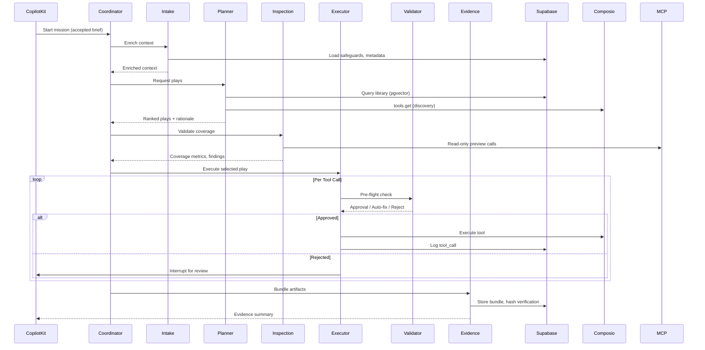
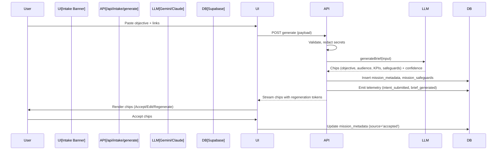
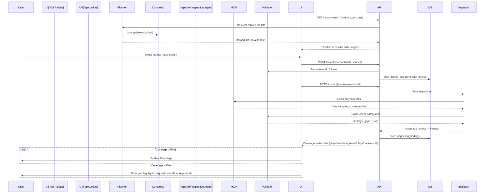
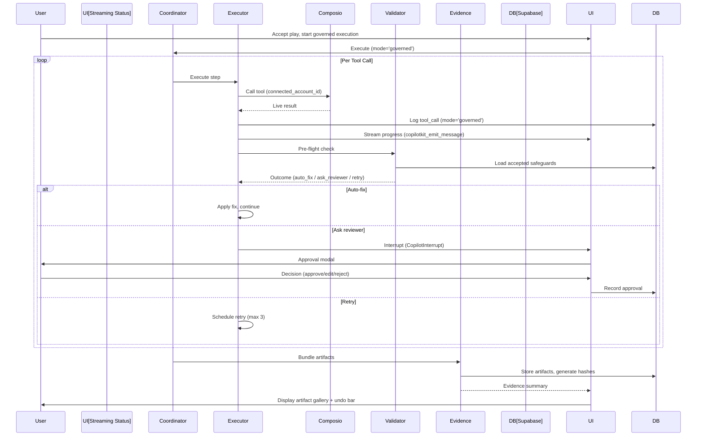
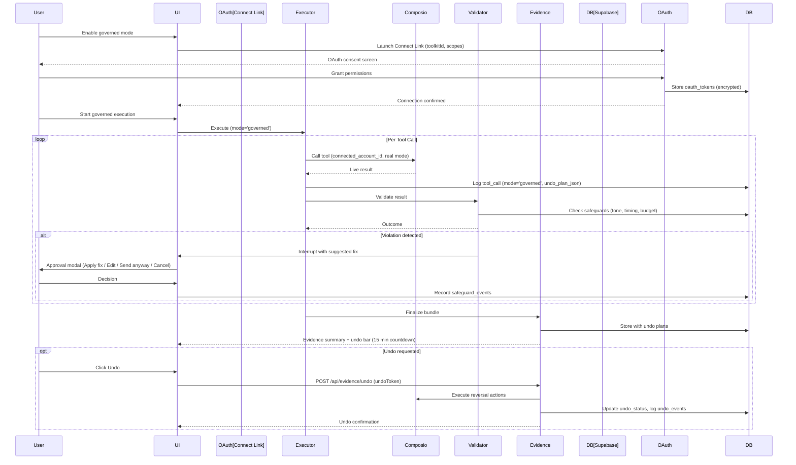

# AI Employee Control Plane: System Overview

**Version:** 2.0 (October 2025)
**Audience:** Engineering, Architecture, Technical Leadership
**Status:** Active technical blueprint

---

## Executive Summary

The AI Employee Control Plane is a **generative-first, evidence-backed orchestration platform** that transforms a single freeform input into autonomous, governed executions. It replaces discrete stage-gated workflows with an **eight-stage unified mission flow** where users maintain continuous visibility and control—from objective intake through feedback collection.

The system coordinates four primary layers:

1. **Presentation Layer** (Next.js + CopilotKit) — Generative workspace with streaming chat, approval modals, artifact previews
2. **Orchestration Layer** (Gemini ADK) — Multi-agent coordination (Coordinator, Planner, Executor, Validator, Evidence)
3. **Execution Layer** (Composio + MCP) — Toolkit discovery, OAuth management, tool execution, trigger lifecycle
4. **Data Layer** (Supabase) — Mission metadata, library embeddings, telemetry, evidence storage

Unlike predecessor stage-gated systems, this architecture eliminates discrete transitions, manual form entry, and credential-first onboarding—delivering <15-minute inspection-to-execution loops with ≥80% generative acceptance rates.

---

## Architectural Tenets

### 1. Single-Input Generative Onboarding

A single freeform input (objective text, links, tone hints) produces the mission brief, suggested audiences, KPIs, success metrics, and adaptive safeguards in seconds. No blank forms, no multi-step wizards.

**Technical Implementation:**
- Intake API parses text via Gemini/Claude with entity extraction
- Generates structured chips (objective, audience, safeguards) with confidence scores
- Persists to Supabase `mission_metadata` with source tracking
- Supports chip-level regeneration, editing, and acceptance

**Performance Target:** ≤3s p95 generation time for 1K-character inputs

---

### 2. Adaptive Safeguards, Not Policy Manuals

Safeguard hints are generated per mission (tone, quiet windows, escalation contacts) with confidence scores. Users accept, edit, or regenerate. Validator enforces accepted hints with auto-fix suggestions.

**Technical Implementation:**
- Safeguard generation during intake, enrichment during planning
- Storage in `mission_safeguards` table with status tracking
- Validator agent cross-checks against accepted hints
- Feedback loop records adoption, edits, violations

**Performance Target:** <200ms p95 validator overhead per tool call

---

### 3. Objective-First Execution

Capability grounding, play ranking, and connection planning precede any tool call. Undo plans attach to every mutating step.

**Technical Implementation:**
- Planner queries library (pgvector) + Composio discovery
- Ranks plays by similarity, precedent, impact estimation
- Generates undo plan during planning, validates during execution
- Evidence agent executes rollbacks via stored undo tokens

**Performance Target:** ≤15 min p95 execution loop end-to-end

---

### 4. User-Curated Tool Orchestration

The system recommends Composio toolkits with rationale (no-auth first, OAuth-ready second). Users curate selections before MCP execution.

**Technical Implementation:**
- Discovery via `cx.tools.get(userId, { toolkits, search, tools, limit })`
- Recommended tool palette in CopilotKit with auth badges
- Inspection preview validates coverage via MCP read-only calls
- Toolkit selections persist to `toolkit_selections` table

**Performance Target:** <2 min from recommendation to validation

---

### 5. Evidence by Design

Every action logs artifacts, telemetry, undo data to Supabase for replay and analytics. SHA-256 hashing ensures tamper detection.

**Technical Implementation:**
- Evidence agent bundles mission brief, tool outputs, ROI summary
- Artifacts stored in Supabase Storage with hash verification
- Exportable bundles (PDF, CSV) for compliance
- Telemetry events feed analytics views

**Performance Target:** <5s artifact bundle generation

---

### 6. Composable Agents

Planner, Validator, Evidence, and Coordinator agents remain observable, replayable, and evaluable through ADK eval suites.

**Technical Implementation:**
- Gemini ADK `SequentialAgent` coordination pattern
- Shared session state via `ctx.session.state`
- Checkpointed evaluations with `adk eval`
- Structured telemetry spans per agent

**Performance Target:** ≥90% eval pass rate for top-3 play ranking

---

### 7. Delightful Performance

System maintains strict latency SLOs across all stages.

| Operation | Target | Measurement |
|-----------|--------|-------------|
| Generative intake | ≤3s p95 | `brief_generated` telemetry |
| Chip regeneration | ≤2s p95 | `brief_item_modified` latency |
| Execution loop | ≤15 min p95 | `execution_started` → `execution_completed` |
| Validator overhead | <200ms p95 | `validator_check` span duration |
| Planner ranking | ≤2.5s p95 | `planner_candidate_generated` latency |
| Streaming heartbeat | <5s | SSE interval monitoring |

---

### 8. Explainable Recommendations

Plays, connection plans, and safeguard hints include rationales derived from library embeddings, historical outcomes, and persona context.

**Technical Implementation:**
- Library similarity search (cosine ≥0.75)
- Precedent citation from `library_entries` table
- Impact estimates based on historical success rates
- "Why This?" tooltips in UI with embedding match scores

---

## System Architecture

### High-Level Component View

```mermaid
graph TB
    subgraph Presentation[Presentation Layer]
        UI[Next.js Workspace]
        CK[CopilotKit CoAgents]
        Intake[Generative Intake]
        Tools[Tool Palette]
        Status[Streaming Status]
        Artifacts[Artifact Gallery]
    end

    subgraph Control[Control Plane APIs]
        IntakeAPI[/api/intake/generate]
        ToolkitsAPI[/api/toolkits/recommend]
        InspectAPI[/api/inspect/preview]
        ApprovalAPI[/api/approvals]
        EvidenceAPI[/api/evidence/undo]
        FeedbackAPI[/api/feedback/submit]
    end

    subgraph Orchestration[Orchestration Layer - Gemini ADK]
        Coordinator[Coordinator Agent]
        Planner[Planner Agent]
        Executor[Executor Agent]
        Validator[Validator Agent]
        Evidence[Evidence Agent]
        Inspection[Inspection Agent]
    end

    subgraph Execution[Execution Layer]
        Composio[Composio SDK]
        MCP[MCP Servers]
        OAuth[Connect Link OAuth]
        Triggers[Trigger Lifecycle]
    end

    subgraph Data[Data Layer - Supabase]
        DB[(Postgres + pgvector)]
        Storage[Storage Buckets]
        Edge[Edge Functions]
        Cron[pg_cron Jobs]
    end

    UI --> CK
    CK --> Control
    Control --> Orchestration
    Orchestration --> Execution
    Orchestration --> Data
    Execution --> Data

    Intake -.-> IntakeAPI
    Tools -.-> ToolkitsAPI
    Status -.-> InspectAPI
    Artifacts -.-> EvidenceAPI
```

---

## Eight-Stage Mission Flow

The unified mission workspace progresses through eight stages **without route transitions**. All stages render in a single React tree with shared CopilotKit context.

| Stage | Description | Primary Components | Completion Trigger | Telemetry Events |
|-------|-------------|-------------------|-------------------|------------------|
| **1. Intake** | Single-input banner generates chips | `MissionIntake`, IntakeAPI | Chips accepted | `intent_submitted`, `brief_generated`, `brief_item_modified` |
| **2. Mission Brief** | Accepted chips persist as pinned brief | `MissionBriefCard` | Brief loaded, locked | `mission_created` |
| **3. Toolkits & Connect** | User-curated toolkit palette + OAuth | `RecommendedToolStrip`, Connect Link | Toolkits selected, connections authorized | `toolkit_recommendation_viewed`, `toolkit_selected`, `connect_link_completed` |
| **4. Data Inspect** | MCP read-only preview validates coverage | Coverage Meter, Inspection Summary | Coverage ≥85% or override | `inspection_preview_rendered`, `plan_validated` |
| **5. Plan** | Planner streams ranked plays with rationale | Planner Insight Rail, Play Cards | Play selected | `play_generated`, `play_selected` |
| **6. Governed Execution** | Streaming tool execution with validator checks | Streaming Status Panel | Evidence bundle generated | `execution_started`, `execution_completed` |
| **7. Evidence** | Artifact gallery with undo bar | Artifact Gallery, Undo Bar | Artifacts persisted, undo verified | `undo_requested`, `undo_completed` |
| **8. Feedback** | Per-artifact and mission feedback | Feedback Drawer | Feedback submitted | `feedback_submitted` |

**Key Design Decision:** Stages are UI states managed by `MissionStageProvider`, not Next.js routes. This preserves CopilotKit session continuity and enables cross-stage coordination.

---

## Layer Architectures

### 1. Presentation Layer (Next.js 15 + CopilotKit)

**Purpose:** Generative workspace with continuous visibility

**Components:**

- **Generative Intake Banner** — Textarea with sample prompts, streaming chip generation
- **Generated Chip Rows** — Objective, audience, safeguards with confidence badges, edit/regenerate controls
- **Mission Brief Card** — Pinned persistent brief with status badges
- **Recommended Tool Strip** — Toolkit carousel with auth badges, impact estimates, multi-select
- **Coverage Meter** — Radial progress (objectives/safeguards/plays/datasets segments)
- **Planner Insight Rail** — Streaming rationale cards with filters
- **Streaming Status Panel** — Live progress with heartbeat, expandable logs, pause/cancel
- **Artifact Gallery** — Grid of artifacts with hash badges, status filters
- **Undo Bar** — Countdown timer, undo plan summary, risk tags
- **Feedback Drawer** — Timeline of feedback entries with quick actions

**CopilotKit Integration:**

- `useCopilotReadable` — Shares mission brief, toolkit selections, safeguards
- `useCopilotAction` — Handles chip acceptance, play selection, approval decisions, undo triggers
- `copilotkit_emit_message` — Streams agent updates (planner rationale, execution progress)
- `copilotkit_exit` — Signals run completion for router handoff
- Interrupts — `CopilotInterrupt` for safeguard checkpoints

**Accessibility:**

- WCAG 2.1 AA compliance
- Keyboard navigation (Tab, Enter, Space, Esc, Arrow keys)
- Screen reader support with live regions (`role="status"`, `aria-live`)
- Focus indicators (2px outline, 4.5:1 contrast)

**Performance:**

- Code-split by stage (lazy load Evidence, Feedback until needed)
- Optimistic UI updates with SSE reconciliation
- Service worker caching for static assets
- Edge-rendered server components for dashboard views

**File Locations:**
- `src/app/(control-plane)/ControlPlaneWorkspace.tsx` — Main workspace container
- `src/components/MissionIntake.tsx` — Intake banner
- `src/components/RecommendedToolkits.tsx` — Tool palette
- `src/components/StreamingStatusPanel.tsx` — Execution status
- `src/components/ArtifactGallery.tsx` — Evidence display
- `src/components/FeedbackDrawer.tsx` — Feedback collection

---

### 2. Control Plane APIs (Next.js App Router)

**Purpose:** Stateless endpoints mediating frontend ↔ orchestration ↔ data

**Key Routes:**

#### **POST /api/intake/generate**

- **Input:** `{ objective: string, context?: string, persona?: string }`
- **Output:** Chips with confidence scores, regeneration tokens
- **Implementation:**
  - Validates input, redacts secrets
  - Calls `intakeService.generateBrief` (Gemini/Claude)
  - Logs to `mission_metadata` with `source='generated'`
  - Emits `intent_submitted`, `brief_generated` telemetry
- **SLA:** ≤3s p95

#### **POST /api/intake/regenerate**

- **Input:** `{ missionId: string, field: string, context?: string }`
- **Output:** Updated chip with new confidence score
- **Implementation:**
  - Retrieves mission context from Supabase
  - Calls LLM with field-specific prompt
  - Increments `regeneration_count`, updates `mission_metadata`
  - Emits `brief_item_modified` telemetry
- **SLA:** ≤2s p95

#### **GET /api/toolkits/recommend**

- **Input:** Query params `missionId`, `persona`, `industry`
- **Output:** Ranked toolkit list with auth metadata, impact estimates
- **Implementation:**
  - Fetches mission context
  - Calls Planner library service (pgvector query)
  - Merges with `Composio.tools.get` discovery
  - Returns no-auth first, OAuth-ready second
- **SLA:** ≤1.5s p95

#### **POST /api/toolkits/selections**

- **Input:** `{ missionId: string, toolkitIds: string[], scopes?: Record<string, string[]> }`
- **Output:** Selection confirmation, undo tokens
- **Implementation:**
  - Validates toolkit availability
  - Persists to `toolkit_selections` table
  - Calls Validator to generate undo tokens
  - Emits `toolkit_selected` telemetry
- **SLA:** ≤500ms p95

#### **POST /api/inspect/preview**

- **Input:** `{ missionId: string }`
- **Output:** Coverage metrics, inspection findings
- **Implementation:**
  - Validates toolkit selections exist
  - Invokes Inspection agent (read-only MCP calls)
  - Persists findings to `inspection_findings` table
  - Returns coverage percentage, gap highlights
- **SLA:** ≤10s p95

#### **POST /api/approvals**

- **Input:** `{ toolCallId: string, decision: 'approve'|'reject', edits?: object, notes?: string }`
- **Output:** Approval confirmation, next step signal
- **Implementation:**
  - Records to `approvals` table with reviewer ID, timestamp
  - Links safeguard feedback if applicable
  - Signals Executor to proceed or halt
  - Emits `approval_decision` telemetry
- **SLA:** ≤300ms p95

#### **POST /api/evidence/undo**

- **Input:** `{ undoToken: string, missionId: string }`
- **Output:** Undo status, updated artifact bundle
- **Implementation:**
  - Validates token expiry (default 15 minutes)
  - Calls Evidence service `execute_undo`
  - Updates `tool_calls.undo_status` and `undo_events` table
  - Returns confirmation, logs telemetry
- **SLA:** ≤5s p95

#### **POST /api/feedback/submit**

- **Input:** `{ missionId: string, artifactId?: string, sentiment: 'positive'|'neutral'|'risk', content: string, stage: string }`
- **Output:** Feedback confirmation
- **Implementation:**
  - Sanitizes content via redaction helper
  - Persists to `mission_feedback` table
  - Emits `feedback_submitted` telemetry
- **SLA:** ≤500ms p95

**Security:**

- Row-level security (RLS) enforces tenant isolation
- OAuth tokens encrypted at rest with rotation policy
- Rate limiting per mission (Redis-backed)
- CORS restricted to approved origins

**File Locations:**
- `src/app/api/intake/generate/route.ts`
- `src/app/api/toolkits/recommend/route.ts`
- `src/app/api/inspect/preview/route.ts`
- `src/app/api/approvals/route.ts`
- `src/app/api/evidence/undo/route.ts`
- `src/app/api/feedback/submit/route.ts`

---

### 3. Orchestration Layer (Gemini ADK)

**Purpose:** Multi-agent coordination with checkpointed evaluation

**Agent Architecture:**



#### **Coordinator Agent**

- **Pattern:** `SequentialAgent` with stage guards
- **Responsibilities:**
  - Enforce eight-stage transition rules
  - Wrap stages in telemetry spans
  - Persist state to `mission_runs` table
  - Handle graceful degradation (library-only fallback)
- **Key Logic:**
  - Block Stage 5 (Plan) until coverage ≥85% or governance override
  - Skip Connect Link when missions stay in inspection mode
  - Retry with exponential backoff on transient failures
- **File:** `agent/agents/coordinator.py`

#### **Intake Agent**

- **Pattern:** `CustomAgent` with enrichment step
- **Responsibilities:**
  - Load accepted chips from `mission_metadata`
  - Enrich context with safeguards, historical plays
  - Build `generated_brief`, `confidence_map` for session state
- **Key Logic:**
  - Ensure all required fields present (objective, audience)
  - Attach persona defaults if missing
- **File:** `agent/agents/intake_agent.py`

#### **Planner Agent**

- **Pattern:** `CustomAgent` with hybrid ranking
- **Responsibilities:**
  - Query Supabase pgvector for similar plays (cosine ≥0.75)
  - Call `cx.tools.get` with toolkit and search filters
  - Rank plays by similarity + precedent + impact
  - Generate rationale, undo sketch, toolkit list
- **Key Logic:**
  - Prefer no-auth toolkits for inspection mode
  - Include "Why This?" citations with embedding match scores
  - Fallback to library-only if Composio returns zero results
- **Performance:** ≤2.5s p95 for 3 candidate generation
- **File:** `agent/agents/planner.py`

#### **Inspection Agent**

- **Pattern:** `CustomAgent` with read-only MCP calls
- **Responsibilities:**
  - Issue non-mutating tool calls per toolkit selection
  - Validate data coverage (objectives, datasets, safeguards)
  - Produce coverage metrics, gap highlights
- **Key Logic:**
  - Honor scope filters (no simulation flags)
  - Calculate readiness percentage per segment
  - Surface findings with severity tags
- **Performance:** ≤10s p95 for multi-toolkit inspection
- **File:** `agent/agents/inspection_agent.py`

#### **Executor Agent**

- **Pattern:** `CustomAgent` with inspection vs. governed modes
- **Responsibilities:**
  - Execute tool calls via Composio SDK
  - Stream progress via `copilotkit_emit_message`
  - Support inspection mode with deterministic stubs
  - Log tool calls to `tool_calls` table
- **Key Logic:**
  - Inspection: issue read-only previews via MCP connectors
  - Governed: resolve `connected_account_id` per toolkit
  - Capture latency, results, undo plan
- **Performance:** Varies by toolkit; <15 min end-to-end execution loop
- **File:** `agent/agents/executor.py`

#### **Validator Agent**

- **Pattern:** `CustomAgent` with safeguard policy evaluation
- **Responsibilities:**
  - Evaluate actions against tone, timing, budget, escalation hints
  - Generate undo tokens
  - Produce `auto_fix`, `ask_reviewer`, `retry_later` outcomes
  - Log to `safeguard_events` table
- **Key Logic:**
  - Read accepted hints from `mission_safeguards`
  - Apply quiet window checks (local tenant timezone)
  - Tone validation via LLM sentiment analysis
  - Budget checks via spend accumulation
- **Performance:** <200ms p95 overhead per call
- **File:** `agent/agents/validator.py`

#### **Evidence Agent**

- **Pattern:** `CustomAgent` with bundle generation
- **Responsibilities:**
  - Compile mission brief, tool outputs, ROI summary
  - Hash artifacts (SHA-256)
  - Store to Supabase Storage
  - Execute undo plans when requested
- **Key Logic:**
  - Redact PII before bundling
  - Link undo instructions to `tool_calls.undo_plan_json`
  - Verify hash parity on retrieval
- **Performance:** <5s bundle generation
- **File:** `agent/agents/evidence.py`

**ADK Evaluation:**

- Eval suites: `agent/evals/control_plane/*.json`
- Run with `mise run test-agent`
- Coverage: execution ranking, validator negatives, undo execution
- Target: ≥90% pass rate for promotion

**File Locations:**
- `agent/agent.py` — FastAPI entry point
- `agent/agents/` — Agent implementations
- `agent/services/` — Shared services (library, composio, safeguard)
- `agent/tools/` — Composio client, supabase stub

---

### 4. Execution Layer (Composio + MCP)

**Purpose:** Toolkit discovery, OAuth management, tool execution

#### **Composio Integration**

**Discovery:**

- `cx.tools.get(userId, { toolkits, search, tools, scopes, limit })` — Discovery with supported filters
- `toolkits.list()` — Enumerate available toolkits with metadata
- Prefer no-auth options, surface OAuth-ready with scope transparency

**Managed Auth:**

- `toolkits.authorize` — Generate Connect Link session
- `waitForConnection` — Poll for OAuth completion
- Store tokens in `oauth_tokens` table (encrypted)
- Support per-user and org-level scopes

**Execution:**

- `cx.tools.execute(tool_slug, userId, { arguments, connected_account_id })`
- Inspection mode: Read-only tool previews via MCP connectors
- Governed mode: Live execution with latency tracking

**Triggers:**

- `create_trigger` — Register event subscription
- `subscribe_trigger` — Activate webhook
- `disable_trigger` — Deactivate after 30 days idle
- Events logged to `trigger_warehouse` table

**Error Handling:**

- Respect `429` retry headers (exponential backoff)
- On persistent failures: mark `mission_flags.rate_limited`, pause run
- On `401/403`: prompt re-auth, abort current execution
- Zero-result discovery: fallback to library-only, warn user

**File Locations:**
- `agent/tools/composio_client.py` — SDK wrapper
- `agent/services/composio_service.py` — Discovery logic

**Reference:** `libs_docs/composio/llms.txt`

#### **MCP (Model Context Protocol) Servers**

**Purpose:** Read-only data inspection for coverage validation

**Implementation:**

- Issue non-mutating calls (e.g., "Fetch 5 sample contacts")
- Validate scope sufficiency before governed execution
- Return summaries for coverage meter segments

**Integration:**

- Inspection agent orchestrates MCP calls
- Results stored in `inspection_findings` table
- Coverage meter displays readiness percentage

**Future Extensions:**

- Code MCP for repository operations (post-Core milestone)
- CRM MCP for advanced data queries

---

### 5. Data Layer (Supabase)

**Purpose:** Mission metadata, library intelligence, telemetry, evidence storage

#### **Core Tables**

| Table | Purpose | Key Columns | Indexes |
|-------|---------|-------------|---------|
| `objectives` | Canonical mission summary | `mission_id`, `goal`, `audience`, `timeframe`, `success_metric`, `status` | mission_id, status |
| `mission_metadata` | Generated/edited chips | `mission_id`, `field`, `value`, `confidence`, `source`, `regeneration_count`, `accepted_at` | mission_id + field |
| `mission_safeguards` | Adaptive hints | `mission_id`, `hint_type`, `suggested_value`, `confidence`, `status`, `updated_at` | mission_id, status |
| `plays` | Planner outputs | `mission_id`, `mode`, `plan_json`, `impact_estimate`, `undo_plan`, `confidence`, `reason_markdown`, `pinned_at` | mission_id, mode |
| `tool_calls` | Execution log | `play_id`, `toolkit`, `tool_name`, `args_hash`, `undo_plan_json`, `result_ref`, `latency_ms`, `undo_status` | play_id, undo_status |
| `approvals` | Reviewer decisions | `tool_call_id`, `reviewer_id`, `decision`, `edits`, `notes`, `decided_at` | tool_call_id |
| `artifacts` | Evidence bundles | `play_id`, `type`, `title`, `content_ref`, `hash`, `reviewer_edits` | play_id, hash |
| `library_entries` | Reusable plays | `id`, `persona`, `embedding`, `success_score`, `reuse_count` | embedding (GiST) |
| `safeguard_events` | Validator feedback | `mission_id`, `event_type`, `details`, `resolved_at` | mission_id, event_type |
| `toolkit_selections` | User-curated toolkits | `mission_id`, `toolkit_id`, `auth_mode`, `undo_token`, `created_at` | mission_id |
| `oauth_tokens` | Encrypted credentials | `connection_id`, `scopes`, `status`, `last_verified_at` | connection_id |
| `trigger_warehouse` | Trigger events | `trigger_id`, `event_type`, `payload_hash`, `tool_call_id`, `received_at` | trigger_id |
| `mission_feedback` | User feedback | `mission_id`, `artifact_id`, `sentiment`, `content`, `stage`, `created_at` | mission_id, sentiment |

#### **Analytics Views**

- `analytics_weekly_approved_jobs` — Weekly job counts per tenant
- `analytics_generative_acceptance` — Chip acceptance rates without regeneration
- `analytics_connection_adoption` — OAuth toolkit adoption
- `analytics_safeguard_feedback` — Hint adoption, auto-fix, send-anyway rates
- `analytics_override_rate` — Governance overrides per mission
- `analytics_undo_success` — Rollback success rates

**Refresh Schedule:** Nightly via `pg_cron`

#### **Storage Buckets**

- `evidence-artifacts` — PDF, CSV, JSON bundles with versioning
- Access via signed URLs with expiry (default 24h)

#### **Edge Functions**

- `generate-embedding` — Produce embeddings for library entries
- `catalog-sync` — Refresh Composio metadata nightly
- `narrative-summariser` — Generate dashboard summaries (optional)

#### **pg_cron Jobs**

- `catalog_snapshot` — Snapshot Composio catalog for diff tracking
- `safeguard_feedback_rollup` — Aggregate feedback for analytics
- `connection_health_check` — Verify OAuth token validity
- `retention_enforcement` — Purge old data per 7-day policy

#### **Security**

- **Row-Level Security (RLS):** All tables enforce tenant isolation via `auth.uid()`
- **Encryption:** OAuth tokens encrypted at rest (Supabase vault)
- **Audit Logs:** `mission_events` table captures all writes with user ID, timestamp
- **Redaction:** PII scrubbed before telemetry export

**File Locations:**
- `supabase/migrations/0001_init.sql` — Schema definitions
- `supabase/functions/` — Edge function implementations
- `supabase/types.ts` — Generated TypeScript types

**Reference:** `libs_docs/supabase/llms_docs.txt`

---

## Data Flow Diagrams

### 1. Generative Intake Flow



**Performance:** 3s p95 generation, <500ms persistence

---

### 2. Tool Curation & Inspection Flow



**Performance:** <2 min recommendation → validation, <10s inspection

---

### 3. Governed Execution Flow



**Performance:** <15 min p95 total, <5s heartbeat updates

---

### 4. Governed Execution with OAuth



**Performance:** Varies by toolkit, <200ms validator overhead, <5s undo execution

---

## Integration Reference

### Composio SDK

**Key Operations:**

| Operation | API Call | Purpose | SLA |
|-----------|----------|---------|-----|
| Discovery | `cx.tools.get(userId, { toolkits, search, tools, scopes, limit })` | Find relevant tools | <1s |
| Toolkit List | `cx.toolkits.list()` | Enumerate available toolkits | <500ms |
| Authorize | `cx.toolkits.authorize(userId, toolkit)` | Generate Connect Link session | <2s |
| Wait Connection | `connection.waitForConnection()` | Poll OAuth completion | <10s |
| Execute Tool | `cx.tools.execute(toolSlug, userId, { arguments, connected_account_id })` | Run governed tool call | Varies |
| Create Trigger | `cx.triggers.create(slug, userId, config)` | Register event subscription | <2s |
| Subscribe Trigger | `cx.triggers.subscribe(triggerId, webhookUrl)` | Activate webhook | <1s |
| Disable Trigger | `cx.triggers.disable(triggerId)` | Deactivate webhook | <1s |

**Error Handling:**

- `429` — Respect retry-after header, exponential backoff
- `401/403` — Prompt re-auth, abort execution
- Zero results — Fallback to library-only, warn user
- Rate limit exhaustion — Mark `mission_flags.rate_limited`, pause run

**Reference:** `libs_docs/composio/llms.txt`

---

### CopilotKit CoAgents

**Key Patterns:**

| Pattern | Implementation | Purpose |
|---------|---------------|---------|
| Shared State | `useCopilotReadable` | Share mission brief, safeguards across agents |
| Frontend Actions | `useCopilotAction` | Handle chip edits, play selection, approvals |
| Streaming Updates | `copilotkit_emit_message` | Stream agent progress (planner rationale, execution status) |
| Interrupts | `CopilotInterrupt` | Pause execution for approval checkpoints |
| Session Exit | `copilotkit_exit` | Signal completion, enable router handoff |
| Message Persistence | CopilotKit store → Supabase | Persist transcripts for reload recovery |

**Session Recovery:**

1. On disconnect: Store `mission_context`, `pending_interrupt` to Supabase
2. On reconnect: Load state, replay last 20 messages
3. Multi-tab: Last write wins with `revision_id` conflict detection

**Reference:** `libs_docs/copilotkit/llms-full.txt`

---

### Gemini ADK Coordination

**Agent Types:**

- `SequentialAgent` — Coordinator with stage guards
- `CustomAgent` — Planner, Executor, Validator, Evidence, Inspection

**Session State:**

```python
ctx.session.state = {
    'mission_context': {...},  # Brief, safeguards, confidence map
    'agent_progress': {...},   # Streaming updates
    'pending_interrupt': {...} # Approval modal context
}
```

**Evaluation:**

- Suites: `agent/evals/control_plane/*.json`
- Run: `mise run test-agent`
- Target: ≥90% pass rate for top-3 play ranking

**Reference:** `libs_docs/adk/llms-full.txt`

---

### Supabase Data & Analytics

**Key Services:**

- **Postgres + pgvector** — Mission data, library embeddings
- **Storage** — Evidence bundles with versioning
- **Edge Functions** — Embeddings, catalog sync, narratives
- **pg_cron** — Nightly rollups, health checks, retention
- **PostgREST** — Auto-generated REST API over tables/views
- **RLS** — Tenant isolation via `auth.uid()`

**Analytics Pipeline:**

1. Events logged to `mission_events` table
2. Nightly rollups via `pg_cron` → Materialized views
3. Dashboard queries via PostgREST
4. Export to external sinks (optional): Parquet, CSV

**Reference:** `libs_docs/supabase/llms_docs.txt`

---

## Performance & Scalability

### Performance Targets

| Metric | Target | Measurement | Status |
|--------|--------|-------------|--------|
| Generative intake | ≤3s p95 | `brief_generated` latency | ✅ Foundation |
| Chip regeneration | ≤2s p95 | `brief_item_modified` latency | ✅ Foundation |
| Toolkit recommendation | ≤1.5s p95 | `/api/toolkits/recommend` span | ✅ Foundation |
| Inspection preview | ≤10s p95 | `/api/inspect/preview` span | ⚠️ Core |
| Planner ranking | ≤2.5s p95 | `planner_candidate_generated` latency | ✅ Foundation |
| Validator overhead | <200ms p95 | `validator_check` span | ✅ Core |
| Execution loop | ≤15 min p95 | `execution_started` → `execution_completed` | ✅ Foundation |
| Streaming heartbeat | <5s | SSE interval | ✅ Foundation |
| Undo execution | <5s p95 | `undo_completed` latency | ⚠️ Core |
| Evidence bundle gen | <5s | Evidence agent span | ✅ Foundation |

---

### Scalability Considerations

**Concurrent Missions:**

- Target: 20 concurrent governed missions by Scale milestone
- Approach: Horizontal scaling of Next.js, ADK workers
- Bottleneck monitoring: Composio rate limits, Supabase connections

**Data Growth:**

- Partition `mission_events`, `tool_calls` by month
- Archive old missions to cold storage (Supabase Storage → S3)
- Retention: 7 days hot, 90 days warm, 365 days cold

**Library Embeddings:**

- GiST index on `library_entries.embedding`
- Incremental updates (nightly batch)
- Scale: 10K entries → <1s query time

**Telemetry Volume:**

- ~40 events per mission
- Buffer to Supabase Edge Function (batch inserts)
- Export to external sink for long-term analysis

---

## Security & Compliance

### Authentication & Authorization

- **User Auth:** Supabase Auth (email/password, OAuth providers)
- **RLS:** All tables enforce `auth.uid()` checks
- **API Auth:** Bearer tokens, rate limiting per mission
- **OAuth Tokens:** Encrypted in Supabase vault, never exposed to frontend

---

### Data Protection

- **Encryption at Rest:** Supabase default (AES-256)
- **Encryption in Transit:** TLS 1.3 for all connections
- **PII Redaction:** Telemetry scrubbed before analytics export
- **Token Rotation:** OAuth tokens auto-rotate per Composio policy

---

### Audit & Compliance

- **Audit Logs:** `mission_events` table captures all actions with user ID, timestamp
- **Evidence Bundles:** SHA-256 hashed for tamper detection
- **Governance Dashboard:** Export compliance reports (PDF, CSV)
- **Retention Policy:** 7-day default, configurable per tenant
- **SOC 2 Type II:** Planned Q2 2026

---

## Deployment & Operations

### Local Development

```bash
# Install dependencies
mise run install

# Start services
supabase start
mise run dev        # Next.js + agent
mise run agent      # Agent only
```

### Environment Variables

**Frontend:**
- `NEXT_PUBLIC_SUPABASE_URL`
- `NEXT_PUBLIC_SUPABASE_ANON_KEY`

**Agent:**
- `COMPOSIO_API_KEY`
- `SUPABASE_URL`
- `SUPABASE_SERVICE_ROLE_KEY`
- `GOOGLE_API_KEY` (Gemini)
- `OPENAI_API_KEY` (fallback)
- `ENCRYPTION_KEY` (OAuth tokens)
- `REDIS_URL` (rate limiting)

---

### CI/CD Pipeline

1. **Lint & Type Check** — `mise run lint`, `pnpm tsc --noEmit`
2. **Unit Tests** — Vitest (frontend), pytest (agent)
3. **Integration Tests** — Playwright (e2e), ADK eval suites
4. **Telemetry Audit** — `scripts/audit_telemetry_events.py --mode check`
5. **Accessibility Scan** — axe-core audit
6. **Performance Benchmarks** — `scripts/benchmark_gate_gb.py`
7. **Evidence Collection** — Export readiness artifacts to `docs/readiness/`

---

### Monitoring & Alerts

**Metrics:**

- Generative acceptance rate (≥80%)
- Dry-run conversion rate (≥60%)
- Validator overhead (p95 <200ms)
- Undo success rate (≥95%)
- Streaming heartbeat misses (<2% failures)

**Alerts:**

- Slack/PagerDuty for safeguard violation spikes
- OAuth token expiry warnings
- Composio rate limit exhaustion
- Supabase replication lag
- Streaming heartbeat failures

**Dashboards:**

- Executive: KPI tiles, trends, library reuse
- Governance: Incidents, overrides, audit trails
- Operational: Latency histograms, error rates, throughput

---

## Migration from Stage-Gated Architecture

### Key Changes

| Legacy Stage-Gated System | New Unified System | Migration Strategy |
|---------------------------|-------------------|-------------------|
| Discrete route transitions (separate pages per stage) | Single workspace with stage state | Preserve readiness artifacts, update routing to workspace |
| Manual form entry | Generative intake from freeform input | Migrate form schemas to chip generation prompts |
| Static safeguard policies | Adaptive hints generated per mission | Convert policy docs to safeguard generation templates |
| Credential-first onboarding | Zero-privilege inspection first | Update OAuth flows to post-validation |
| Stage-specific telemetry | Eight-stage unified events | Map legacy events to new catalog |

### Backward Compatibility

- Legacy stage URLs redirect to workspace with stage query param
- Existing missions hydrate into stage state machine
- Historical evidence bundles remain accessible via archive API

---

## Future Enhancements (Post-Optimize Milestone)

### Narrative Intelligence

- Auto-generated dashboard summaries with edit/regenerate controls
- Natural language queries over mission history
- Insight clustering (top praise, top risk, safeguard trends)

### Multi-Agent Collaboration

- Parallel execution paths for independent plays
- Agent-to-agent handoffs for complex workflows
- Consensus-based decision making for ambiguous approvals

### Advanced Triggers

- Cross-toolkit event chaining (Slack reaction → Zendesk reply)
- Conditional trigger activation based on safeguard state
- Trigger-driven library updates (auto-add successful patterns)

### Expanded Integrations

- Code MCP for repository operations (PR creation, code review)
- CRM MCP for advanced data queries (segmentation, forecasting)
- Finance MCP for billing automations (invoice generation, reconciliation)

---

## Conclusion

The AI Employee Control Plane represents a **paradigm shift** from stage-gated to unified-system architecture:

- **Generative-first** — Single input generates complete missions
- **Adaptive safeguards** — Mission-specific hints replace static policies
- **User-curated orchestration** — Informed toolkit selection with inspection validation
- **Evidence-backed** — Every action logged, hashed, and auditable
- **Radically reversible** — Undo plans for confident experimentation

This system enables organizations to **prove AI value in <15 minutes**, **scale with confidence**, and **maintain governance without bureaucracy**.

**Next Steps:**

1. Review with engineering, architecture, and technical leadership
2. Validate performance targets with load testing (Core milestone)
3. Complete security audit (SOC 2 prep)
4. Finalize partner integration certifications (Composio, CopilotKit, ADK, Supabase)
5. Document operational runbooks (incident response, scaling procedures)

---

**Document Owner:** Engineering Leadership
**Last Updated:** October 2025
**Related Documents:** `01_product_vision.md`, `03_user_experience.md`, `04_implementation_guide.md`
