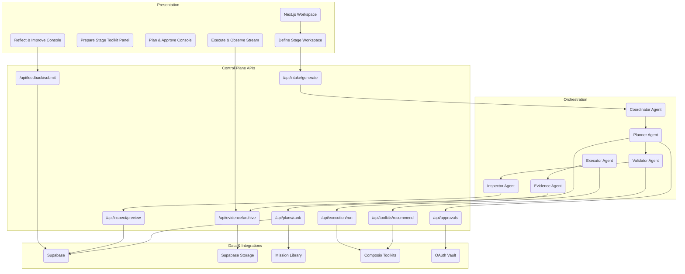

# AI Employee Control Plane: System Overview

**Version:** 3.0 (October 2025)
**Audience:** Engineering, Architecture, Technical Leadership
**Status:** Active technical blueprint

---

## Executive Summary

The AI Employee Control Plane converts a single freeform mission intent into governed execution across a **five-stage mission journey**: **Define, Prepare, Plan & Approve, Execute & Observe, Reflect & Improve**. Each stage preserves safeguards, telemetry, and approval checkpoints while reducing handoffs and documentation drift. Presentation, orchestration, execution, and data layers collaborate to deliver governed autonomy with continuous evidence.

Key architectural pillars:

- **Generative intent capture** that produces mission briefs, safeguards, and KPIs inside Stage 1 (Define)
- **Progressive trust** with toolkit validation and data inspection in Stage 2 (Prepare)
- **Ranked plays, approvals, and undo plans** orchestrated in Stage 3 (Plan & Approve)
- **Governed multi-agent execution** with streaming telemetry in Stage 4 (Execute & Observe)
- **Feedback loops and library updates** completing Stage 5 (Reflect & Improve)

The system preserves schema and telemetry naming. Existing Supabase tables, CopilotKit interactions, Composio integrations, and Gemini ADK agent roles operate unchanged.

---

## Architecture Overview

### Layered System

1. **Presentation Layer** — Next.js (App Router) + CopilotKit CoAgents, Tailwind UI primitives, artifact gallery, approval modals
2. **Orchestration Layer** — Gemini ADK agents (Coordinator, Planner, Executor, Validator, Evidence, Inspector) with shared session state
3. **Execution Layer** — Composio toolkits, Model Context Protocol (MCP) runners, OAuth token vault, undo handlers
4. **Data Layer** — Supabase (Postgres + Storage + Functions) for mission metadata, telemetry, evidence bundles, library embeddings

### High-Level Component Graph

---

## Five-Stage Mission Journey

| Stage                 | Primary Outcomes                                                  | Governance Checkpoints                       |
| --------------------- | ----------------------------------------------------------------- | -------------------------------------------- |
| **Define**            | Mission intent captured, safeguards aligned, brief locked         | Intent review, safeguard acceptance          |
| **Prepare**           | Toolkits authorized, data coverage validated, readiness confirmed | Toolkit approval, data coverage attestation  |
| **Plan & Approve**    | Ranked plays reviewed, undo plans validated, approvals granted    | Play approval, risk sign-off                 |
| **Execute & Observe** | Governed actions run, validator monitoring, artifacts generated   | Live execution oversight, evidence packaging |
| **Reflect & Improve** | Feedback captured, library reuse identified, next steps logged    | Feedback routing, library curation           |

### Stage 1 — Define

- Intake banner (`src/app/(control-plane)/mission/define/page.tsx`) sends text to `IntakeAPI`
- Gemini/Claude parsing yields objective, audience, KPI, safeguard chips
- Supabase `mission_metadata`, `mission_safeguards` persist accepted chips with provenance
- Telemetry rollup: `intent_submitted`, `brief_generated`, `brief_item_modified`

### Stage 2 — Prepare

- Recommended toolkits via Composio discovery, prioritized by no-auth readiness
- Users authorize OAuth flows; validator flags missing scopes
- Data inspection previews sample records via MCP read-only probes
- Supabase tables: `toolkit_selections`, `data_inspection_checks`
- Telemetry rollup: `toolkit_recommended`, `toolkit_selected`, `data_preview_generated`, `safeguard_reviewed`

### Stage 3 — Plan & Approve

- Planner agent ranks plays using library embeddings (`library_entries`, `library_embeddings`)
- Undo plans generated per mutating step; stored in `mission_undo_plans`
- Approvals captured in `mission_approvals` with role-based gating
- Telemetry rollup: `planner_candidate_generated`, `plan_ranked`, `plan_approved`

### Stage 4 — Execute & Observe

- Executor agent dispatches to MCP runners; validator enforces safeguards pre- and post-call
- Evidence agent streams outputs, attaches to artifact gallery (`mission_artifacts`)
- Undo handler applies rollbacks when triggered
- Telemetry rollup: `execution_started`, `execution_step_completed`, `validator_alert_raised`, `evidence_bundle_generated`

### Stage 5 — Reflect & Improve

- Feedback modal captures qualitative + quantitative signals
- Library curator suggests reusable assets; contributions stored in `library_entries`
- Post-mission checklist prompts next-step logging (`mission_followups`)
- Telemetry rollup: `feedback_submitted`, `mission_retrospective_logged`, `library_contribution`

---

## Telemetry & Analytics Continuity

Existing event names remain unchanged. Dashboards now group events by the five-stage labels using the mapping table below.

| Telemetry Event                | Stage             | Notes                                           |
| ------------------------------ | ----------------- | ----------------------------------------------- |
| `intent_submitted`             | Define            | Entry point for mission text                    |
| `brief_generated`              | Define            | Generative chips produced                       |
| `brief_item_modified`          | Define            | User edits for audit trail                      |
| `safeguard_reviewed`           | Prepare           | Emitted when safeguards are explicitly reviewed |
| `toolkit_recommended`          | Prepare           | Ranked toolkit suggestions                      |
| `toolkit_selected`             | Prepare           | User selection captured                         |
| `data_preview_generated`       | Prepare           | MCP inspection outputs                          |
| `planner_candidate_generated`  | Plan & Approve    | Each play candidate                             |
| `plan_ranked`                  | Plan & Approve    | Final ordering emitted                          |
| `plan_approved`                | Plan & Approve    | Approval modal confirm                          |
| `execution_started`            | Execute & Observe | First governed action                           |
| `execution_step_completed`     | Execute & Observe | Step-by-step tracing                            |
| `validator_alert_raised`       | Execute & Observe | Safeguard hit, auto-fix                         |
| `evidence_bundle_generated`    | Execute & Observe | Final artifact package                          |
| `feedback_submitted`           | Reflect & Improve | Primary feedback form                           |
| `mission_retrospective_logged` | Reflect & Improve | Post-mission summary                            |
| `library_contribution`         | Reflect & Improve | Library entry or update                         |

Analytics dashboards (`supabase/functions/dashboard_views.sql`) require only an updated grouping clause to align stage filters. No schema migrations are required.

---

## Governance Alignment

- **Define:** Safeguard chips require dual acknowledgement (mission owner + governance delegate). Validator enforces accepted constraints downstream.
- **Prepare:** OAuth approvals logged with scope diff view; coverage meter must reach ≥85% before progressing.
- **Plan & Approve:** Risk matrix (impact × reversibility) reviewed alongside undo plan before granting approvals.
- **Execute & Observe:** Validator monitors each tool call; auto-fix attempts logged; manual stop available via live control strip.
- **Reflect & Improve:** Feedback routed to governance queue when safeguards were overridden or validator escalated auto-fix failures.

Governance checkpoints are callable via `mise run governance-check`, which now references five-stage labels in its output.

---

## Subsystems

### Intake & Safeguards (Define)

- `agent/tools/intake.py` handles parsing and chip scoring
- `src/lib/mission/safeguards.ts` exposes helper utilities for UI display
- Confidence weighting ensures low-certainty chips require user edits

### Toolkit Selection & Inspection (Prepare)

- `src/app/(control-plane)/mission/prepare/toolkit-panel.tsx`
- `agent/tools/composio_client.py` orchestrates discovery and authorization
- Inspection API limits data sampling to redactable fields using `src/lib/telemetry/redaction.ts`

### Planning & Approval (Plan & Approve)

- `agent/planner/plan_agent.py` ranks plays with pgvector similarity
- `src/components/PlanReviewModal.tsx` collects approvals and exposes undo plan details
- `supabase/functions/apply_approval_policy.sql` enforces role gating

### Execution & Evidence (Execute & Observe)

- `agent/executor/sequential_executor.py` coordinates MCP tool runs
- `src/components/ExecutionTimeline.tsx` streams SSE updates
- Evidence bundler writes to `supabase/storage/evidence/${missionId}` with SHA-256 verification

### Feedback & Library (Reflect & Improve)

- `src/app/(control-plane)/mission/reflect/page.tsx`
- `agent/tools/library_client.py` manages contribution suggestions
- `supabase/functions/update_library_metrics.sql` aggregates reuse signals

---

## System Notes

- URLs, API endpoints, Supabase schemas, and telemetry events remain unchanged
- Historical missions automatically surface the new stage labels via Supabase views; no manual data cleanup required
- All diagrams are now embedded inline within this document for durability
