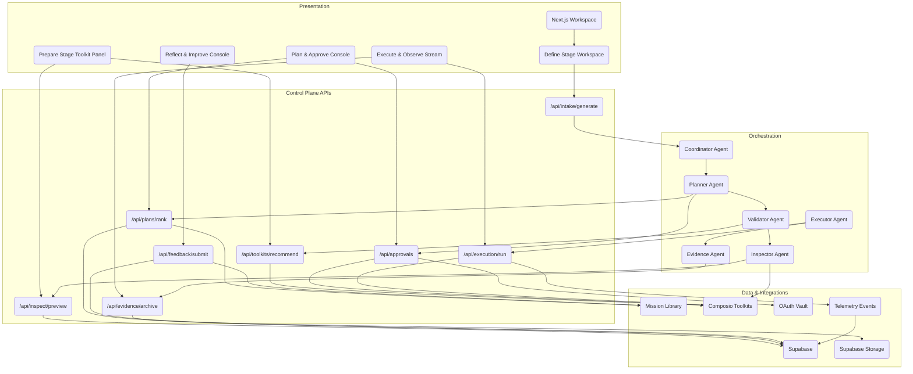

# AI Employee Control Plane: System Overview

**Version:** 3.0 (October 2025)
**Audience:** Engineering, Architecture, Technical Leadership
**Status:** Active technical blueprint

---

## Executive Summary

The AI Employee Control Plane converts a single freeform mission intent into governed execution across a **five-stage mission journey**: **Define, Prepare, Plan & Approve, Execute & Observe, Reflect & Improve**. Each stage preserves safeguards, telemetry, and approval checkpoints while reducing handoffs and documentation drift. Presentation, orchestration, execution, and data layers collaborate to deliver governed autonomy with continuous evidence.

Key architectural pillars:

- **Generative intent capture** that produces mission briefs, safeguards, and KPIs inside Stage 1 (Define)
- **Progressive trust** with toolkit validation and data inspection in Stage 2 (Prepare)
- **Ranked plays, approvals, and undo plans** orchestrated in Stage 3 (Plan & Approve)
- **Governed multi-agent execution** with streaming telemetry in Stage 4 (Execute & Observe)
- **Feedback loops and library updates** completing Stage 5 (Reflect & Improve)

The system preserves schema and telemetry naming. Existing Supabase tables, CopilotKit interactions, Composio integrations, and Gemini ADK agent roles operate unchanged.

---

## Architecture Overview

### Layered System

1. **Presentation Layer** — Next.js (App Router) + CopilotKit CoAgents, Tailwind UI primitives, artifact gallery, approval modals, persistent chat rail
2. **Orchestration Layer** — Gemini ADK agents (Coordinator, Planner, Executor, Validator, Evidence, Inspector) with shared session state
3. **Execution Layer** — Composio toolkits, provider adapters, OAuth token vault, undo handlers
4. **Data Layer** — Supabase (Postgres + Storage + Functions) for mission metadata, telemetry, evidence bundles, library embeddings

### High-Level Component Graph

---

## Five-Stage Mission Journey

| Stage                 | Primary Outcomes                                                  | Governance Checkpoints                       |
| --------------------- | ----------------------------------------------------------------- | -------------------------------------------- |
| **Define**            | Mission intent captured, safeguards aligned, brief locked         | Intent review, safeguard acceptance          |
| **Prepare**           | Toolkits authorized, data coverage validated, readiness confirmed | Toolkit approval, data coverage attestation  |
| **Plan & Approve**    | Ranked plays reviewed, undo plans validated, approvals granted    | Play approval, risk sign-off                 |
| **Execute & Observe** | Governed actions run, validator monitoring, artifacts generated   | Live execution oversight, evidence packaging |
| **Reflect & Improve** | Feedback captured, library reuse identified, next steps logged    | Feedback routing, library curation           |

**Chat orchestration:** CopilotKit maintains a single conversational spine across all stages, broadcasting telemetry, approvals, and evidence updates without route changes. Refer to `docs/03a_chat_experience.md` for UI specifics.

### Stage 1 — Define

- Intake banner (`src/app/(control-plane)/mission/define/page.tsx`) sends text to `IntakeAPI`
- Gemini/Claude parsing yields objective, audience, KPI, safeguard chips
- Supabase `mission_metadata`, `mission_safeguards` persist accepted chips with provenance
- Telemetry rollup: `intent_submitted`, `brief_generated`, `brief_item_modified`
- Chat narrative: Mission intent summary, chip regeneration prompts, and “Brief locked” confirmation receipts.

### Stage 2 — Prepare

- Recommended toolkits via Composio discovery (`client.tools.search()` + `client.toolkits.get()`), prioritized by readiness
- Inspector previews anticipated scopes and connection requirements without initiating OAuth
- After stakeholder review and approval via chat, Inspector initiates OAuth via `client.toolkits.authorize()` Connect Links
- Inspector awaits `wait_for_connection()` handshake before proceeding; all granted scopes logged in Supabase
- Data inspection previews sample records via read-only SDK probes (`client.tools.execute()` on inspection-safe actions)
- Supabase tables: `toolkit_selections`, `data_inspection_checks`, `mission_connections` (approved scopes + timestamps)
- Telemetry rollup: `toolkit_recommended`, `toolkit_selected`, `data_preview_generated`, `safeguard_reviewed`, `composio_discovery`, `composio_auth_flow`
- Chat narrative: Inspector cards summarize readiness gaps, present Connect Link approval modals, log granted scopes, and confirm readiness before planning.

### Stage 3 — Plan & Approve

- Planner agent receives established connections from Inspector with validated scopes
- Planner ranks plays (mission playbooks) using library embeddings (`library_entries`, `library_embeddings`), tool usage patterns, and data investigation insights
- Each play is annotated with sequencing, resource requirements, and undo affordances before ranking so reviewers understand operational impact
- Plays emphasize mission strategy, sequencing, and safeguard alignment rather than credential discovery
- Undo plans generated per mutating step; stored in `mission_undo_plans`
- Validator verifies scopes via `client.connected_accounts.status()` against Inspector's approved connections before play approval
- Approvals captured in `mission_approvals` with role-based gating
- Telemetry rollup: `planner_candidate_generated`, `plan_ranked`, `plan_approved`
- Chat narrative: Planner streams ranked plays with rationale, embeds undo plan callouts, highlights tool usage patterns, and confirms scope alignment from Inspector.

### Stage 4 — Execute & Observe

- Executor agent runs provider adapters (`provider.session(...)` + `session.handle_tool_call(...)`) for governed tool execution; validator enforces safeguards pre/post call
- Evidence agent streams outputs, attaches to artifact gallery (`mission_artifacts`)
- Undo handler applies rollbacks when triggered
- Telemetry rollup: `execution_started`, `execution_step_completed`, `validator_alert_raised`, `evidence_bundle_generated`, `composio_tool_call`, `composio_tool_call_error`, `session_heartbeat`
- Chat narrative: Executor streams tool calls, validator flags safeguards, evidence agent delivers hash cards and undo countdowns.

### Stage 5 — Reflect & Improve

- Feedback modal captures qualitative + quantitative signals
- Library curator suggests reusable assets; contributions stored in `library_entries`
- Post-mission checklist prompts next-step logging (`mission_followups`)
- Telemetry rollup: `feedback_submitted`, `mission_retrospective_logged`, `library_contribution`
- Chat narrative: Evidence agent posts mission summary, feedback form, and follow-up checklist with owners.

---

## Telemetry & Analytics Continuity

Events emitted by the UI, Gemini ADK agents, CopilotKit workspace, and Composio SDK all land in `telemetry_events` with a shared schema (`event_type`, `stage`, `status`, `context`). Dashboards group them by the five-stage labels using the mapping tables below.

**Stage-Centric Events**

| Telemetry Event                | Stage             | Notes                                           |
| ------------------------------ | ----------------- | ----------------------------------------------- |
| `intent_submitted`             | Define            | Entry point for mission text                    |
| `brief_generated`              | Define            | Generative chips produced                       |
| `brief_item_modified`          | Define            | User edits for audit trail                      |
| `composio_discovery`           | Prepare           | Catalog lookup, includes result count & latency |
| `safeguard_reviewed`           | Prepare           | Emitted when safeguards are explicitly reviewed |
| `toolkit_recommended`          | Prepare           | Ranked toolkit suggestions                      |
| `toolkit_selected`             | Prepare           | User selection captured                         |
| `data_preview_generated`       | Prepare           | Read-only inspection outputs                    |
| `composio_auth_flow`           | Prepare           | Connect Link lifecycle (`initiated/approved/expired`); Inspector-initiated after approval |
| `planner_candidate_generated`  | Plan & Approve    | Each play candidate (mission playbooks)         |
| `plan_ranked`                  | Plan & Approve    | Final ordering emitted with tool usage patterns |
| `plan_approved`                | Plan & Approve    | Approval modal confirmed                        |
| `execution_started`            | Execute & Observe | First governed action                           |
| `execution_step_completed`     | Execute & Observe | Step-by-step tracing                            |
| `validator_alert_raised`       | Execute & Observe | Safeguard hit, auto-fix                         |
| `composio_tool_call`           | Execute & Observe | Provider adapter outcome + latency              |
| `composio_tool_call_error`     | Execute & Observe | Normalized failure envelope (`rate_limit`, etc.)|
| `evidence_bundle_generated`    | Execute & Observe | Final artifact package                          |
| `feedback_submitted`           | Reflect & Improve | Primary feedback form                           |
| `mission_retrospective_logged` | Reflect & Improve | Post-mission summary                            |
| `library_contribution`         | Reflect & Improve | Library entry or update                         |

**Cross-Cutting Workspace & Session Events**

| Telemetry Event         | Stage Scope        | Notes                                                     |
| ----------------------- | ------------------ | --------------------------------------------------------- |
| `inspection_viewed`     | Prepare → Execute  | CopilotKit panel viewed; fuels session heatmaps           |
| `approval_granted`      | Plan & Approve     | Stakeholder action from workspace modal                   |
| `rollback_triggered`    | Execute & Observe  | Live undo request surfaced in UI                          |
| `workspace_stream_open` | Execute & Observe  | SSE channel opened; includes `telemetryDisabled` sampling |
| `session_heartbeat`     | All stages         | Gemini ADK per-agent heartbeat (lag + token usage)        |

Update dashboard grouping clauses (`supabase/functions/dashboard_views.sql`) to include the new event families; no schema migrations are required because payload shape already matches `telemetry_events`.

---

## Governance Alignment

- **Define:** Safeguard chips require dual acknowledgement (mission owner + governance delegate). Validator enforces accepted constraints downstream.
- **Prepare:** Inspector previews anticipated scopes and presents Connect Link approval requests to stakeholders via chat. OAuth approvals logged with scope diff view; all granted scopes stored in `mission_connections` table. Coverage meter must reach ≥85% before progressing to planning.
- **Plan & Approve:** Planner receives validated connections from Inspector. Risk matrix (impact × reversibility) reviewed alongside undo plan before granting play approvals. Focus shifts to mission strategy, tool usage patterns, and data investigation insights rather than credential management.
- **Execute & Observe:** Validator monitors each tool call; auto-fix attempts logged; manual stop available via live control strip.
- **Reflect & Improve:** Feedback routed to governance queue when safeguards were overridden or validator escalated auto-fix failures.

Governance checkpoints are callable via `mise run governance-check`, which now references five-stage labels in its output.

---

## Subsystems

### Intake & Safeguards (Define)

- `agent/tools/intake.py` handles parsing and chip scoring
- `src/lib/mission/safeguards.ts` exposes helper utilities for UI display
- Confidence weighting ensures low-certainty chips require user edits

### Toolkit Selection & Inspection (Prepare)

- `src/app/(control-plane)/mission/prepare/toolkit-panel.tsx`
- `agent/tools/composio_client.py` orchestrates discovery and authorization
- Inspection API limits data sampling to redactable fields using `src/lib/telemetry/redaction.ts`

### Planning & Approval (Plan & Approve)

- `agent/planner/plan_agent.py` ranks plays with pgvector similarity
- `src/components/PlanReviewModal.tsx` collects approvals and exposes undo plan details
- `supabase/functions/apply_approval_policy.sql` enforces role gating

### Execution & Evidence (Execute & Observe)

- `agent/executor/sequential_executor.py` coordinates provider sessions (`provider.session(...)` + `handle_tool_call`)
- `src/components/ExecutionTimeline.tsx` streams SSE updates
- Evidence bundler writes to `supabase/storage/evidence/${missionId}` with SHA-256 verification

### Feedback & Library (Reflect & Improve)

- `src/app/(control-plane)/mission/reflect/page.tsx`
- `agent/tools/library_client.py` manages contribution suggestions
- `supabase/functions/update_library_metrics.sql` aggregates reuse signals

---

## System Notes

- URLs, API endpoints, Supabase schemas, and telemetry events remain unchanged
- Historical missions automatically surface the new stage labels via Supabase views; no manual data cleanup required
- All diagrams are now embedded inline within this document for durability
