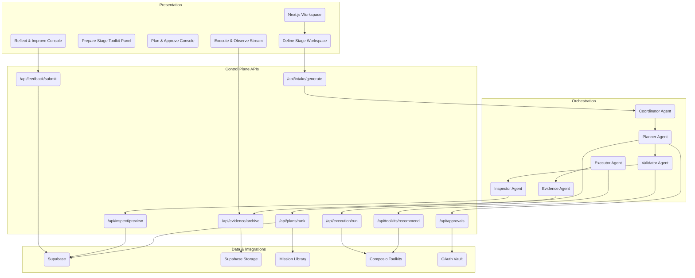

# AI Employee Control Plane: System Overview

**Version:** 3.0 (October 2025)
**Audience:** Engineering, Architecture, Technical Leadership
**Status:** Active technical blueprint

---

## Executive Summary

The AI Employee Control Plane converts a single freeform mission intent into governed execution across a consolidated **five-stage mission journey**: **Define, Prepare, Plan & Approve, Execute & Observe, Reflect & Improve**. Each stage preserves the safeguards, telemetry, and approval checkpoints established in the legacy eight-stage flow while reducing handoffs and documentation drift. Presentation, orchestration, execution, and data layers collaborate to deliver governed autonomy with continuous evidence.

Key architectural pillars:

- **Generative intent capture** that produces mission briefs, safeguards, and KPIs inside Stage 1 (Define)
- **Progressive trust** with toolkit validation and data inspection in Stage 2 (Prepare)
- **Ranked plays, approvals, and undo plans** orchestrated in Stage 3 (Plan & Approve)
- **Governed multi-agent execution** with streaming telemetry in Stage 4 (Execute & Observe)
- **Feedback loops and library updates** completing Stage 5 (Reflect & Improve)

The consolidation does not change schema or telemetry naming. Existing Supabase tables, CopilotKit interactions, Composio integrations, and Gemini ADK agent roles operate unchanged. Dashboards roll up the same events against the new stage labels, enabling teams to migrate without code changes.

> **Legacy Mapping:** Intake + Mission Brief → Define; Toolkits & Connect + Data Inspect → Prepare; Plan → Plan & Approve; Governed Execution + Evidence → Execute & Observe; Feedback → Reflect & Improve.

---

## Architecture Overview

### Layered System

1. **Presentation Layer** — Next.js (App Router) + CopilotKit CoAgents, Tailwind UI primitives, artifact gallery, approval modals
2. **Orchestration Layer** — Gemini ADK agents (Coordinator, Planner, Executor, Validator, Evidence, Inspector) with shared session state
3. **Execution Layer** — Composio toolkits, Model Context Protocol (MCP) runners, OAuth token vault, undo handlers
4. **Data Layer** — Supabase (Postgres + Storage + Functions) for mission metadata, telemetry, evidence bundles, library embeddings

### High-Level Component Graph

---

## Five-Stage Mission Journey

| Stage                 | Legacy Source                     | Primary Outcomes                                                  | Governance Checkpoints                       |
| --------------------- | --------------------------------- | ----------------------------------------------------------------- | -------------------------------------------- |
| **Define**            | Intake → Mission Brief            | Mission intent captured, safeguards aligned, brief locked         | Intent review, safeguard acceptance          |
| **Prepare**           | Toolkits & Connect → Data Inspect | Toolkits authorized, data coverage validated, readiness confirmed | Toolkit approval, data coverage attestation  |
| **Plan & Approve**    | Plan                              | Ranked plays reviewed, undo plans validated, approvals granted    | Play approval, risk sign-off                 |
| **Execute & Observe** | Governed Execution → Evidence     | Governed actions run, validator monitoring, artifacts generated   | Live execution oversight, evidence packaging |
| **Reflect & Improve** | Feedback                          | Feedback captured, library reuse identified, next steps logged    | Feedback routing, library curation           |

### Stage 1 — Define

- Intake banner (`src/app/(control-plane)/mission/define/page.tsx`) sends text to `IntakeAPI`
- Gemini/Claude parsing yields objective, audience, KPI, safeguard chips
- Supabase `mission_metadata`, `mission_safeguards` persist accepted chips with provenance
- Telemetry rollup: `intent_submitted`, `brief_generated`, `brief_item_modified`

### Stage 2 — Prepare

- Recommended toolkits via Composio discovery, prioritized by no-auth readiness
- Users authorize OAuth flows; validator flags missing scopes
- Data inspection previews sample records via MCP read-only probes
- Supabase tables: `toolkit_selections`, `data_inspection_checks`
- Telemetry rollup: `toolkit_recommended`, `toolkit_selected`, `data_preview_generated`, `safeguard_reviewed`

### Stage 3 — Plan & Approve

- Planner agent ranks plays using library embeddings (`library_entries`, `library_embeddings`)
- Undo plans generated per mutating step; stored in `mission_undo_plans`
- Approvals captured in `mission_approvals` with role-based gating
- Telemetry rollup: `planner_candidate_generated`, `plan_ranked`, `plan_approved`

### Stage 4 — Execute & Observe

- Executor agent dispatches to MCP runners; validator enforces safeguards pre- and post-call
- Evidence agent streams outputs, attaches to artifact gallery (`mission_artifacts`)
- Undo handler applies rollbacks when triggered
- Telemetry rollup: `execution_started`, `execution_step_completed`, `validator_alert_raised`, `evidence_bundle_generated`

### Stage 5 — Reflect & Improve

- Feedback modal captures qualitative + quantitative signals
- Library curator suggests reusable assets; contributions stored in `library_entries`
- Post-mission checklist prompts next-step logging (`mission_followups`)
- Telemetry rollup: `feedback_submitted`, `mission_retrospective_logged`, `library_contribution`

---

## Telemetry & Analytics Continuity

Existing event names remain unchanged. Dashboards now group events by the five-stage labels using the mapping table below.

| Telemetry Event                | Stage             | Notes                                           |
| ------------------------------ | ----------------- | ----------------------------------------------- |
| `intent_submitted`             | Define            | Entry point for mission text                    |
| `brief_generated`              | Define            | Generative chips produced                       |
| `brief_item_modified`          | Define            | User edits for audit trail                      |
| `safeguard_reviewed`           | Prepare           | Emitted when safeguards are explicitly reviewed |
| `toolkit_recommended`          | Prepare           | Ranked toolkit suggestions                      |
| `toolkit_selected`             | Prepare           | User selection captured                         |
| `data_preview_generated`       | Prepare           | MCP inspection outputs                          |
| `planner_candidate_generated`  | Plan & Approve    | Each play candidate                             |
| `plan_ranked`                  | Plan & Approve    | Final ordering emitted                          |
| `plan_approved`                | Plan & Approve    | Approval modal confirm                          |
| `execution_started`            | Execute & Observe | First governed action                           |
| `execution_step_completed`     | Execute & Observe | Step-by-step tracing                            |
| `validator_alert_raised`       | Execute & Observe | Safeguard hit, auto-fix                         |
| `evidence_bundle_generated`    | Execute & Observe | Final artifact package                          |
| `feedback_submitted`           | Reflect & Improve | Primary feedback form                           |
| `mission_retrospective_logged` | Reflect & Improve | Post-mission summary                            |
| `library_contribution`         | Reflect & Improve | Library entry or update                         |

Analytics dashboards (`supabase/functions/dashboard_views.sql`) require only an updated grouping clause to align stage filters. No schema migrations are required.

---

## Governance Alignment

- **Define:** Safeguard chips require dual acknowledgement (mission owner + governance delegate). Validator enforces accepted constraints downstream.
- **Prepare:** OAuth approvals logged with scope diff view; coverage meter must reach ≥85% before progressing.
- **Plan & Approve:** Risk matrix (impact × reversibility) reviewed alongside undo plan before granting approvals.
- **Execute & Observe:** Validator monitors each tool call; auto-fix attempts logged; manual stop available via live control strip.
- **Reflect & Improve:** Feedback routed to governance queue when safeguards were overridden or validator escalated auto-fix failures.

Governance checkpoints are callable via `mise run governance-check`, which now references five-stage labels in its output.

---

## Subsystems

### Intake & Safeguards (Define)

- `agent/tools/intake.py` handles parsing and chip scoring
- `src/lib/mission/safeguards.ts` exposes helper utilities for UI display
- Confidence weighting ensures low-certainty chips require user edits

### Toolkit Selection & Inspection (Prepare)

- `src/app/(control-plane)/mission/prepare/toolkit-panel.tsx`
- `agent/tools/composio_client.py` orchestrates discovery and authorization
- Inspection API limits data sampling to redactable fields using `src/lib/telemetry/redaction.ts`

### Planning & Approval (Plan & Approve)

- `agent/planner/plan_agent.py` ranks plays with pgvector similarity
- `src/components/PlanReviewModal.tsx` collects approvals and exposes undo plan details
- `supabase/functions/apply_approval_policy.sql` enforces role gating

### Execution & Evidence (Execute & Observe)

- `agent/executor/sequential_executor.py` coordinates MCP tool runs
- `src/components/ExecutionTimeline.tsx` streams SSE updates
- Evidence bundler writes to `supabase/storage/evidence/${missionId}` with SHA-256 verification

### Feedback & Library (Reflect & Improve)

- `src/app/(control-plane)/mission/reflect/page.tsx`
- `agent/tools/library_client.py` manages contribution suggestions
- `supabase/functions/update_library_metrics.sql` aggregates reuse signals

---

## Legacy Compatibility Notes

- URLs, API endpoints, Supabase schemas, and telemetry events remain unchanged.
- Existing missions stored with legacy stage labels receive a computed `stage_v3` column (view) for dashboards.
- Eight-stage diagrams remain archived in `docs/diagrams/eight_stage_journey.mmd` for reference; new materials use `docs/diagrams/five_stage_journey.mmd`.

---

## Migration Appendix

### Stage Mapping Reference

| Legacy Stage       | Five-Stage Destination | Rationale                                      |
| ------------------ | ---------------------- | ---------------------------------------------- |
| Intake             | Define                 | Mission capture unchanged; renamed for clarity |
| Mission Brief      | Define                 | Brief locking now part of Stage 1              |
| Toolkits & Connect | Prepare                | Authorization + toolkit selection consolidated |
| Data Inspect       | Prepare                | Coverage checks happen before planning         |
| Plan               | Plan & Approve         | Emphasizes approval checkpoint                 |
| Governed Execution | Execute & Observe      | Live execution with observers                  |
| Evidence           | Execute & Observe      | Artifact packaging tied to execution           |
| Feedback           | Reflect & Improve      | Feedback loops and library contributions       |

### Telemetry Alignment Matrix

| Event                          | Legacy Stage       | Five-Stage Destination | Action Required             |
| ------------------------------ | ------------------ | ---------------------- | --------------------------- |
| `intent_submitted`             | Intake             | Define                 | Update dashboard label only |
| `brief_generated`              | Mission Brief      | Define                 | None                        |
| `brief_item_modified`          | Mission Brief      | Define                 | None                        |
| `toolkit_recommended`          | Toolkits & Connect | Prepare                | Update stage filter         |
| `toolkit_selected`             | Toolkits & Connect | Prepare                | None                        |
| `data_preview_generated`       | Data Inspect       | Prepare                | None                        |
| `planner_candidate_generated`  | Plan               | Plan & Approve         | None                        |
| `plan_ranked`                  | Plan               | Plan & Approve         | None                        |
| `plan_approved`                | Plan               | Plan & Approve         | None                        |
| `execution_started`            | Governed Execution | Execute & Observe      | None                        |
| `execution_step_completed`     | Governed Execution | Execute & Observe      | None                        |
| `validator_alert_raised`       | Governed Execution | Execute & Observe      | None                        |
| `evidence_bundle_generated`    | Evidence           | Execute & Observe      | None                        |
| `feedback_submitted`           | Feedback           | Reflect & Improve      | None                        |
| `mission_retrospective_logged` | Feedback           | Reflect & Improve      | None                        |
| `library_contribution`         | Feedback           | Reflect & Improve      | None                        |

### Implementation Checklist

**Frontend/UI**

- Update breadcrumb labels and stage badges to five-stage terminology
- Replace `StageEightTimeline` component with `StageFiveTimeline`
- Swap diagram references to `five_stage_journey.mmd`

**Agent Orchestration**

- Ensure planner emits `plan_stage=current` metadata for dashboards
- Validator logging uses new `stage_label` constants (`DEFINE`, `PREPARE`, etc.)
- Evidence agent tags bundles with `mission_stage: "Execute & Observe"`

**Data & Analytics**

- Update Supabase view `mission_stage_rollup_vw`
- Refresh Metabase dashboards: replace eight-stage filters, add five-stage chart
- Update readiness evidence templates in `docs/readiness/*`

**Documentation & Enablement**

- Add "Legacy Mapping" subsection across docs (complete)
- Notify partner teams via Operations Playbook update (see docs/07_operations_playbook.md)
- Archive eight-stage training deck in `docs/archive/`

### Backward Compatibility Strategy

- All APIs accept legacy stage parameters but normalize to five-stage internally
- `StageBadge` component accepts both enums; legacy labels trigger deprecation warning
- Analytics exports include both `stage_legacy` and `stage_v3` columns until December 2025

### Migration Timeline (Suggested)

| Week | Focus                                   |
| ---- | --------------------------------------- |
| 1    | Documentation + UI copy updates         |
| 2    | Dashboard grouping updates              |
| 3    | Partner enablement sessions             |
| 4    | Governance sign-off on new checkpoints  |
| 5-6  | Retrospective training, update runbooks |
| 7    | Deprecate eight-stage UI assets         |
| 8    | Remove legacy toggle from feature flag  |

### Success Metrics

- 100% missions tagged with five-stage labels by Week 4
- Zero regressions in telemetry ingestion
- Governance lead sign-off on checkpoint placements
- Net promoter score for operators unchanged or improved

### Assumptions & Risks

- No Supabase schema changes are introduced
- Partner integrations rely on telemetry event names, not stage labels
- Governance sign-off requires updated runbooks (tracked in docs/07, docs/09)

### Contacts & Escalations

- Product Owner: `@product-lead`
- Engineering Lead: `@eng-lead`
- Governance Lead: `@trust-lead`
- Analytics Lead: `@analytics`

---

## Next Steps

- Coordinate with UX to publish updated `docs/diagrams/five_stage_journey.mmd`
- Align operations runbooks (docs/07) and readiness checklists (docs/09)
- Monitor telemetry dashboards post-release and capture feedback for Reflect & Improve retro
