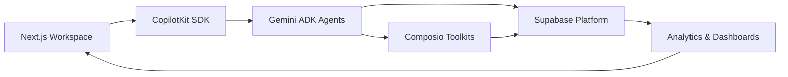

# AI Employee Control Plane: Implementation Guide

**Version:** 3.1 (October 2025)
**Audience:** Frontend, Backend, Agent, and Infra Engineers
**Status:** Authoritative build and extension manual

---

## 1. Orientation

- **Repository Root:** `/` (Next.js 15 app, FastAPI agent, Supabase schema)
- **Primary Workspaces:**
  - `src/app/(control-plane)` — Mission workspace UI (CopilotKit powered)
  - `src/app/api/*` — Next.js API routes (intake, toolkits, missions, evidence)
  - `agent/` — Gemini ADK FastAPI service (Coordinator, Planner, Executor, Validator, Evidence agents)
  - `supabase/` — Single migration (`migrations/0001_init.sql`), seed data, edge functions
  - `docs/readiness/` — Evidence artifacts for major capabilities
- **Toolchain Managed by `mise`:** Node 22.20.0, pnpm 10.18.0, Python 3.13.7, uv 0.9.2

### Setup Checklist

```bash
mise trust
mise install
mise run install       # pnpm install
mise run agent-deps    # uv sync for agent
mise run dev           # Next.js + FastAPI concurrently
```

Optional:

- `mise run ui` (UI-only)
- `mise run agent` (agent-only)
- `pnpm run test:ui`, `mise run test-agent`, `pnpm run lint`

---

## 2. Frontend (Next.js + CopilotKit)

### Architecture Highlights

- **App Router:** `src/app/(control-plane)/layout.tsx` hosts `MissionWorkspaceLayout`
- **State:** `MissionStageProvider` orchestrates five-stage flow with shared context (`DEFINE`, `PREPARE`, `PLAN_APPROVE`, `EXECUTE_OBSERVE`, `REFLECT_IMPROVE`)
- **CopilotKit Hooks:**
  - `useCopilotReadable` exposes mission brief, toolkits, safeguards
  - `useCopilotAction` handles chip acceptance, play selection, undo decisions
  - `copilotkit_emit_message` streams planner/execution updates
- **Styling:** Tailwind v4 + custom tokens (see `src/styles/tokens.ts`)
- **Testing:** Vitest + Testing Library (`pnpm test:ui`), Playwright for e2e

### Key Components

- `MissionIntake` — Define stage generative banner, chip editing controls
- `MissionBriefCard` — Persistent mission truth with edit locking
- `RecommendedToolStrip` — Toolkit recommendations, OAuth badges
- `CoverageMeter` — Prepare stage readiness radial with segment analytics
- `PlannerRail` — Plan & Approve stage streaming plays with rationale and safeguard tags
- `ExecutionPanel` — Execute & Observe stage streaming timeline with pause/cancel
- `EvidenceGallery` — Execute & Observe stage artifact cards, hash badges, export menu
- `UndoBar` — Execute & Observe stage countdown + impact summary + confirm
- `FeedbackDrawer` — Reflect & Improve stage timeline of feedback events with quick reactions

### Implementation Guidelines

- **Streaming:** Server-sent events via `/api/stream/*`; ensure SSE reconnect handlers manage `429` backoffs.
- **State Persistence:** Use `MissionWorkspaceStore` (Zustand) backed by `sessionStorage` to maintain context across reloads; persist current five-stage state for telemetry alignment.
- **Accessibility:** Wrap streaming sections in `aria-live="polite"`; provide keyboard shortcuts for primary actions.
- **Error Handling:** Display inline callouts with retry affordances; log telemetry (`error_surface_viewed`).
- **Storybook:** Add stories under `stories/mission-workspace/*.stories.tsx` with controls and accessibility notes.

---

## 3. Backend Agents (Gemini ADK)

### Service Layout

- `agent/agent.py` — FastAPI bootstrap, load `.env`, route definitions
- `agent/agents/` — Coordinator, Planner, Executor, Validator, Evidence agents
- `agent/services/` — Mission service, Composio client, Supabase client, telemetry
- `agent/tools/` — Tool abstractions, undo plans, scoring utilities
- `agent/evals/` — Evaluation configs (`smoke_foundation.json`, `dry_run_ranking.json`)

### Development Workflow

```bash
mise run agent      # hot reload FastAPI server
mise run test-agent # adk eval smoke + execution ranking
uv run --with-requirements agent/requirements.txt pytest agent/tests
```

### Agent Responsibilities

- **CoordinatorAgent** — Stage orchestration, safeguards enforcement, telemetry fan-out
- **IntakeAgent** — Chip generation, confidence scoring, rationale hints
- **PlannerAgent** — Play generation with hybrid ranking (retrieval + rule-based filters)
- **InspectorAgent** — Data coverage validation, read-only toolkit previews, capability assessment during Prepare stage
- **ExecutorAgent** — Composio tool execution, state tracking, heartbeat updates
- **ValidatorAgent** — Safeguard verification, success heuristics, undo planning
- **EvidenceAgent** — Artifact packaging, hash generation, library updates

### Patterns & Practices

- **Session State:** Persist mission context in Supabase `mission_state` table; agents read/write via transactional API.
- **Telemetry:** Use `TelemetryClient.track(event, payload)` with correlation ids; follow schema in `scripts/audit_telemetry_events.py`.
- **Safeguards:** Generate default hints, allow overrides, mirror edits back to Supabase.
- **Undo Plans:** Required for every mutating action; store in `undo_events` with rollback script reference.
- **Retries:** Exponential backoff for Composio calls; surface failure reason to planner for adaptation.

---

## 4. API Layer (Next.js Routes)

- `/api/intake/generate` — Gemini prompt orchestration and chip normalization
- `/api/toolkits/recommend` — Toolkit scoring (precedent, capability vectors)
- `/api/toolkits/authorize` — Connect Link token issuance and status polling
- `/api/inspect/preview` — Read-only Composio previews for data coverage
- `/api/plan/*` — Planner streaming endpoints (SSE)
- `/api/execution/*` — Execution triggers, heartbeat updates
- `/api/evidence/*` — Artifact retrieval, undo execution, export bundling
- `/api/feedback/*` — Feedback submission, library tagging

### Implementation Notes

- **Auth:** Supabase Auth JWT validated via middleware; internal service-to-service tokens stored in environment.
- **Rate Limiting:** per-account quotas with sliding window implemented via Supabase functions.
- **Error Surface:** Map known error codes to user-friendly messages; include incident id.
- **Testing:** Supertest integration tests under `tests/api/*.test.ts`.

---

## 5. Composio Tool Router Integration

### 5.1 Tool Router Architecture

**The AI Employee Control Plane standardizes on the Composio Tool Router as the sole interface for toolkit execution.** This production-ready meta-tool system eliminates per-toolkit MCP server selection and provides a three-phase workflow (Discovery, Authentication, Execution) across 500+ toolkits.

**Tool Router Meta-Tools (Six Total):**
- **`COMPOSIO_SEARCH_TOOLS`** — Semantic search for discovery and capability assessment (no-auth inspection)
- **`COMPOSIO_CREATE_PLAN`** — Multi-step execution planning with parallelism detection
- **`COMPOSIO_MANAGE_CONNECTIONS`** — OAuth lifecycle management (preview, create, verify, refresh, delete connections)
- **`COMPOSIO_MULTI_EXECUTE_TOOL`** — Parallel tool execution with result aggregation (governed execution)
- **`COMPOSIO_REMOTE_WORKBENCH`** — Persistent Python sandbox for processing large tool outputs and orchestrating bulk runs
- **`COMPOSIO_REMOTE_BASH_TOOL`** — Remote Bash environment for scripted transformations on Tool Router artifacts

**Session API:**
- `composio.experimental.tool_router.create_session(user_id, options)` returns a presigned MCP URL per conversation. Use this during Plan & Approve to scope Tool Router access to the current user and toolkit allowlist.

**Staging Integration (Revised Flow):**

**Define Stage (Coordinator Seeds Mission):**
- Coordinator may perform optional lightweight toolkit discovery using `COMPOSIO_SEARCH_TOOLS` to seed mission context
- No connections established; purely informational

**Prepare Stage (Inspector + Preview Connections):**
- Inspector performs no-auth discovery via `COMPOSIO_SEARCH_TOOLS` to identify available toolkits and capabilities
- Inspector uses `COMPOSIO_MANAGE_CONNECTIONS` in "preview" mode to pre-populate anticipated connection requirements
- Produces coverage reports, schema previews, and lists credentials stakeholders will need
- No OAuth credentials required yet; demonstrates value before formal requests

**Plan & Approve Stage (Planner + Validator + Formal OAuth):**
- Planner consolidates execution plan using `COMPOSIO_CREATE_PLAN`
- Validator attaches safeguards and surfaces approval checkpoints via CopilotKit
- **COMPOSIO_MANAGE_CONNECTIONS formally triggered here** after stakeholders approve scopes (creates connections and returns Auth Link URLs)
- `composio.experimental.tool_router.create_session` generates presigned MCP URLs so OAuth flows stay scoped to the mission
- After this stage, all required connections should be ready

**Execute & Observe Stage (Executor with Governed Execution):**
- Executor uses `COMPOSIO_MANAGE_CONNECTIONS` (verify action only) to check connection freshness
- Executes approved actions via `COMPOSIO_MULTI_EXECUTE_TOOL` using already-established connections
- Does NOT initiate new OAuth flows; only verifies existing connections are active
- Tool Router handles authentication refresh, rate limiting, and error recovery internally
- Advanced workflows may use `COMPOSIO_REMOTE_WORKBENCH` (Python sandbox) or `COMPOSIO_REMOTE_BASH_TOOL` (scripted transforms) for large-result processing

### 5.2 Tool Router Implementation Patterns

**Inspector Agent Pattern (No-Auth Discovery + Preview Connections):**

```python
# Prepare Stage - discovery and preview anticipated connections
async def inspect_mission(mission_objective: str) -> InspectionReport:
    # 1. Discover toolkits (no credentials required)
    search_response = await tool_router.execute({
        "tool": "COMPOSIO_SEARCH_TOOLS",
        "params": {
            "query": mission_objective,
            "limit": 10,
            "include_metadata": True
        }
    })

    toolkits = [parse_toolkit(tk) for tk in search_response["toolkits"]]

    # 2. Preview anticipated connections (pre-populate credential requirements)
    anticipated_connections = []
    for toolkit in toolkits:
        if toolkit.requires_oauth:
            preview_response = await tool_router.execute({
                "tool": "COMPOSIO_MANAGE_CONNECTIONS",
                "params": {
                    "action": "preview",  # Preview mode - does not initiate OAuth
                    "toolkit": toolkit.name,
                    "mode": "anticipated"
                }
            })
            anticipated_connections.append({
                "toolkit": toolkit.name,
                "scopes_needed": preview_response["required_scopes"],
                "auth_flow": preview_response["flow_type"]  # e.g., "oauth2", "api_key"
            })

    # Returns coverage report + anticipated connection list for stakeholder review
    return InspectionReport(
        toolkits=toolkits,
        anticipated_connections=anticipated_connections,
        coverage_estimate=calculate_coverage(toolkits, mission_objective)
    )
```

**Planner + Validator Pattern (Plan & Approve Stage - Formal OAuth):**

```python
# Plan & Approve Stage - establish connections after stakeholder approval
from composio import Composio

composio = Composio()

async def establish_connections(approved_scopes: list[dict], user_id: str):
    """Formally trigger OAuth after stakeholder approval in Plan & Approve stage."""

    # Create a Tool Router session scoped to this user/mission
    session = composio.experimental.tool_router.create_session(
        user_id=user_id,
        options={"toolkits": [scope["toolkit"] for scope in approved_scopes]}
    )

    connections = []
    for scope in approved_scopes:
        connection_response = await tool_router.execute({
            "tool": "COMPOSIO_MANAGE_CONNECTIONS",
            "params": {
                "action": "create",
                "toolkit": scope["toolkit"],
                "scopes": scope["permissions"],
                "session_url": session["url"]
            }
        })

        connections.append(connection_response["connection_id"])

    return connections  # Ready for Execute & Observe stage
```

**Executor Agent Pattern (Execute & Observe - Verify & Execute):**

```python
# Execute & Observe Stage - verify connections and execute with already-established OAuth
async def execute_mission_plan(plan: ExecutionPlan, connection_id: str):
    # 1. Verify OAuth connection freshness (does NOT initiate new OAuth flows)
    connection_status = await tool_router.execute({
        "tool": "COMPOSIO_MANAGE_CONNECTIONS",
        "params": {
            "action": "verify",
            "connection_id": connection_id
        }
    })

    if not connection_status["active"]:
        # Connection expired - Tool Router will attempt auto-refresh
        # If refresh fails, surface error to user (do not initiate new OAuth in Execute stage)
        raise ConnectionExpiredError("OAuth connection expired; please re-approve in Plan stage")

    # 2. Execute tools in parallel via Tool Router (governed execution)
    execution_response = await tool_router.execute({
        "tool": "COMPOSIO_MULTI_EXECUTE_TOOL",
        "params": {
            "connection_id": connection_id,
            "actions": [
                {"toolkit": "gmail", "action": "send", "params": {...}},
                {"toolkit": "slack", "action": "post_message", "params": {...}}
            ],
            "parallel": True,
            "timeout_seconds": 30
        }
    })

    return execution_response["results"]
```

**Safeguards Integration:**

Tool Router operations integrate with Validator agent safeguards:

```python
# Before execution, validator checks against safeguards
async def validated_execute(action: ToolAction, safeguards: list[Safeguard]):
    # 1. Validator pre-checks
    validation = await validator.check(action, safeguards)

    if not validation.passed:
        if validation.auto_fix_available:
            action = validation.apply_fix(action)
        else:
            raise SafeguardViolation(validation.reason)

    # 2. Execute via Tool Router
    result = await tool_router.execute({
        "tool": "COMPOSIO_MULTI_EXECUTE_TOOL",
        "params": {"actions": [action.to_dict()]}
    })

    # 3. Validator post-checks
    await validator.verify_result(result, safeguards)

    return result
```

### 5.3 Tool Router Best Practices

**Discovery Optimization:**
- Cache `COMPOSIO_SEARCH_TOOLS` results per mission objective (1-hour TTL)
- Use semantic search with mission keywords for relevant toolkit filtering
- Limit results to top 10 toolkits to reduce context usage
- Store toolkit metadata in Supabase for offline analysis

**OAuth Management:**
- Use `COMPOSIO_MANAGE_CONNECTIONS` to verify connection status before each execution
- Handle OAuth refresh automatically via Tool Router's internal retry logic
- Surface connection errors to user with clear "reconnect" affordances
- Track connection lifecycle events for governance dashboards

**Execution Safeguards:**
- Always validate actions through Validator before calling `COMPOSIO_MULTI_EXECUTE_TOOL`
- Set execution timeouts (30s default, configurable per toolkit)
- Handle rate limit errors (429) with exponential backoff
- Log all tool calls (redacted) for audit trails and evidence bundles

**Context Management:**
- Tool Router operations consume ~20k tokens per session on average
- Optimize by: (1) batching discovery queries, (2) caching plans, (3) limiting concurrent executions
- Monitor token usage via telemetry and alert when approaching LLM limits

**Error Handling:**
```python
async def robust_tool_router_call(tool: str, params: dict):
    try:
        result = await tool_router.execute({"tool": tool, "params": params})
        return result
    except RateLimitError as e:
        # Tool Router handles retries internally, surface to user if exhausted
        await notify_user(f"Rate limit hit, retry after {e.retry_after}s")
        raise
    except OAuthExpiredError:
        # Prompt user to reconnect
        await trigger_oauth_refresh(params["connection_id"])
        return await tool_router.execute({"tool": tool, "params": params})
    except ToolkitNotFoundError:
        # Toolkit may have been deprecated, run discovery again
        await refresh_toolkit_cache()
        raise
```

**Reference:** See `libs_docs/composio/llms.txt` for complete Tool Router API documentation, meta-tool parameters, OAuth flows, and error codes.

### Partner Integration Architecture



**Integration References:**
- **CopilotKit:** See `libs_docs/copilotkit/llms-full.txt` for CoAgents patterns, streaming SSE, frontend actions, and state management
- **Gemini ADK:** See `libs_docs/adk/llms-full.txt` for agent orchestration, evaluation frameworks, and session coordination
- **Supabase:** See `libs_docs/supabase/llms_docs.txt` for database APIs, storage patterns, edge functions, and real-time subscriptions
- **Composio Tool Router:** See reference above and `libs_docs/composio/llms.txt` for meta-tool API specifications

---

## 6. Supabase Data Layer

- **Schema:** Single migration `supabase/migrations/0001_init.sql`
  - Key tables: `missions`, `mission_metadata`, `toolkits`, `mission_toolkits`, `undo_events`, `artifacts`, `mission_feedback`
  - Views: `mission_activity_feed`, `mission_performance_dashboard`, `governance_incidents`
- **Policies:** RLS ensures persona-specific access (operators vs. governance vs. admins)
- **Edge Functions:** `verify_undo`, `export_evidence`, `trigger_analytics`
- **Cron:** Nightly library embedding refresh, weekly telemetry rollups
- **Types:** Regenerate after schema changes:
  ```bash
  supabase gen types typescript --linked --schema public,storage,graphql_public > supabase/types.ts
  pnpm tsc --noEmit
  ```

---

## 7. Telemetry & Analytics

- **Event Catalog:** 37 canonical events (frontend + backend). Maintain schema in `scripts/audit_telemetry_events.py`.
- **Collection:** `telemetry_client.ts` (frontend) → `/api/telemetry` → Supabase `telemetry_events`
- **Dashboards:** Supabase SQL + Metabase (if connected) for executive, governance, operations views.
- **Redaction:** Use `src/lib/telemetry/redaction.ts` helpers to scrub PII.
- **Audits:** Run `pnpm ts-node scripts/audit_telemetry_events.py --mode check` before releases.

---

## 8. Testing Strategy

- **Frontend:**
  - Unit: `pnpm test:ui`
  - Integration: Playwright `pnpm test:e2e`
  - Accessibility: `pnpm run test:a11y` (axe CLI)
- **Agent:** `mise run test-agent` (ADK evals), `pytest agent/tests`
- **API:** `pnpm test:api`
- **Supabase:** `supabase db reset --seed supabase/seed.sql` for local reproducibility
- **Performance:** `pnpm run test:perf` (Lighthouse + k6 scripts)
- **Observability:** Validate metrics/log traces via staging Grafana dashboards

---

## 9. Operational Readiness

- **Environments:** local → dev → staging → production
- **Deployment:**
  - Next.js: Vercel or custom Docker (production should pin environment variables from `.env.production`)
  - FastAPI: Fly.io or GKE (use `scripts/deploy-agent.sh`)
  - Supabase: Apply migration via CI pipeline, confirm types generation
- **Secrets Management:** `.env` for local, environment-specific vault for production
- **Monitoring:**
  - Metrics: Datadog dashboards (latency, error rates, planner success)
  - Logs: Structured JSON shipped via OTLP
  - Alerts: On-call rotation via PagerDuty, rules for heartbeat misses, undo failures, SLA breaches
- **Runbooks:** Store incident guides in `docs/readiness/runbooks/*.md`

---

## 10. Extension Playbooks

- **Add a New Stage:** Define stage contract, extend `MissionStageProvider`, add telemetry, update UX blueprint.
- **Introduce New Toolkit:** Register metadata in Supabase, implement Composio connector, add recommendation logic, document scopes.
- **Expand Library Learning:** Add embedding retraining script, update planner retrieval pipeline, monitor reuse metrics.
- **Create New Dashboard:** Add Supabase view, update Metabase, document metrics origin, ensure telemetry coverage.

---

## 11. Change Management

- **Proposal Process:** RFC in `docs/rfcs/`, review with Product, UX, Trust, and Engineering leads.
- **Testing Requirements:** No merges without lint, tests, agent evals passing; include evidence artifact references in PR description.
- **Documentation:** Update relevant sections in `docs` alongside code changes.
- **Release Notes:** Publish weekly changelog summarizing mission improvements, toolkit additions, safeguards updates.

---

## 12. Resources

- `docs/01_product_vision.md` — Business context
- `docs/02_system_overview.md` — Architecture reference
- `docs/03_user_experience.md` — UX contracts and telemetry matrix
- `docs/readiness/` — Evidence artifacts and checklists
- `libs_docs/` — Partner SDK quick references (CopilotKit, Composio, ADK, Supabase)
