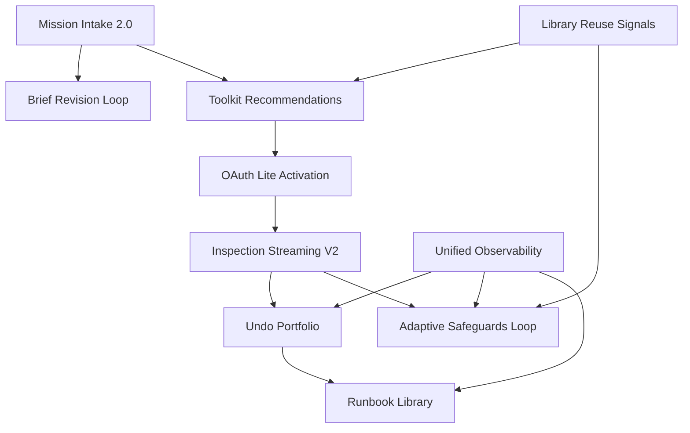

# AI Employee Control Plane: Capability Roadmap

**Version:** 3.0 (October 2025)
**Audience:** Product, Program Management, Engineering Leadership
**Status:** Unified capability progression replacing legacy gates

---

## 1. Purpose

The Control Plane now operates as a single continuous system aligned with the seven-stage mission journey. Instead of rigid gate silos, we track five capability pillars that mature together and map to stages as follows:

1. **Generative Intake & Briefing** *(Stage 1 — Define)* — Objective-first onboarding with editable chips
2. **Capability Orchestration** *(Stage 2 — Prepare)* — Toolkit discovery, stakeholder-reviewed Connect Link OAuth, and readiness validation before planning
3. **Evidence & Undo Confidence** *(Stage 5 — Execute)* — Dry-run artifacts, undo plans, audit trails
4. **Learning & Intelligence** *(Stages 3, 4, 6 — Plan, Approve, Reflect)* — Telemetry loops, library reuse, adaptive safeguards
5. **Operational Excellence** *(All Stages, including Stage 0 — Home)* — Monitoring, compliance, and incident readiness

This roadmap articulates milestones across pillars, their interdependencies, and the evidence required to ship with confidence.

---

## 2. Milestone Framework

Each milestone adheres to this template:

| Field            | Description                                     |
| ---------------- | ----------------------------------------------- |
| **Objective**    | Business and user outcome                       |
| **Scope**        | Surfaces, agents, APIs, data changes            |
| **Evidence**     | Artifacts proving readiness (docs/readiness/\*) |
| **Telemetry**    | Events required for instrumentation             |
| **Risks**        | Known risks + mitigation owner                  |
| **Dependencies** | Other milestones or external partners           |
| **Status**       | ✅ done · ⚠️ in progress · ❌ not started       |

---

## 3. Capability Milestones

### A. Generative Intake & Briefing (Stage 1 — Define)

1. **Mission Intake 2.0** (Status: ❌)
   - Objective: One-prompt mission creation
   - Scope: Intake banner, chip editing, confidence badges
   - Evidence: `docs/readiness/intake_acceptance_report.md`
   - Telemetry: `intent_submitted`, `brief_generated`, `brief_item_modified`
   - Risks: Prompt drift (mitigated via weekly evals)
   - Dependencies: Gemini prompt tuning pipeline

2. **Brief Revision Loop** (Status: ❌)
   - Objective: Editable brief loop without losing downstream context
   - Scope: Brief reopening, diff visualization, planner rehydration
   - Evidence: `docs/readiness/brief_edit_resilience.md`
   - Telemetry: `mission_brief_reopened`, `mission_brief_diff_applied`
   - Risks: Stage context mismatch (owner: Frontend Platform)
   - Dependencies: Planner diff resilience work

### B. Capability Orchestration (Stage 2 — Prepare)

1. **Toolkit Recommendations** (Status: ❌)
   - Objective: Recommend top 3 toolkits with rationale and success metrics
   - Scope: Recommendation service, capability scoring, UI badges
   - Evidence: `docs/readiness/toolkit_recommendation_accuracy.md`
   - Telemetry: `toolkit_recommendation_viewed`, `toolkit_selected`
   - Risks: Outdated capability vectors (owner: Data Platform)
   - Dependencies: Library embeddings refresh

2. **OAuth Lite Activation** (Status: ❌)
   - Objective: Progressive OAuth initiated by Inspector during Prepare stage with scope explanations and rollback
   - Scope: Connect Link integration, scope previews, audit logging
   - Evidence: `docs/readiness/oauth_scope_audit.md`
   - Telemetry: `connect_link_completed`, `connection_deferred`
   - Risks: Vendor rate limits (owner: Integrations)
   - Dependencies: Composio scope metadata

### C. Evidence & Undo Confidence (Stage 5 — Execute)

1. **Inspection Streaming V2** (Status: ❌)
   - Objective: Reliable streaming with <5s heartbeat and retry resilience
   - Scope: SSE pipeline, heartbeat telemetry, pause/resume UI
   - Evidence: `docs/readiness/inspection_resilience.md`
   - Telemetry: `execution_started`, `execution_step_completed`, `execution_completed`
   - Risks: Network instability (mitigation: exponential backoff)
   - Dependencies: Executor heartbeat service

2. **Undo Portfolio** (Status: ❌)
   - Objective: Every mutating action ships with rollback plan and countdown
   - Scope: `undo_events` schema, EvidenceAgent undo generation, UI countdown
   - Evidence: `docs/readiness/undo_efficacy.md`
   - Telemetry: `undo_requested`, `undo_completed`
   - Risks: Insufficient rollback coverage (owner: Trust Engineering)
   - Dependencies: Supabase function `verify_undo`

### D. Learning & Intelligence (Stages 3, 4, 6 — Plan, Approve, Reflect)

1. **Library Reuse Signals** (Status: ❌)
   - Objective: Recommend proven plays based on mission context
   - Scope: Library embeddings, planner retrieval integration, reuse metrics
   - Evidence: `docs/readiness/library_reuse_metrics.md`
   - Telemetry: `library_play_recommended`, `library_play_activated`
   - Risks: Cold-start bias (mitigation: curated playbooks)
   - Dependencies: Data Intelligence pipeline

2. **Adaptive Safeguards Feedback Loop** (Status: ❌)
   - Objective: Safeguards improve based on human edits and validator outcomes
   - Scope: Safeguard feedback schema, planner prompt updates, analytics dashboard
   - Evidence: `docs/readiness/safeguard_learning_loop.md`
   - Telemetry: `safeguard_edited`, `validator_override_requested`
   - Risks: Conflicting edits (owner: Planner Team)
   - Dependencies: Feedback drawer instrumentation

### E. Operational Excellence (Cross-Stage)

1. **Unified Observability** (Status: ❌)
   - Objective: Single dashboard for latency, success rates, safeguard incidents
   - Scope: Datadog dashboards, alerting rules, Supabase views
   - Evidence: `docs/readiness/observability_dashboard.md`
   - Telemetry: Aggregated from mission events + infrastructure metrics
   - Risks: Alert fatigue (owner: Operations)
   - Dependencies: Data warehouse sync

2. **Runbook Library** (Status: ❌)
   - Objective: Complete incident playbooks for frontline responders
   - Scope: `docs/readiness/runbooks/*.md`, on-call rotation, escalation maps
   - Evidence: `docs/readiness/runbook_validation.md`
   - Telemetry: `incident_opened`, `incident_resolved`
   - Risks: Stale procedures (owner: Incident Management)
   - Dependencies: Operations Playbook completion

---

## 4. Dependency Graph

---

## 5. Evidence Management

- Store readiness proof in `docs/readiness/<capability>/<artifact>.md`
- Link artifacts in milestone entries and PR descriptions
- Maintain evidence index spreadsheet to track owner, last updated, and validation status
- Automate checks via CI to confirm referenced artifacts exist and are updated within 30 days

---

## 6. Release Cadence & Governance

**Automation-First Execution Philosophy:**

- **Inspection validation:** Every milestone ships with automated inspection tests proving core functionality without credentials
- **Evidence automation:** CI/CD generates readiness artifacts (performance reports, test coverage, accessibility audits) on every build
- **Self-service metrics:** Dashboards auto-refresh from telemetry, reducing manual status reporting overhead
- **Continuous evaluation:** ADK eval suites run on every PR, blocking merge if pass rate drops below 90%

**Release Rhythm:**

- **Cadence:** Two-week sprints with monthly executive demo (focus on outcome metrics)
- **Decision Forum:** Weekly roadmap review with Product, Engineering, Trust, and Operations
- **Risk Register:** Track top risks, mitigation owners, review bi-weekly
- **Change Control:** Major capability changes require RFC + sign-off from affected pillar leads
- **Automation Review:** Monthly review of CI/CD gate effectiveness, evidence artifact quality, and telemetry coverage

---

## 7. Metrics & Targets

| Pillar                  | Metric                             | Target Q4 2025   |
| ----------------------- | ---------------------------------- | ---------------- |
| Intake & Briefing       | Mission acceptance without edit    | ≥80%             |
| Orchestration           | Toolkit connection completion rate | ≥65%             |
| Evidence & Undo         | Undo success rate                  | ≥95%             |
| Learning & Intelligence | Library reuse rate                 | ≥40% of missions |
| Operational Excellence  | Incident mean time to resolve      | ≤30 min          |

Monitor metrics via Supabase dashboards and Datadog alerts. Investigate variances >10% within 48 hours.

---

## 8. Communication Plan

- Weekly digest summarizing milestone status and risks
- Monthly webinar for stakeholders highlighting business impact
- Internal wiki page linking to most recent roadmap snapshot
- Quarterly partner sync with Composio, CopilotKit, Gemini teams on integration roadmaps

---

## 9. Looking Ahead

Future pillars under exploration:

- **Autonomous Negotiation** — Agents negotiating guardrails with stakeholders
- **Self-Tuning Prompts** — Auto-synthesized prompt patches from telemetry
- **Marketplace Integrations** — Community toolkit submissions with review workflows
- **Policy Simulation** — Sandbox to test safeguards before production

Track early experiments in `docs/research/` and surface in roadmap reviews when ready.

---

## 10. Automation & Continuous Improvement Priorities

To maintain velocity and quality, prioritize these automation investments alongside feature development:

### CI/CD Enhancements

- **Automated Evidence Generation** — Script to compile readiness artifacts from test results, telemetry, and coverage reports
- **Performance Regression Detection** — Alert when latency SLOs breach thresholds in staging deployments
- **Accessibility Gate Enforcement** — Block merges when critical a11y violations detected (currently informational)
- **ADK Eval Coverage Expansion** — Add eval suites for new agents (Inspector, Evidence) to match Planner/Validator coverage

### Operational Automation

- **Self-Healing OAuth Tokens** — Automated re-auth flow when Composio connection health checks fail
- **Library Embedding Auto-Refresh** — Weekly pgvector reindexing with monitoring and rollback on quality degradation
- **Telemetry Anomaly Detection** — Real-time alerts for abnormal patterns (event volume spikes, missing events, latency outliers)
- **Runbook Validation** — Quarterly automated tests of incident response procedures in staging

### Developer Experience

- **One-Command Environment Setup** — Streamline `mise run bootstrap` to handle all deps, migrations, and seed data
- **Hot-Reload Agent Changes** — Reduce agent iteration time with better FastAPI auto-reload configuration
- **Pre-Commit Hooks** — Automated linting, type checking, and telemetry schema validation before commits
- **Documentation Sync Checks** — CI validation that code changes include corresponding doc updates

### Cross-Functional Alignment

- **Partner API Change Detection** — Automated monitoring of Composio, CopilotKit, ADK, Supabase SDK releases with breaking change alerts
- **Compliance Dashboard Automation** — Generate governance reports (undo efficacy, safeguard overrides) without manual data export
- **Executive Metric Auto-Refresh** — Nightly dashboard updates with narrative summaries for board presentations

**Ownership:** Engineering Platform team with quarterly reviews by Product, Operations, and Trust leads.

**Success Metrics:**

- Evidence artifact generation time: <5 minutes per milestone
- CI/CD pipeline duration: ≤15 minutes for full test suite
- Manual reporting overhead reduction: 75% by Q2 2026
- Incident detection-to-alert time: ≤2 minutes for critical issues

---

## 11. Open Questions & Follow-Up Items

### Pending Decisions

1. **Codex Integration Depth** — Should agent prompt generation leverage Codex/Claude Code for self-improving templates? (Impact: Library learning loop complexity)
2. **Multi-Model Routing** — Should planner/validator use different LLM providers for cost/latency optimization? (Impact: Prompt parity requirements)
3. **Evidence Bundle Versioning** — How long should artifact history be retained? (Impact: Storage costs, compliance windows)
4. **Library Marketplace** — Public vs. private play sharing model? (Impact: Security review, moderation overhead)

### Deferred Enhancements (Post-Scale Milestone)

- Cross-mission dependency tracking (e.g., "Mission B requires artifacts from Mission A")
- Agent-to-agent negotiation for conflicting safeguards
- Autonomous prompt patching based on telemetry feedback loops
- Trigger-driven mission orchestration (event chains across toolkits)

**Review Cadence:** Revisit open questions monthly in roadmap forums; surface for decision when blocking progress or architecture clarity needed.
