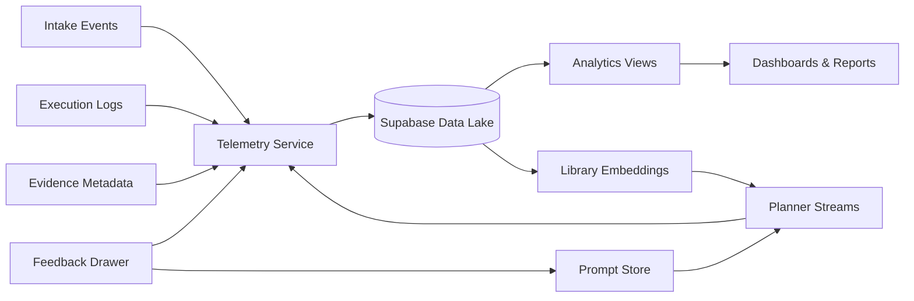
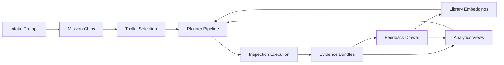
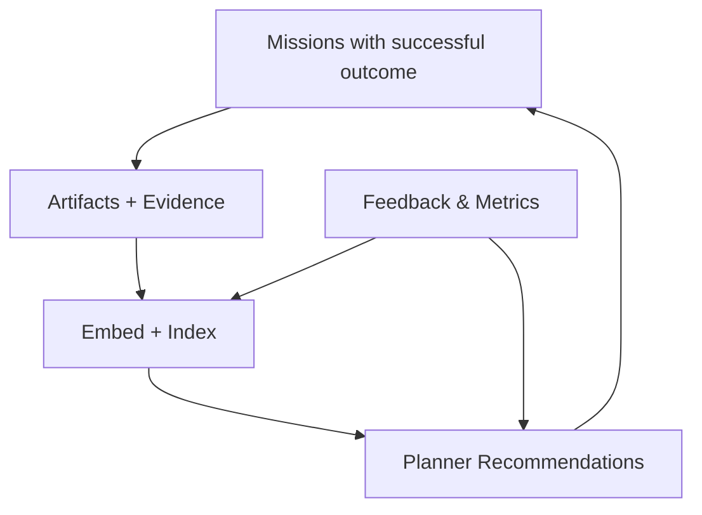

# AI Employee Control Plane: Data Intelligence Playbook

**Version:** 2.0 (October 2025)
**Audience:** Data Engineering, Analytics, Product Ops, Governance
**Status:** Authoritative reference for telemetry, analytics, and learning loops

---

## 1. Intelligence Philosophy

- **Every mission is a learning opportunity.** Capture inputs, decisions, outcomes, and feedback.
- **Telemetry is a product surface.** Visibility enables trust, governance, and iteration.
- **Privacy-respecting by default.** Redact PII before storage; minimize sensitive retention.
- **Closed-loop feedback.** Planner, validator, and safeguard prompts adapt based on telemetry insights.

---

## 2. Data Architecture Overview

- **Telemetry Service:** Consolidates frontend and backend events, applies redaction helpers, forwards to Supabase `telemetry_events`.
- **Supabase Data Lake:** Mission tables, telemetry events, undo events, library entries, analytics views, materialized metrics.
- **Dashboards:** Metabase or Supabase Studio for persona-specific insights.
- **Feedback Loop:** Library embeddings and prompt patches inform future agent recommendations.

### End-to-End Mission Data Flow

The following diagram highlights how mission inputs, tooling selections, execution outputs, and analytics feedback reinforce one another.

---

## 3. Event Catalog Highlights

All telemetry enters Supabase through the shared `telemetry_events` table (`event_type`, `stage`, `status`, `context`, `payload_sha`). Categorize new events before shipping and update `scripts/audit_telemetry_events.py` accordingly.

| Category | Events | Notes |
|----------|--------|-------|
| Intake | `intent_submitted`, `brief_generated`, `brief_item_modified` | Token counts, tone hints, safeguard presence |
| Discovery & Inspection | `composio_discovery`, `toolkit_recommendation_viewed`, `toolkit_selected`, `data_preview_generated` | Coverage %, latency, auth requirements |
| Planning | `planner_candidate_generated`, `plan_ranked`, `plan_approved`, `planner_retry_requested` | Confidence, validator critique |
| Connect Link & Auth | `composio_auth_flow` | Track initiation → approval → expiry (`status` field) |
| Execution | `execution_started`, `execution_step_completed`, `execution_paused`, `execution_completed` | Tool call ids, latency, undo hints |
| Composio Tooling | `composio_tool_call`, `composio_tool_call_error` | Outcome envelope (`success`, `rate_limit`, `auth_expired`) |
| Validator & Safeguards | `validator_alert_raised`, `validator_override_requested` | Severity, safeguard id, auto-fix status |
| Workspace & UX | `inspection_viewed`, `approval_granted`, `rollback_triggered`, `workspace_stream_open` | CopilotKit session activity + sampling flags |
| Sessions & Agents | `session_heartbeat` | Gemini ADK agent heartbeat (lag + token usage in payload) |
| Evidence | `artifact_published`, `undo_requested`, `undo_completed`, `evidence_bundle_generated` | Artifact hash, rollback plan |
| Feedback | `feedback_submitted`, `satisfaction_recorded`, `followup_scheduled` | Effort saved, blockers |
| Governance | `safeguard_edited`, `incident_opened`, `incident_resolved` | Persona, audit references |

> **Telemetry hygiene:** propagate `mission_id`, `tenantId`, `toolkit`, and `action` across all event families. When CopilotKit runs with `telemetryDisabled` or a reduced sample rate, emit `workspace_stream_open` with `sampling_mode` so downstream dashboards can adjust denominators.

**Reference sources:** `libs_docs/composio/llms.txt` (native SDK events), `libs_docs/copilotkit/llms-full.txt` (workspace telemetry), `libs_docs/adk/llms-full.txt` (agent heartbeats), and `libs_docs/supabase/llms_docs.txt` (telemetry storage best practices).

---

## 4. Analytics Views

### Executive Dashboard (`views/executive_summary`)
- Metrics: Weekly approved missions, inspection → activation conversion, pipeline impact, automation coverage
- Dimensions: Persona, business unit, mission type
- Visuals: Multi-line trends, stacked bar for mission types, tooltip for evidence references

### Governance Dashboard (`views/governance_insights`)
- Metrics: Safeguard edits, overrides, undo success, incident frequency
- Drill-down: Mission timeline, evidence bundle, actor list
- Alerts: Undo success <95%, incident MTTR >30 min

### Operations Dashboard (`views/operations_health`)
- Metrics: Latency percentiles, SSE heartbeat, Composio rate limits, planner error rate
- Integrations: Datadog metrics overlay
- Actions: Trigger runbook link, open incident ticket

### Growth & Adoption Dashboard (`views/adoption_funnel`)
- Metrics: Intent submissions, brief acceptance, toolkit connections, activation approvals
- Conversion funnel visualization with persona segmentation

Regenerate materialized views nightly; ensure Supabase cron refresh completes within SLA.

---

## 5. Learning Loops

### Loop 1: Generative Quality

1. Capture chip edits (`brief_item_modified`)
2. Analyze edit patterns (which chip types change, token diffs)
3. Update prompt templates and tone guidance
4. Measure acceptance rate (target ≥80%)

### Loop 2: Planner Excellence

1. Track planner rejections and manual overrides
2. Feed negative signals into retrieval scoring
3. Adjust weighting for library vs. generative plays
4. Validate via `adk eval` execution ranking suite

### Loop 3: Safeguard Reinforcement

1. Record safeguard edits and validator overrides
2. Cluster feedback by theme (tone, budget, timing)
3. Update safeguard generation prompts
4. Monitor reduction in manual edits

### Loop 4: Library Growth

1. Capture artifacts pinned to library
2. Embed mission + artifact context
3. Boost future recommendations when context matches
4. Track library reuse rate (target ≥40%)

#### Library Learning Loop Diagram

---

## 6. Data Governance & Privacy

- **Redaction:** Use `src/lib/telemetry/redaction.ts` to scrub PII (emails, phone numbers, account ids)
- **Retention:** Telemetry raw events retained 180 days; aggregated views indefinitely
- **Access Controls:** RLS on telemetry tables by persona; analytics roles via Supabase Auth groups
- **Compliance:** SOC2 logging expectations met via evidence bundles and audit trails; export function for compliance reviews
- **Incident Response:** If redaction failure detected, trigger incident runbook, rotate tokens, and purge affected records

---

## 7. Tooling & Automation

- **Scripts:**
  - `scripts/audit_telemetry_events.py` — Validates schema and coverage
  - `scripts/run_metrics_refresh.py` — Triggers view refresh and metrics export
  - `scripts/export_evidence_bundle.py` — Packages mission evidence for auditors
- **Testing:** Add unit tests for analytics SQL via `supabase/tests/*.sql`
- **CI Gates:** Enforce `pnpm ts-node scripts/audit_telemetry_events.py --mode check` on PRs touching analytics

---

## 8. Reporting Cadence

- **Daily:** Health check (SSE latency, telemetry ingestion rate, error spikes)
- **Weekly:** Executive summary + adoption funnel review
- **Monthly:** Persona deep dive (e.g., Revenue vs. Customer Operations)
- **Quarterly:** Governance audit (undo efficacy, safeguard overrides)
- **Ad-hoc:** Incident retrospectives, experiment readouts

---

## 9. Future Investments

- **Predictive Confidence Scores:** Train model to predict execution success before commitment
- **Autonomous Prompt Patching:** Auto-generate prompt improvements based on telemetry signals
- **Library Recommendation Marketplace:** Surface community-shared plays with rating system
- **Anomaly Detection:** Real-time alerts for abnormal mission behavior (tool execution spikes, unexpected edits)

Track experiments in `docs/research/data_intelligence/*.md` and integrate successful prototypes into pipeline.
