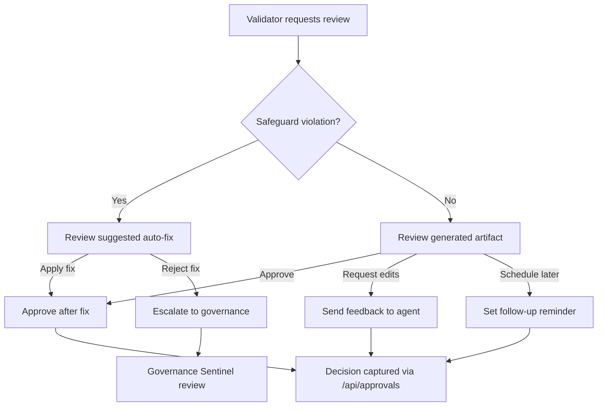

# Reviewer Workflow — Gate G-B Dry-Run Proof Loop

_Last updated: October 10, 2025_

This SOP outlines how governance reviewers participate in the Gate G-B
dry-run loop. The process mirrors the UX blueprint (`new_docs/ux.md §4–§7`) and
the planner/validator orchestration described in `new_docs/architecture.md`.

## Roles

- **Reviewer**: Approves or requests changes for validator interruptions.
- **Runtime Steward**: Monitors telemetry and ensures undo plans are viable.
- **Governance Sentinel**: Captures decisions and follows up on policy exceptions.

## Decision Flow

## Approval Modal Checklist

1. **Context** — Verify mission goal, selected play, and guardrail summary.
2. **Suggested Fixes** — Apply validator-suggested tone/quiet-hour adjustments when available.
3. **Undo Plan** — Confirm `undo_plan_json` contains clear instructions; request updates if missing.
4. **Decision** — Choose Approve, Request Changes, Schedule, or Escalate.
5. **Annotation** — Provide reviewer note summarising rationale (mandatory for Request Changes or Escalate).

## Telemetry Expectations

- `approval_required` emitted when modal opens.
- `approval_decision` captured on submit with `decision`, `reviewer_id`, and `mission_id`.
- `undo_requested`/`undo_completed` tied to post-approval actions when relevant.

## Evidence Capture

After each review the following artefacts should be updated:

- `artifacts` table entry with reviewer note appended to the corresponding proof pack.
- `docs/readiness/undo_trace_G-B.md` whenever undo is executed.
- `docs/readiness/dry_run_verification.md` if the scenario participates in stopwatch tracking.

## Outstanding Tasks

- Finalise reviewer training session recordings and store alongside this SOP.
- Integrate reviewer decisions into `scripts/audit_telemetry_events.py` summaries once Supabase staging data is populated.
- Capture governance sign-off in `docs/readiness/governance_signoff_G-B.md` (pending).

