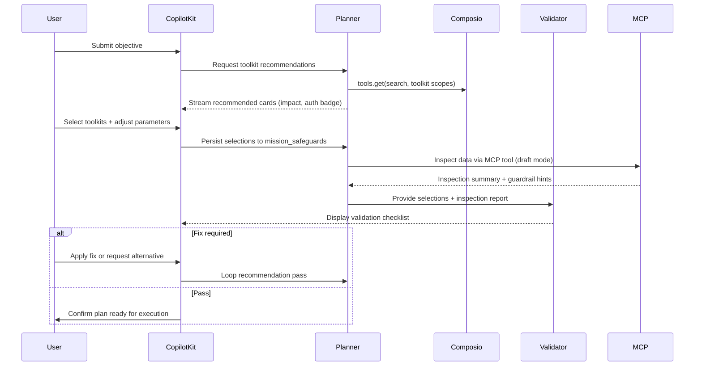
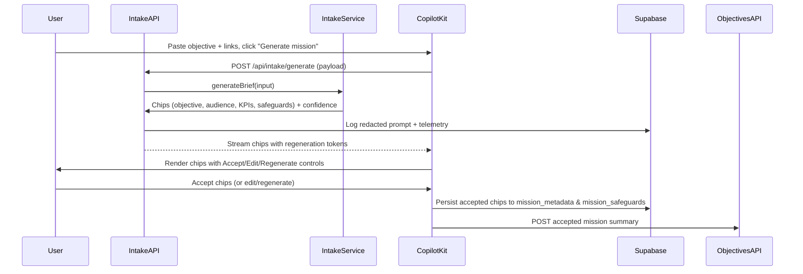
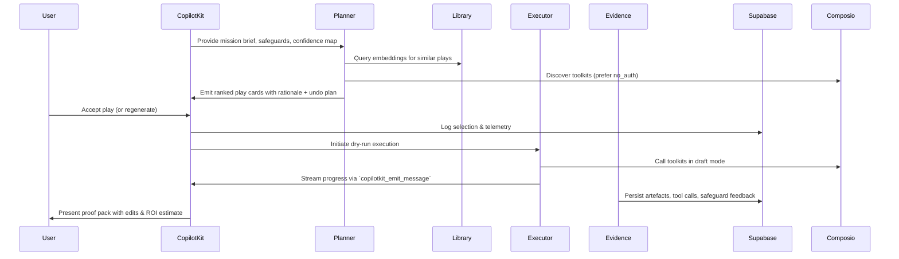
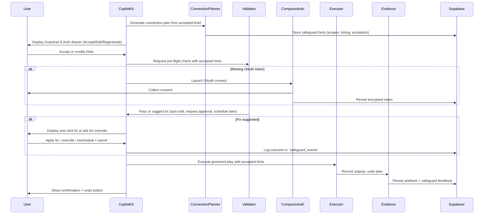
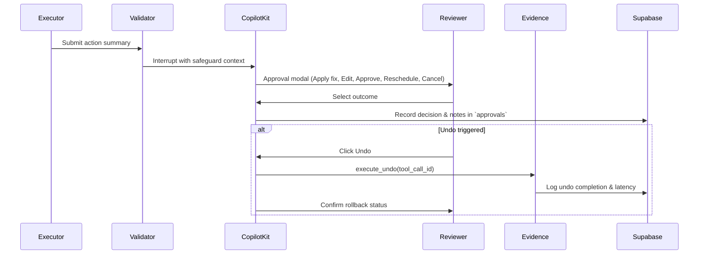

# AI Employee Control Plane — Technical Architecture (October 8, 2025)

This blueprint describes the generative-first architecture that powers Gates G-A through G-E of the AI Employee Control Plane. It is designed to be read alongside the Business PRD (`new_docs/prd.md`), UX Blueprint (`new_docs/ux.md`), and the Checkpoint Control Plan (`new_docs/todo.md`). Partner references live in `libs_docs/` (CopilotKit, Composio, Gemini ADK, Supabase) and should be consulted whenever SDK contracts change.

---

## 0. Repository Snapshot

- **Frontend:** Next.js 15 experience under `src/app`; the CopilotKit workspace lives at `src/app/(control-plane)` with API routes in `src/app/api/*`.
- **Agent Backend:** Gemini ADK FastAPI service (`agent/agent.py`) orchestrating Coordinator, Planner, Executor, Validator, Evidence, and helper agents located in `agent/agents`, `agent/services`, and `agent/tools`.
- **Data Plane:** Supabase Postgres (pgvector enabled) with migrations in `supabase/migrations`, artefacts in `docs/readiness`, and Supabase Edge Functions / PostgREST for analytics and event fan-out.
- **Documentation Inputs:** `new_docs/` (PRD, UX, roadmap) plus partner packs in `libs_docs/copilotkit`, `libs_docs/composio`, `libs_docs/adk`, and `libs_docs/supabase`.
- **Tooling:** Managed through `mise`; use `mise run install`, `mise run dev`, `mise run lint`, and `mise run agent`. Python packages are hydrated with `uv`.

---

## 1. Architectural Tenets

1. **Single-input generative onboarding:** A single freeform input (objective text, links, tone hints) produces the mission brief, suggested audiences, KPIs, success metrics, and adaptive safeguards in seconds.
2. **Adaptive safeguards, not policy manuals:** Safeguard hints are generated per mission (e.g., tone, quiet windows, escalation contacts) and can be accepted, edited, or regenerated. No static policy pack is required.
3. **Objective-first execution:** Capability grounding, play ranking, and connection plans precede any tool call. Undo paths are attached to each mutating step.
4. **User-curated tool orchestration:** The workspace recommends Composio toolkits (no-auth first, OAuth-ready second) with rationale cards, but the user always locks selections before any MCP plan executes.
5. **Evidence by design:** Every action logs artefacts, telemetry, and optional rollback data to Supabase for replay and analytics.
6. **Composable agents:** Planner, Validator, Evidence, and Coordinator agents remain observable, replayable, and evaluable through `adk eval` suites.
7. **Delightful performance:** Generative intake ≤3 s p95 (1 k char input), regeneration ≤2 s p95, dry-run loop ≤15 min, governed validation overhead <200 ms p95.
8. **Explainable recommendations:** Plays, connection plans, and safeguard hints include rationales derived from library embeddings, historical outcomes, and persona context.

---

## 2. Layered Architecture Overview

| Layer                                   | Responsibilities                                                              | Key Assets                                                                                                               |
| --------------------------------------- | ----------------------------------------------------------------------------- | ------------------------------------------------------------------------------------------------------------------------ |
| **Presentation (Next.js + CopilotKit)** | Generative intake, chip editing, streaming chat, approvals, artefact previews | `src/app/(control-plane)`, `src/app/components`, CopilotKit hooks (`libs_docs/copilotkit/llms-full.txt`)                 |
| **Control Plane APIs**                  | Intake generation/regeneration, mission CRUD, safeguard hints, approvals      | `src/app/api/intake/*`, `src/app/api/objectives`, `src/app/api/safeguards`, `src/app/api/approvals`, `src/app/api/plays` |
| **Orchestration (Gemini ADK)**          | Mission state machine, planner ranking, validator feedback, evidence bundling | `agent/agent.py`, `agent/agents`, `libs_docs/adk/llms-full.txt`                                                          |
| **Execution (Composio & MCP)**          | Toolkit discovery, OAuth handshakes, trigger lifecycle, undo plans            | `agent/tools/composio_client.py`, `libs_docs/composio/*`                                                                 |
| **Data & Analytics (Supabase)**         | Mission metadata, safeguard hints, telemetry views, pgvector, cron jobs       | `supabase/migrations/*.sql`, `supabase/functions`, `libs_docs/supabase/llms_docs.txt`                                    |

---

## 3. Component Blueprints

### 3.1 Presentation & Control Plane (Next.js + CopilotKit)

- **Generative Intake Banner:** Single textarea with sample prompts and privacy note. POSTs to `/api/intake/generate`, streaming generated chips (objective, audience, KPIs, safeguard hints) with confidence scores.
- **Generated Chip Rows:** Each chip exposes Accept / Edit / Regenerate / Reset. Chips carry metadata (`source`, `confidence`, optional citations) and trigger telemetry (`brief_item_modified`).
- **Mission Canvas:**
  - Generated brief stack pinned at top.
  - CopilotKit chat streams planner/executor updates.
  - Generated play cards (accept/regenerate) with impact, effort, undo plan, and “Why this?” tooltips.
  - Safeguard drawer summarises adaptive hints (tone, timing, fallback contacts) with quick adjustments.
  - Artefact previews with inline edits, downloads, and share links.
- **CopilotKit Hooks:** `useCopilotReadable` shares mission brief; `useCopilotAction` handles chip acceptance, play selection, safeguard adjustments, undo triggers. `useCopilotAction.renderAndWaitForResponse` supports approval modals and interrupts.
- **Accessibility & Telemetry:** Keyboard-first navigation, live regions, and events for `intent_submitted`, `brief_generated`, `brief_item_modified`, `toolkit_suggestion_applied`, `mission_created`, `play_selected`, `approval_required`, `approval_decision`, `undo_requested`, `undo_completed`.

### 3.2 Control Plane APIs & Services

- **`POST /api/intake/generate`:** Validates input, redacts secrets, calls `intakeService.generateBrief` (Gemini/Claude). Returns structured chips with confidence and regeneration tokens; logs prompts (redacted) and emits `intent_submitted`, `brief_generated`.
- **`POST /api/intake/regenerate`:** Regenerates specific chips, writes updates to `mission_metadata`, increments `regeneration_count`, emits `brief_item_modified`.
- **`POST /api/objectives`:** Stores accepted mission summary in `objectives` and `mission_metadata` (`source='accepted'`).
- **`POST /api/safeguards/hints`:** Optional endpoint for regenerating safeguard hints; writes to `mission_safeguards` with confidence and rationale.
- **`POST /api/plays/select`:** Locks selected play, logs to `plays` table, and emits `play_selected`.
- **`POST /api/approvals`:** Records reviewer decisions, optional edits, and references any safeguard hints applied during approval.

### 3.3 Orchestration (Gemini ADK)

- **Coordinator (`SequentialAgent`):**
  1. `IntakeAgent` ensures accepted chips exist and enriches context (`generated_brief`, `safeguard_hints`, `confidence_map`).
  2. `PlannerAgent` queries Supabase pgvector for similar plays, applies Composio discovery (`tools.get`), and ranks plays with rationale, expected impact, undo plan, and confidence.
  3. `ExecutionLoop` (planner → executor → validator → evidence) retries until safeguards pass or retries exhausted (`max_retries = 3`).
- **Validator:** Reads `mission_safeguards` and mission history, evaluates proposed actions against adaptive hints (e.g., “Maintain professional tone”, “Respect quiet window 8 pm–7 am Local”). Produces feedback tiers: _auto-fix_, _ask reviewer_, _retry later_. Records feedback to `safeguard_events`.
- **Evidence Agent:** Bundles mission brief, play outputs, undo instructions, ROI summary, safeguard feedback, and telemetry for Supabase storage.

### 3.4 Execution & Composio Integration

**Managed Auth Flow (Toolkits & Connect stage):**

- **Discovery:** `Composio.tools.get` with persona filters and semantic search; suggestions highlight `no_auth` options first and include reasoning (success rate, precedent). UI surfaces badges with tooltips sourced from Composio docs.
- **Toolkit Palette:** User-curated Composio palette renders as recommended tool strip with badges (`No credentials needed`, `Requires OAuth`), impact estimates, precedent missions, and undo confidence. Multi-select supported with keyboard and pointer.
- **Connection Planner:** Planner generates connection plan (toolkits, scopes, quiet window suggestions) stored in `mission_safeguards`. Reviewers can accept, edit, or regenerate; accepted items emit `toolkit_suggestion_applied`.
- **Managed Auth:** `toolkits.authorize` and `waitForConnection` persist tokens encrypted in Supabase `oauth_tokens` with `connection_id`, `scopes`, `status`, `last_verified_at`. Connect Link provides hosted auth flow.

**Inspection & Validation (Data Inspect stage):**

- **Coverage Meter:** MCP draft calls validate data coverage/freshness; coverage meter displays readiness percentage and highlights gaps.
- **Inspection Preview:** Non-mutating tool calls (e.g., "Fetch 5 sample contacts") surface summaries inline before plan execution. Validator cross-checks inspection results against accepted safeguards.
- **Validation Gate:** Validator produces `auto_fix`, `ask_reviewer`, or `retry_later` outcomes. Mismatches return to user with fixes or alternative suggestions rather than auto-executing.

**Execution & Evidence:**

- **Triggers:** `create_trigger`, `subscribe_trigger`, `disable_trigger`; events logged to `trigger_warehouse` and linked to tool calls.
- **Undo Plans:** Every mutating tool call defines an undo plan in `tool_calls.undo_plan`; Evidence service executes and logs outcomes. Undo bar remains visible for time-bound rollback.

### 3.5 Supabase Data Plane

| Table / View         | Purpose                       | Key Columns                                                                                                                                                                               |
| -------------------- | ----------------------------- | ----------------------------------------------------------------------------------------------------------------------------------------------------------------------------------------- |
| `objectives`         | Canonical mission summary     | `mission_id`, `goal`, `audience`, `timeframe`, `success_metric`, `status`                                                                                                                 |
| `mission_metadata`   | Generated + edited chips      | `mission_id`, `field`, `value`, `confidence`, `source`, `regeneration_count`, `accepted_at`                                                                                               |
| `mission_safeguards` | Adaptive safeguard hints      | `mission_id`, `hint_type` (tone, timing, budget, escalation), `suggested_value`, `confidence`, `status` (suggested/accepted/edited/rejected), `updated_at`                                |
| `plays`              | Planner outputs               | `mission_id`, `mode` (dry_run/governed), `plan_json`, `impact_estimate`, `risk_profile`, `undo_plan`, `confidence`                                                                        |
| `tool_calls`         | Execution log                 | `play_id`, `toolkit`, `tool_name`, `args_hash`, `undo_plan`, `result_ref`, `latency_ms`                                                                                                   |
| `approvals`          | Reviewer decisions            | `tool_call_id`, `reviewer_id`, `decision`, `edits`, `notes`, `decided_at`                                                                                                                 |
| `artifacts`          | Evidence payloads             | `play_id`, `type`, `title`, `content_ref`, `hash`, `reviewer_edits`                                                                                                                       |
| `library_entries`    | Reusable plays                | `id`, `persona`, `embedding`, `success_score`, `reuse_count`                                                                                                                              |
| `safeguard_events`   | Validator & reviewer feedback | `mission_id`, `event_type` (hint_applied, hint_declined, violation), `details`, `resolved_at`                                                                                             |
| `trigger_warehouse`  | Trigger activity              | `trigger_id`, `event_type`, `payload_hash`, `tool_call_id`, `received_at`                                                                                                                 |
| `analytics_*` views  | Telemetry snapshots           | `analytics_weekly_approved_jobs`, `analytics_generative_acceptance`, `analytics_connection_adoption`, `analytics_safeguard_feedback`, `analytics_override_rate`, `analytics_undo_success` |

Supporting infrastructure:

- **Storage:** Supabase `evidence-artifacts` bucket for large outputs (drafts, CSVs, PDFs).
- **Edge Functions:**
  - `generate-embedding` — produce embeddings for library entries and artefacts.
  - `catalog-sync` — refresh Composio metadata nightly.
  - `narrative-summariser` — optional function to generate dashboard narratives with reviewer approval.
- **pg_cron Jobs:** `catalog_snapshot`, `safeguard_feedback_rollup`, `connection_health_check`.

### 3.6 Evidence, Analytics & Narratives

- **Evidence Service:** Hashes tool arguments, stores undo plans, executes rollbacks, and appends safeguard feedback to artefacts. Provides `execute_undo(tool_call_id)` for UI undo buttons.
- **Dashboards:** Next.js server components over PostgREST. Layout follows UX blueprint: KPI tiles (jobs approved, generative acceptance, connection adoption), trend charts, library reuse, safeguard feedback heatmap, narrative summary card (editable/regenerable).
- **Analytics Views:** Provide adoption metrics, generative acceptance, average regenerations per field, connection plan adoption, safeguard feedback closure time, undo success.

### 3.7 Adaptive Safeguards

- Safeguards are generated hints (e.g., “Keep tone warm-professional”, “Respect quiet hours 8 pm–7 am tenant local”, “Escalate to Rina if budget >$500”). They are editable per mission and stored in `mission_safeguards`.
- Validators reference accepted hints when deciding whether to auto-fix, request reviewer input, or halt execution. Feedback is logged in `safeguard_events`.
- Reviewers can pin hints as defaults for future missions; pinned hints become seed prompts for subsequent intake generations.

### 3.8 Collaborative Tool Selection & Plan Validation

- **Recommended palette:** Planner surfaces a ranked strip of Composio toolkits with badges for **no-auth**, **OAuth-ready**, expected impact, and precedent missions. Cards cite data from `Composio.tools.get` and `toolkits.list` (see `libs_docs/composio/llms.txt §3–§5`).
- **Selection workflow:** Users curate one or multiple tools directly in the generative UI. Each selection writes to `mission_safeguards` (`hint_type='toolkit_recommendation'`) and adds structured intent for the MCP plan.
- **Plan preview:** After curation, the ADK planner composes a data inspection pass via MCP (e.g., summarise CRM snapshot) before issuing actions. CopilotKit renders the reasoning chain so the user can approve or adjust inputs prior to execution.
- **Validation gate:** The validator cross-checks chosen toolkits, accepted safeguards, and the data inspection results. If mismatches arise (missing scope, stale data), the loop returns to the user with fixes or alternative suggestions rather than auto-executing.
- **Telemetry:** `toolkit_recommendation_viewed`, `toolkit_selected`, and `plan_validated` events feed analytics to confirm the co-planning experience remains fast (<2 minutes from suggestion to approval) and trusted.
- **Outcome:** Only after the collaborative validation passes does the executor branch to dry-run or governed mode, ensuring users feel the AI employee is co-authored, not opaque.

---

## 4. Runtime Flows

### 4.0 Tool Curation & Plan Validation

### 4.1 Generative Intake & Mission Capture

### 4.2 Dry-Run Loop

### 4.3 Governed Activation & Safeguards

### 4.4 Approval & Undo Loop

---

## 5. Deployment & Operations

- **Local dev:** `mise run install`, `uv pip install -r agent/requirements.txt`, `mise run dev` (UI + agent) or component-specific commands. `supabase start` → `supabase db push --file supabase/migrations/0001_init.sql` to hydrate schema.
- **Environment variables:**
  - Frontend: `NEXT_PUBLIC_SUPABASE_URL`, `NEXT_PUBLIC_SUPABASE_ANON_KEY`.
  - Agent: `COMPOSIO_API_KEY`, `SUPABASE_URL`, `SUPABASE_SERVICE_ROLE_KEY`, `GOOGLE_API_KEY`, `OPENAI_API_KEY`, `ENCRYPTION_KEY`, optional `COMPOSIO_TENANT_ID`, `NARRATIVE_MODEL`.
- **Cron & Edge:** Deploy `catalog-sync`, `generate-embedding`, `narrative-summariser`; schedule `catalog_snapshot`, `safeguard_feedback_rollup`, `connection_health_check` jobs.
- **CI/CD:** Run `mise run lint`, execute `adk eval` suites (dry-run, validator, undo), verify telemetry coverage, and update status beacons before merging.

---

## 6. Capability Progression & Evidence Requirements

| Gate                          | Focus                                         | Highlights                                                                       | Evidence                                                                                                                 |
| ----------------------------- | --------------------------------------------- | -------------------------------------------------------------------------------- | ------------------------------------------------------------------------------------------------------------------------ |
| **G-A — Foundation**          | Generative intake + persistence               | `/api/intake/generate`, mission metadata, safeguard hints stored                 | `status_beacon_A.json`, `generative_intake_playbook.md`, `generative_intake_samples_G-A.json`, CopilotKit QA screenshots |
| **G-B — Dry-Run Proof**       | Streaming UX, planner loop, quality review    | Dry-run <15 min, ≥70% chip acceptance without regeneration, planner telemetry    | `dry_run_verification.md`, `copilotkit_session_G-B.mp4`, `generative_quality_report_G-B.md`                              |
| **G-C — Governed Activation** | OAuth, validator feedback, connection planner | Two governed toolkits live, safeguard hints applied, undo verified               | `governed_activation_report.csv`, `approval_feed_export_G-C.json`, `connection_plan_telemetry_G-C.json`                  |
| **G-D — Insight & Library**   | Dashboards, narratives, trigger warehouse     | Analytics live, recommendation API returns contextual plays, triggers reconciled | `insight_snapshot.parquet`, `library_recommendations.json`, `narrative_prompts_G-D.md`, dashboard QA video               |
| **G-E — Scale & Trust**       | Security, performance, accessibility          | Token rotation, load tests, WCAG 2.1 AA audit, telemetry audit                   | `trust_review.pdf`, `load_test_results.json`, `accessibility_audit_G-E.pdf`, `telemetry_audit_G-E.md`                    |
| **G-F — Stabilised Ops**      | Operational reporting, incident hygiene       | Weekly reporting closed, safeguard feedback loop tuned                           | `stabilisation_digest.md`, KPI exports                                                                                   |

---

## 7. Observability, Metrics & Alerts

- **Telemetry events:** `intent_submitted`, `brief_generated`, `brief_item_modified`, `toolkit_suggestion_applied`, `mission_created`, `play_selected`, `dry_run_started`, `dry_run_completed`, `approval_required`, `approval_decision`, `oauth_initiated`, `oauth_completed`, `governed_execution_completed`, `undo_requested`, `undo_completed`, `safeguard_hint_applied`, `safeguard_hint_rejected`, `dashboard_viewed`.
- **Key metrics:** Generative acceptance rate (≥80%), average regenerations per field, connection adoption, safeguard hint adoption, undo success (≥95%), safeguard fix turnaround (<24 h), narrative edit frequency.
- **Analytics pipeline:** Supabase → PostgREST → dashboards; optional warehouse export (Parquet/CSV). Telemetry aggregated nightly by `safeguard_feedback_rollup`.
- **Logging:** Structured logs include `mission_id`, `play_id`, `tool_call_id`, `hint_id`, `override_id`. Personally identifiable data is redacted per intake service rules.
- **Alerts:** Slack/PagerDuty for safeguard violation spikes, generative acceptance dips, OAuth token expiry, catalogue sync failures, Supabase replication lag.

---

## 8. Reference Index

- **Business PRD:** `new_docs/prd.md`
- **UX Blueprint:** `new_docs/ux.md`
- **Checkpoint Control Plan:** `new_docs/todo.md`
- **CopilotKit Docs:** `libs_docs/copilotkit/llms-full.txt`
- **Composio Field Guide:** `libs_docs/composio/`
- **Gemini ADK Docs:** `libs_docs/adk/`
- **Supabase AI & Vectors:** `libs_docs/supabase/`

Keep this architecture document synchronized with implementation. Any revision to intake flow, safeguards, analysis, or orchestration must be reflected here and mirrored across the other `new_docs` artefacts.
