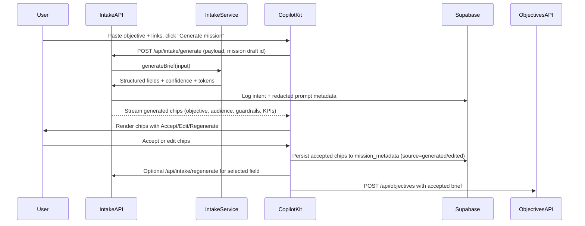
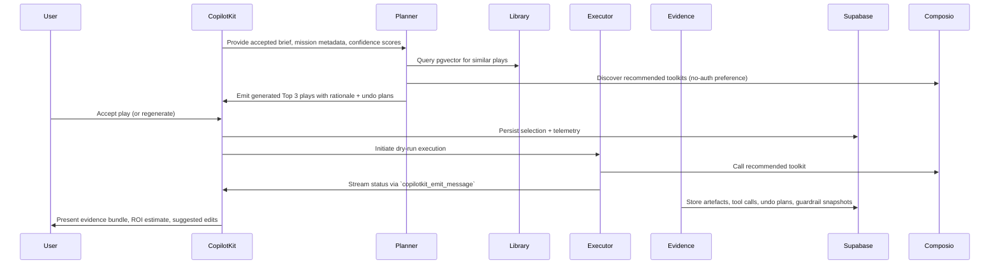
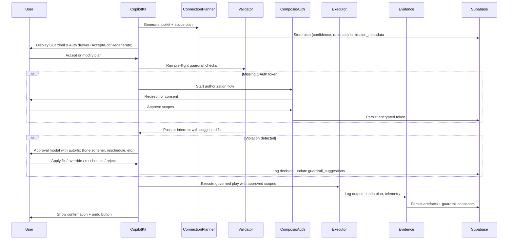
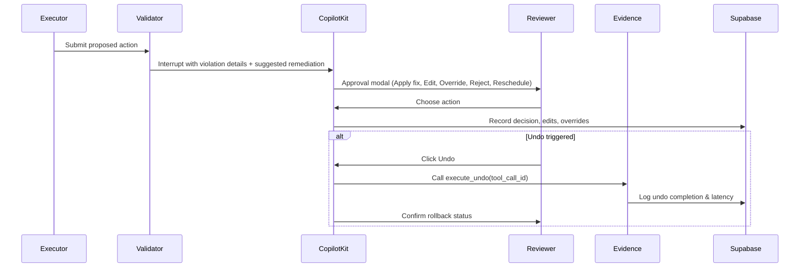

# AI Employee Control Plane — Technical Architecture (October 8, 2025)

This blueprint captures how Gate G-A through Gate G-E capabilities are implemented across the AI Employee Control Plane. Pair it with the Business PRD (`new_docs/prd.md`), UX Blueprint (`new_docs/ux.md`), Guardrail Policy Pack (`new_docs/guardrail_policy_pack.md`), and Checkpoint Control Plan (`new_docs/todo.md`). Partner references live in `libs_docs/` (CopilotKit, Composio, Gemini ADK, Supabase) and should be consulted whenever SDK contracts change.

---

## 0. Repository Snapshot
- **Frontend:** Next.js 15 app under `src/app`; the CopilotKit mission workspace roots at `src/app/(control-plane)` with API routes in `src/app/api/*`.
- **Agent Backend:** Gemini ADK FastAPI service (`agent/agent.py`) orchestrating Coordinator, Planner, Validator, Evidence, and utility agents within `agent/agents`, `agent/services`, and `agent/tools`.
- **Data Plane:** Supabase Postgres (pgvector enabled) with migrations in `supabase/migrations`, evidence artefacts in `docs/readiness`, and Supabase Edge Functions / PostgREST for analytics delivery.
- **Documentation Inputs:** `new_docs/` (PRD, UX, guardrails, roadmap) plus partner packs in `libs_docs/copilotkit`, `libs_docs/composio`, `libs_docs/adk`, `libs_docs/supabase`.
- **Tooling:** Managed via `mise` (`mise run install`, `mise run dev`, `mise run lint`, `mise run agent`). Python services rely on `uv` to hydrate dependencies.

---

## 1. Mission & Architectural Tenets
1. **Generative-first, editable always:** A single freeform input (objective text + links) generates a structured mission brief, toolkit plan, guardrails, and suggested plays. Every generated item exposes *Accept*, *Edit*, *Regenerate*, and *Reset* affordances.
2. **Objective-first execution:** Capability grounding and play ranking precede tool execution. Guardrails and undo plans attach to every mutating step.
3. **Zero-privilege default, governed opt-in:** Dry-run artefacts demonstrate value before OAuth scopes are requested and enforced per guardrail policy.
4. **Deterministic guardrails:** Tone, quiet hours, rate limits, budget caps, and undo guarantees are enforced in the UI, ADK validator, and database layers.
5. **Evidence & telemetry by design:** All inputs, generated recommendations, approvals, overrides, and undo outcomes are logged for replay, analytics, and audits.
6. **Composable agents & explainability:** Planner, Validator, Evidence, and Coordinator agents remain observable, replayable, and evaluable via `adk eval` suites.
7. **Progressive trust & latency targets:** Generative intake ≤3 s p95 (1 k char input), regeneration ≤2 s p95, dry-run loop ≤15 min end-to-end, validator overhead <200 ms p95.

---

## 2. Layered Architecture Overview

| Layer | Responsibilities | Key Assets |
| --- | --- | --- |
| **Presentation (Next.js + CopilotKit)** | Generative intake, chip editing, streaming chat, approvals, artefact previews | `src/app/(control-plane)`, `src/app/components`, CopilotKit hooks (see `libs_docs/copilotkit/llms-full.txt`) |
| **Control Plane APIs** | Intake generation & regeneration, objectives CRUD, guardrail overrides, approvals | `src/app/api/intake/*`, `src/app/api/objectives`, `src/app/api/approvals`, `src/app/api/guardrails/*` |
| **Orchestration (Gemini ADK)** | Mission state machine, planner ranking, validator interrupts, evidence bundling | `agent/agent.py`, `agent/agents`, `libs_docs/adk/llms-full.txt` |
| **Execution (Composio & MCP)** | Toolkit discovery, OAuth, trigger lifecycle, undo plans | `agent/tools/composio_client.py`, `libs_docs/composio/*` |
| **Governance & Evidence** | Guardrail enforcement, override workflow, evidence storage | `agent/services/evidence_service.py`, `src/app/components/ApprovalModal.tsx`, `new_docs/guardrail_policy_pack.md` |
| **Data & Analytics (Supabase)** | Mission metadata, suggestion logs, analytics views, pgvector, cron jobs | `supabase/migrations/*.sql`, `supabase/functions`, `libs_docs/supabase/llms_docs.txt` |

---

## 3. Component Blueprints

### 3.1 Presentation & Control Plane (Next.js + CopilotKit)
- **Generative Intake Banner (`<GenerativeIntakeBanner />`):** Single textarea with sample prompts, privacy notice, and *Generate mission* CTA. Submits to `/api/intake/generate` and streams generated fields with confidence badges.
- **Generated Brief Stack (`<GeneratedChipRow />`):** Renders chips for objective, audience, KPIs, guardrails, tone, timeframe. Chips display confidence, source (`generated` / `edited`), and expose Accept / Edit / Regenerate / Reset actions (regeneration via `/api/intake/regenerate`).
- **Mission Canvas & Sidebar:** Mirrors UX blueprint—generated brief at top, CopilotKit chat with streaming updates, generated play cards (accept/regenerate), Guardrail & Auth drawer (suggested scopes + quiet hours), artefact previews.
- **CopilotKit Hooks:**
  - `useCopilotReadable` publishes the accepted brief to agent context.
  - `useCopilotAction` drives actions like `createMission`, `acceptGeneratedField`, `applyGuardrailSuggestion`, `runDryRun`, `triggerUndo`.
  - `useCopilotAction.renderAndWaitForResponse` powers guardrail interrupts and approval modals.
- **Accessibility & Telemetry:** Implement keyboard shortcuts and live regions; emit events `intent_submitted`, `brief_generated`, `brief_item_modified`, `toolkit_suggestion_applied`, `mission_created`, `play_selected`, `approval_required`, `approval_decision`, `undo_requested`, `undo_completed`.
- **Persistence:** CopilotKit sessions and chat history stored in `copilot_sessions` and `copilot_messages` (per CopilotKit docs).

### 3.2 Control Plane APIs & Intake Services
- **`POST /api/intake/generate`:** Validates input, redacts secrets, calls `intakeService.generateBrief` (Gemini/Claude per `libs_docs/adk/`). Returns structured fields with confidence, source spans, regeneration tokens; logs redacted prompts for debugging; emits `intent_submitted` and `brief_generated` telemetry.
- **`POST /api/intake/regenerate`:** Regenerates single fields, updates `mission_metadata` (`source='generated'`, increments `regeneration_count`), emits `brief_item_modified` with action context.
- **`POST /api/objectives`:** Persists accepted chips (objective, audience, timeframe, guardrails) to `objectives` and `mission_metadata` (`source='edited'`).
- **Guardrail APIs:** `/api/guardrails/validate` ensures payload integrity; `/api/guardrails/override` records override requests, expiry, reviewer, and justification; emits telemetry and notifies Governance Sentinel.
- **Approvals API:** `/api/approvals` stores reviewer decisions, edits, guardrail violations, and ties into undo execution.

### 3.3 Orchestration (Gemini ADK)
- **Coordinator (`SequentialAgent`):**
  1. Optional `GenerativeIntakeAgent` normalises accepted chips, confidence, edit stats into session state (`generated_brief`, `edit_log`).
  2. `PlannerAgent` ranks plays via Supabase pgvector similarity, Composio discovery (`tools.get`), and mission metadata; attaches rationale, impact, risk, undo plan, and confidence score.
  3. `ConditionalExecutor` loops execution → validator → evidence (max three attempts) until guardrails pass or retries exhausted.
- **Planner:** Consumes `ctx.session.state['generated_brief']`, `mission_metadata`, `library_entries`. Persists Top-3 plays to `plays` table (`mode`=`dry_run`/`governed`) and emits `play_selected`.
- **Validator:** Loads guardrail payload, mission edits, and pending suggestions. Runs tone (LLM fallback), quiet hour, rate limit, budget, and undo readiness checks. Auto-fixes (tone softener, reschedule, rate reduction) are written to `guardrail_suggestions` with confidence and recommended action.
- **Evidence Agent:** Bundles mission brief (generated vs edited), tool outputs, ROI, undo plans, telemetry; persists artefacts to Supabase Storage and metadata to `artifacts`.

### 3.4 Execution & Composio Integration
- **Toolkit Discovery:** `Composio.tools.get` (persona filters per `libs_docs/composio/`) with preference for `no_auth` toolkits; suggestions show success stories and upgrade paths. UI renders badges + “Why this?” tooltips.
- **Generative Connection Planner:** Planner proposes toolkit, scope, quiet hour plan stored in `mission_metadata` (`field='connection_plan'`). Guardrail & Auth drawer lets reviewers accept, edit, or regenerate; emits `toolkit_suggestion_applied` with outcome.
- **OAuth:** `toolkits.authorize` + `waitForConnection`; encrypted tokens in `oauth_tokens` with `connection_id`, `scopes`, `status`, `last_verified_at`.
- **Trigger Lifecycle:** Implement `create_trigger`, `list_triggers`, `subscribe_trigger`, `disable_trigger`; log events in `trigger_warehouse` and reference from `tool_calls`.
- **Undo Plans:** Each mutating tool call must define `tool_calls.undo_plan`; Evidence service executes undo and logs success/failure.

### 3.5 Supabase Data Plane

| Table | Purpose | Notable Columns |
| --- | --- | --- |
| `objectives` | Accepted mission brief | `mission_id`, `goal`, `audience`, `timeframe`, `guardrails`, `status` |
| `mission_metadata` | Generated + edited fields | `mission_id`, `field`, `value`, `confidence`, `source`, `regeneration_count`, `accepted_at` |
| `plays` | Planner recommendations | `mission_id`, `mode`, `plan_json`, `impact_estimate`, `risk_profile`, `undo_plan`, `confidence` |
| `tool_calls` | Tool execution log | `play_id`, `toolkit`, `tool_name`, `args_hash`, `result_ref`, `undo_plan`, `latency_ms`, `quiet_hour_override` |
| `approvals` | Reviewer decisions | `tool_call_id`, `reviewer_id`, `decision`, `edits`, `guardrail_violation`, `decision_at` |
| `artifacts` | Evidence artefacts | `play_id`, `type`, `title`, `content_ref`, `hash`, `reviewer_edits` |
| `library_entries` | Reusable plays | `id`, `embedding`, `success_score`, `reuse_count`, `persona` |
| `guardrail_profiles` / `mission_guardrails` | Guardrail provenance | JSON policies per guardrail pack |
| `guardrail_suggestions` | Generated guardrail fixes | `mission_id`, `suggestion_id`, `policy`, `suggested_value`, `confidence`, `action`, `resolved_at` |
| `trigger_warehouse` | Trigger events | `trigger_id`, `event_type`, `payload_hash`, `tool_call_id`, `received_at` |
| `analytics_*` views | Adoption & quality metrics | `analytics_weekly_approved_jobs`, `analytics_guardrail_incidents`, `analytics_library_reuse`, `analytics_brief_accept_rate`, `analytics_connection_accept_rate`, `analytics_override_rate` |

Supporting infrastructure:
- **Supabase Storage:** `evidence-artifacts` bucket for large outputs (drafts, CSVs, PDFs).
- **Edge Functions:** `generate-embedding`, `catalog-sync`, `narrative-summariser` (dashboard narratives with human approval).
- **pg_cron Jobs:** `guardrail_override_expiry`, `catalog_snapshot`, `generative_quality_rollup` (aggregates acceptance & regeneration metrics).

### 3.6 Evidence, Analytics & Narratives
- **Evidence Service (`agent/services/evidence_service.py`):** Hashes tool arguments, stores undo plans, appends guardrail snapshots, exposes `execute_undo(tool_call_id)` for UI/automation.
- **Dashboards:** Next.js server components backed by PostgREST. Layout matches UX blueprint (KPI tiles, trends, library reuse, guardrail incidents, narrative summary). Narrative summary is generated via templated prompts and editable/regenerable; edits are logged for prompt tuning.
- **Analytics Views:** Track adoption, dry-run conversion, guardrail incident rate, override closure, undo success, generative acceptance, average regenerations per field, connection plan adoption, mission confidence drift.

### 3.7 Governance & Guardrails
- **Validator Enforcement:** Consumes merged guardrail payload (`ctx.session.state['guardrails']`), mission edit history, and pending suggestions. Violations trigger interrupts with suggested remedies; accepted fixes update `guardrail_suggestions` and guardrail profiles.
- **Override Workflow:** `/api/guardrails/override` writes to `guardrail_overrides`, notifies Governance Sentinel, and blocks Gate promotion until resolved.
- **Incident Logging:** Blocking incidents log to `guardrail_incidents` with severity and evidence pointers; dashboards provide filters, exports, and recommended remediation narratives.

---

## 4. Runtime Flows

### 4.1 Generative Intake & Mission Creation

### 4.2 Dry-Run Proof Loop

### 4.3 Governed Activation & Connection Planner

### 4.4 Approval & Undo Loop

---

## 5. Deployment & Operations
- **Local development:** `mise run install`, `uv pip install -r agent/requirements.txt`, `mise run dev` (UI + agent) or `mise run ui` / `mise run agent`. Apply Supabase schema via `supabase start` → `supabase db push --file supabase/migrations/0001_init.sql`.
- **Environment variables:**
  - Frontend: `NEXT_PUBLIC_SUPABASE_URL`, `NEXT_PUBLIC_SUPABASE_ANON_KEY`.
  - Agent: `COMPOSIO_API_KEY`, `SUPABASE_URL`, `SUPABASE_SERVICE_ROLE_KEY`, `GOOGLE_API_KEY`, `OPENAI_API_KEY`, `ENCRYPTION_KEY` (32-byte hex), `COMPOSIO_TENANT_ID` (if multi-tenant), optional `NARRATIVE_MODEL`.
- **Cron & Edge deployment:** Deploy `catalog-sync`, `generate-embedding`, `narrative-summariser` edge functions and schedule `pg_cron` jobs `guardrail_override_expiry`, `catalog_snapshot`, `generative_quality_rollup`.
- **CI/CD:** `mise run lint`, `adk eval` suites (`agent/evals/dry_run`, `agent/evals/validator_g_c`, etc.), telemetry diff checks, status beacon refresh before merges.

---

## 6. Capability Progression & Evidence Requirements

| Gate | Capability Focus | Highlights | Required Evidence |
| --- | --- | --- | --- |
| **G-A — Foundation** | Generative intake scaffold, persistence, catalog sync | `/api/intake/generate`, `mission_metadata` writes, guardrail seeds, CopilotKit restore | Status beacon A, `generative_intake_playbook`, `copilotkit_qa_G-A`, `generative_intake_samples_G-A.json` |
| **G-B — Dry-Run Proof** | Streaming UX, planner loop, generative quality review | Dry-run <15 min, ≥70% generated chips accepted without regeneration, planner telemetry | `dry_run_verification.md`, `copilotkit_session_G-B.mp4`, `generative_quality_report_G-B.md` |
| **G-C — Governed Activation** | OAuth, validator interrupts, connection planner | Two governed toolkits live, guardrail overrides closed, connection plan telemetry | `governed_activation_report.csv`, `approval_feed_export_G-C.json`, `generative_connection_plan_G-C.json` |
| **G-D — Insight & Library** | Analytics dashboards, narratives, trigger warehouse | Dashboards live with narrative editor, recommendation API, trigger reconciliation | `insight_snapshot.parquet`, `library_recommendations.json`, `generative_narratives_playbook_G-D.md`, `dashboard_qa_G-D.mp4` |
| **G-E — Scale & Trust** | Security, performance, accessibility, telemetry audits | Token rotation, load tests, WCAG 2.1 AA audit, telemetry audit | `trust_review.pdf`, `load_test_results.json`, `accessibility_audit_G-E.pdf`, `telemetry_audit_G-E.md` |
| **G-F — Stabilised Ops** | Operational reporting, incident hygiene | Weekly reports, incident ledger, roadmap prioritisation | `stabilisation_digest.md`, KPI exports |

---

## 7. Observability, Metrics & Alerts
- **Telemetry events:** `intent_submitted`, `brief_generated`, `brief_item_modified`, `toolkit_suggestion_applied`, `mission_created`, `play_selected`, `dry_run_started`, `dry_run_completed`, `approval_required`, `approval_decision`, `oauth_initiated`, `oauth_completed`, `governed_execution_completed`, `undo_requested`, `undo_completed`, `guardrail_override_requested`, `guardrail_override_resolved`, `evidence_bundle_exported`, `dashboard_viewed`.
- **Metrics & SLAs:** Generative acceptance rate (≥80% by Gate G-C), average regenerations per field, connection adoption rate, guardrail suggestion acceptance rate, dry-run / governed latency, validator overhead, undo success (≥95%), override closure (<24 h), guardrail incident rate (<5%).
- **Analytics Pipeline:** Supabase → PostgREST → Next.js dashboards + optional warehouse exports (Parquet/CSV). Narrative edits logged for prompt tuning.
- **Logging:** Structured logs include `mission_id`, `play_id`, `tool_call_id`, `suggestion_id`, `override_id`; sensitive data redacted per guardrail policy.
- **Alerts:** PagerDuty/Slack alerts for guardrail incident spikes, `generative_quality_rollup` anomalies, `oauth_tokens` nearing expiry, Composio catalog sync failures, Supabase replication lag.

---

## 8. Reference Index
- **Business PRD:** `new_docs/prd.md`
- **UX Blueprint:** `new_docs/ux.md`
- **Guardrail Policy Pack:** `new_docs/guardrail_policy_pack.md`
- **Checkpoint Control Plan:** `new_docs/todo.md`
- **CopilotKit Docs:** `libs_docs/copilotkit/llms-full.txt`
- **Composio Field Guide:** `libs_docs/composio/`
- **Gemini ADK Docs:** `libs_docs/adk/`
- **Supabase AI & Vectors:** `libs_docs/supabase/`

Keep this architecture document synchronized with implementation. Any change to mission intake, guardrails, analytics, or orchestration must be reflected here and cross-referenced across the other `new_docs` assets.
