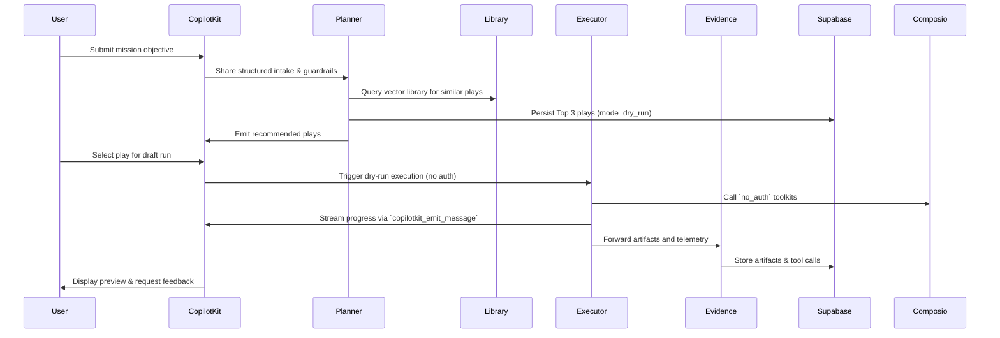
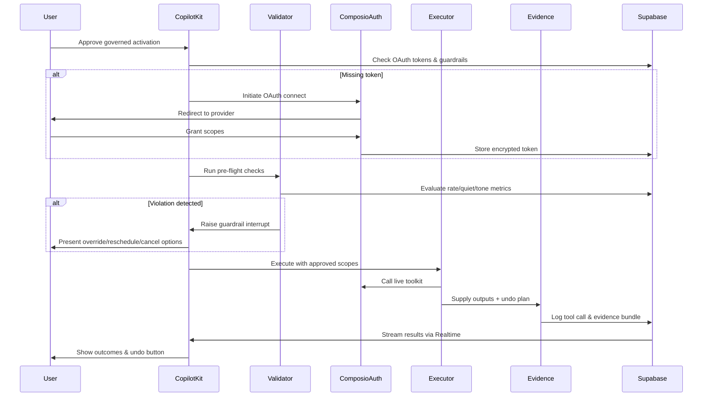
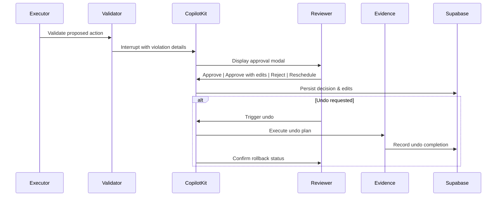

# AI Employee Control Plane — Technical Architecture (October 8, 2025)

This blueprint translates the Gate G-A mandate into concrete implementation guidance. Use it with the Business PRD, Guardrail Policy Pack, and Checkpoint Control Plan when shipping features or onboarding agents.

## 0. Repository Snapshot
- **Frontend:** Next.js 15 app in `src/app` with the CopilotKit workspace at `src/app/(control-plane)` and API routes under `src/app/api`.
- **Agent Backend:** Gemini ADK-powered FastAPI service at `agent/agent.py` with supporting agents in `agent/agents` and utilities in `agent/tools` & `agent/services`.
- **Data Plane:** Supabase migrations in `supabase/migrations`, readiness evidence in `docs/readiness`, and pgvector-enabled Postgres for analytics.
- **Documentation Inputs:** Partner reference packs at `libs_docs/` (Composio, CopilotKit, ADK, Supabase) + new control-plane docs under `new_docs/`, including the UX blueprint in `new_docs/ux.md`.
- **Tooling:** Managed via `mise`. Run `mise run install`, `mise run dev`, `mise run lint`, and `mise run agent` to hydrate deps, start stacks, and lint.

## 1. Mission & Architectural Tenets
- **Objective-first:** Every mission begins with a structured intake and capability scan before committing to execution.
- **Zero-privilege default:** Dry-run proofs leverage Composio `no_auth` toolkits until governance approves OAuth scopes (see §3.3).
- **Deterministic guardrails:** Tone, quiet hours, rate limits, and undo guarantees are enforced in multiple layers (validator, UI, database) per the guardrail pack.
- **Evidence-centric:** All mission activity results in reproducible artifacts, telemetry, and undo plans stored in Supabase and surfaced in dashboards.
- **Composable agents:** The Gemini ADK coordinator routes work across planner, executor, validator, and evidence agents; each must remain debuggable and replayable.
- **Observability first:** Tool calls, approvals, overrides, and incidents feed real-time metrics for operators and auditors.

## 2. Layered Architecture Overview

| Layer | Responsibilities | Primary Assets |
| --- | --- | --- |
| Presentation (Next.js + CopilotKit) | Mission intake, shared state, approval UX, artifact previews | `src/app/(control-plane)`, `src/app/components`, CopilotKit hooks |
| Control Plane APIs | Objective CRUD, approval logging, guardrail validation | `src/app/api/objectives`, `src/app/api/approvals`, `src/app/api/guardrails/*` |
| Orchestration (Gemini ADK) | Agent hierarchy, state management, evaluation harness | `agent/agent.py`, `agent/agents/control_plane.py`, `adk eval` suites |
| Execution (Composio & MCP) | Tool discovery, OAuth, trigger lifecycle, tool execution | `agent/tools/composio_client.py`, Composio SDK |
| Governance & Evidence | Guardrail enforcement, approvals, undo, evidence bundling | `agent/services/evidence_service.py`, `src/app/components/ApprovalModal.tsx`, guardrail pack |
| Data & Analytics (Supabase) | Mission tables, pgvector embeddings, dashboards, cron jobs | `supabase/migrations/*.sql`, Edge Functions, PostgREST views |

## 3. Component Blueprints

### 3.1 Presentation & Control Plane (Next.js + CopilotKit)
- **Mission Intake (`MissionIntake.tsx`):** Collect goal, audience, timeframe, and guardrails; expose structured state via `useCopilotReadable`. Submit to `/api/objectives`.
- **Mission workspace alignment:** Implement layout, navigation, and component behavior per the mission workspace anatomy defined in `new_docs/ux.md` (mission sidebar, streaming status panel, guardrail summary, artifact cards). This ensures UI, accessibility, and interaction patterns stay consistent across teams.
- **Shared State Hooks:** `useCopilotReadable` for mission context, `useCopilotAction` for interactive UI responses, `useCopilotAction.renderAndWaitForResponse` for approval modals.
- **Persistence:** Store chat history and mission state in Supabase tables (`copilot_sessions`, `copilot_messages`) using CopilotKit persistence utilities.
- **Example component skeleton:**
```typescript
// src/app/(control-plane)/MissionIntake.tsx
useCopilotReadable({ description: 'Mission objective draft', value: objective });
useCopilotAction({
  name: 'createMission',
  parameters: [/* goal, audience, timeframe, guardrails */],
  handler: async (payload) => {
    const response = await fetch('/api/objectives', {
      method: 'POST', headers: { 'Content-Type': 'application/json' }, body: JSON.stringify(payload)
    });
    return `Mission ${ (await response.json()).id } captured.`;
  }
});
```
- **API scaffolding (`src/app/api/objectives/route.ts`):** Validate session via `createRouteHandlerClient`, insert objective into Supabase with status `draft`, and return the inserted row.
- **Approval UX:** `ApprovalModal.tsx` renders guardrail summaries, undo plan, and reviewer actions; results persist via `/api/approvals`.
- **Accessibility & telemetry:** Follow the keyboard navigation, screen reader live regions, and instrumentation catalog defined in `new_docs/ux.md` when implementing CopilotKit components to guarantee compliance with WCAG 2.1 AA and analytics consistency.

### 3.2 Orchestration (Gemini ADK)
- **Agent Hierarchy:**
  - `CoordinatorAgent` (`SequentialAgent`) orchestrates planner + conditional executor.
  - `PlannerAgent` (`LlmAgent`) populates `execution_plan` with Composio tool selections, ranked plays, and Supabase library references.
  - `ConditionalExecutor` (`BaseAgent`) loops execution, validation, and evidence capture until guardrails pass or retries expire.
  - `ValidatorAgent` enforces guardrails using merged config (see guardrail pack §2) and raises ADK interrupts.
  - `EvidenceAgent` assembles artifacts, ROI, undo plans, and telemetry.
- **Coordinator sketch:**
```python
class ConditionalExecutor(BaseAgent):
    max_retries = 3
    async def _run_async_impl(self, ctx: InvocationContext):
        attempts = 0
        while attempts < self.max_retries:
            async for event in executor_agent.run_async(ctx):
                yield event
            async for event in validator_agent.run_async(ctx):
                yield event
            if ctx.session.state.get('validation_passed'):
                async for event in evidence_agent.run_async(ctx):
                    yield event
                return
            attempts += 1
            ctx.session.state.update({'validation_failed': False, 'validation_passed': False})
        ctx.session.state['execution_status'] = 'failed_max_retries'

coordinator_agent = SequentialAgent(
    name='CoordinatorAgent', sub_agents=[planner_agent, ConditionalExecutor()]
)
```
- **Eval Harness:** Add `adk eval` scenarios for (a) dry-run success, (b) tone violation, (c) guardrail override. Store eval sets in `agent/evals` and run bi-weekly.
- **State Keys:** Standardize on `execution_plan`, `execution_results`, `validation_passed`, `validation_failed`, `violation_details`, `evidence_bundle`, `guardrails`.

### 3.3 Execution & Composio Integration
- **Discovery:** Use `Composio.tools.get` with one filter at a time (toolkit, search, scopes). Fetch metadata directly from the Composio SDK using the configured API key.
- **OAuth:** Initiate via `toolkits.authorize`, persist `redirect_url`, `connection_id`, and scopes in `oauth_tokens` with encryption (see §3.6).
- **Execution helper:**
```python
class ComposioHandler:
    def __init__(self, api_key: str):
        self.cx = Composio(api_key=api_key)

    async def discover(self, user_id: str, **filters):
        return await self.cx.tools.get(user_id=user_id, **filters)

    async def execute(self, tool_slug: str, *, user_id: str, arguments: dict, connected_account_id: str | None = None):
        try:
            result = await self.cx.tools.execute(tool_slug, user_id=user_id, arguments=arguments, connected_account_id=connected_account_id)
            return { 'success': True, 'result': result }
        except Exception as err:
            return { 'success': False, 'error': str(err), 'arguments_hash': hash(str(arguments)) }

    async def create_trigger(self, user_id: str, slug: str, config: dict):
        trigger = await self.cx.triggers.create(slug=slug, user_id=user_id, trigger_config=config)
        return { 'trigger_id': trigger.id, 'status': 'active' }
```
- **Tool Router / MCP:** Expose curated toolkits per persona when integrating with IDEs (Claude Desktop, Cursor) using Composio MCP APIs.
- **Logging:** All executions must hash arguments, store undo plans, and capture latency/cost metadata for analytics.

### 3.4 Supabase Data Plane
- **Core tables:**
| Table | Purpose | Key Columns |
| --- | --- | --- |
| `objectives` | Mission intake records | `tenant_id`, `goal`, `audience`, `timeframe`, `guardrails`, `status` |
| `plays` | Planner output & recommended jobs | `objective_id`, `mode`, `plan_json`, `impact_estimate`, `risk_profile`, `undo_plan` |
| `tool_calls` | Every Composio action | `play_id`, `toolkit`, `tool_name`, `args_hash`, `result_ref`, `undo_plan`, `latency_ms`, `quiet_hour_override` |
| `approvals` | Human decisions | `tool_call_id`, `reviewer_id`, `decision`, `edits`, `decision_at`, `guardrail_violation` |
| `artifacts` | Evidence payloads | `play_id`, `type`, `title`, `content_ref`, `reviewer_edits` |
| `library_entries` | Reusable plays with embeddings | `embedding vector(1536)`, `success_score`, `reuse_count` |
| `guardrail_profiles`, `mission_guardrails` | Guardrail provenance | See guardrail pack §2 |
- **Example migration snippet:**
```sql
create index tool_calls_play_id_idx on tool_calls(play_id);
create index library_entries_embedding_idx
  on library_entries using ivfflat (embedding vector_cosine_ops) with (lists = 100);

create or replace function match_plays(query_embedding vector(1536), match_count int)
returns table(play_id uuid, similarity float)
language sql stable as $$
  select id, 1 - (embedding <=> query_embedding) as similarity
  from library_entries
  order by similarity desc
  limit match_count;
$$;
```
- **Edge Functions:**
  - `supabase/functions/generate-embedding` — writes embeddings for `library_entries` and artifacts.
- **Cron Jobs:**
  - `guardrail_override_expiry` — expire stale override tokens.

### 3.5 Evidence & Analytics
- **Evidence service** (`agent/services/evidence_service.py`):
  - Hash arguments before logging, upload large outputs to Supabase Storage bucket `evidence-artifacts`, and append undo plans.
  - Provide `execute_undo(tool_call_id)` to reverse actions programmatically when possible.
- **Analytics Views:**
  - `analytics_weekly_approved_jobs` — weekly adoption metric.
  - `analytics_guardrail_incidents` — number and severity of guardrail violations.
  - `analytics_library_reuse` — reuse count per persona.
- **Dashboards:** Build Next.js server components backed by PostgREST to render adoption, ROI, guardrail incidents, undo success, and time-to-proof, following the analytics and governance layouts in `new_docs/ux.md §8`.

### 3.6 Governance & Guardrails
- Enforce guardrail configuration per guardrail policy pack.
- **API Validation:** `src/app/api/guardrails/validate/route.ts` inspects guardrail payloads before execution.
- **CopilotKit Interrupts:** `ApprovalModal.tsx` surfaces violations, override requests, and undo steps. All overrides route through `/api/guardrails/override` and log to Supabase.
- **Validator Agent Responsibilities:** Evaluate tone, quiet hours, rate limit, budget, and undo readiness. Set `validation_passed` or `validation_failed` with `violation_details` and escalate via CopilotKit interrupts.
- **Evidence Artifacts:** Guardrail evaluations append to `guardrail_incidents` and `tool_calls.guardrail_snapshot`.

## 4. Runtime Flows

### 4.1 Dry-Run Proof Sequence


### 4.2 Governed Activation Sequence


### 4.3 Approval & Undo Loop


## 5. Deployment & Operations
- **Local Dev:**
  - Install toolchains: `mise run install` (pnpm) + `uv pip install -r agent/requirements.txt`.
  - Start stacks: `mise run dev` (UI + agent) or `mise run ui` / `mise run agent` individually.
  - Apply Supabase schema: `supabase start` → `supabase db push --file supabase/migrations/0001_init.sql`.
- **Environment Variables:**
  - Frontend `.env.local`: `NEXT_PUBLIC_SUPABASE_URL`, `NEXT_PUBLIC_SUPABASE_ANON_KEY`.
  - Agent `.env`: `COMPOSIO_API_KEY`, `SUPABASE_URL`, `SUPABASE_SERVICE_ROLE_KEY`, `GOOGLE_API_KEY`, `OPENAI_API_KEY`, `ENCRYPTION_KEY` (32-byte hex for token vault).
- **Cron & Edge Deploy:**
  - `supabase functions deploy catalog-sync` (Composio metadata).
  - `supabase functions deploy generate-embedding`.
  - Configure Supabase `pg_cron` jobs for catalog refresh, analytics rollups, and guardrail override expiry.
- **CI/CD Expectations:**
  - Lint: `mise run lint` (Next.js + TypeScript).
  - ADK evals: `adk eval agent/evals/dry_run` before merges.
  - Release gating: promotion requires updated status beacons and evidence artifacts (see §6).

## 6. Capability Progression & Evidence Requirements

| Gate | Capability Focus | Exit Criteria Highlights | Evidence Artifacts |
| --- | --- | --- | --- |
| G-A — Foundation | Dry-run loop scaffolding, persistence, catalog sync | Supabase schema applied with RLS; CopilotKit persistence rehearsal; nightly Composio snapshot job scheduled; guardrail profiles seeded | `docs/readiness/status_beacon_A.json`, migration logs, catalog checksum report |
| G-B — Dry-Run Proof | Streaming UX, planner/executor loop, evidence bundle | Dry-run missions complete <15 min across 3 personas; evidence bundles stored; streaming status recorded; reviewer workflow documented | `docs/readiness/dry_run_verification.md`, QA video, Supabase artifact hashes |
| G-C — Governed Activation | OAuth, guardrail enforcement, undo plan | Two production toolkits connected; validator interrupts demonstrated; undo path verified; trigger lifecycle exercised | `docs/readiness/governed_activation_report.csv`, approval export, trigger logs |
| G-D — Insight & Library | Dashboards, pgvector recommendations, trigger warehouse | Analytics dashboards live; recommendation API returns next-best jobs; trigger warehouse reconciles events | `docs/readiness/insight_snapshot.parquet`, `docs/readiness/library_recommendations.json` |
| G-E — Scale & Trust | Security hardening, load/perf tests, enablement bundle | Token rotation, redaction pipeline, audit export validated; load test passes p95 <250ms; enablement assets published | `docs/readiness/trust_review.pdf`, `docs/readiness/load_test_results.json`, enablement bundle |
| G-F — Stabilized Ops | Operational reporting, incident hygiene | Two reporting windows closed; incident ledger + postmortems; next-phase roadmap prioritized | `docs/readiness/stabilisation_digest.md`, KPI exports |

Gate promotions must reference the guardrail policy pack, architecture blueprint updates, and the checkpoint control plan checklists.

## 7. Observability & Incident Response
- **Metrics pipeline:** Publish latency, success/error counts, override rate, guardrail incidents, undo success via Supabase Realtime → dashboards.
- **Instrumentation:** Ensure frontend and agent events match the telemetry catalog in `new_docs/ux.md §10` (e.g., `mission_created`, `play_selected`, `approval_required`, `undo_completed`).
- **Logging:**
  - Agent backend uses structured logging (mission_id, play_id, tool_call_id) for every ADK event.
  - Supabase triggers populate `tool_call_metrics` aggregates.
- **Alerts:**
  - Guardrail incidents above threshold trigger Governance Sentinel alert (Slack or PagerDuty).
  - Cron failures, catalog sync errors, and Supabase replication lag generate runtime steward alerts.
- **Incident Workflow:** See guardrail pack §7 and checkpoint plan for escalation steps; all incidents must result in postmortems stored under `docs/readiness/guardrail_reports/`.

## 8. Reference Index
- **Business PRD:** `new_docs/prd.md`
- **Guardrail Policy Pack:** `new_docs/guardrail_policy_pack.md`
- **Checkpoint Control Plan:** `new_docs/todo.md`
- **UX Blueprint:** `new_docs/ux.md`
- **Composio Field Guide:** `libs_docs/composio/llms.txt`
- **CopilotKit Docs:** `libs_docs/copilotkit/llms-full.txt`
- **Gemini ADK Docs:** `libs_docs/adk/llms-full.txt`
- **Supabase AI & Vectors:** `libs_docs/supabase/llms_docs.txt`

Keep this blueprint synchronized with code changes. Any deviation (new agents, new tables, guardrail updates) requires revising this document and cross-linking the relevant evidence artifacts.
