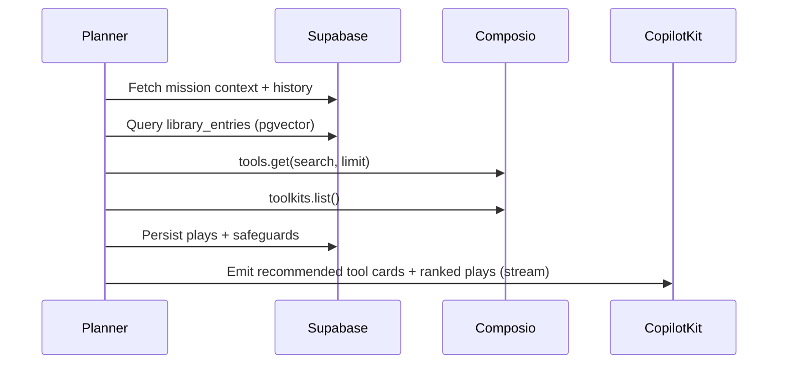
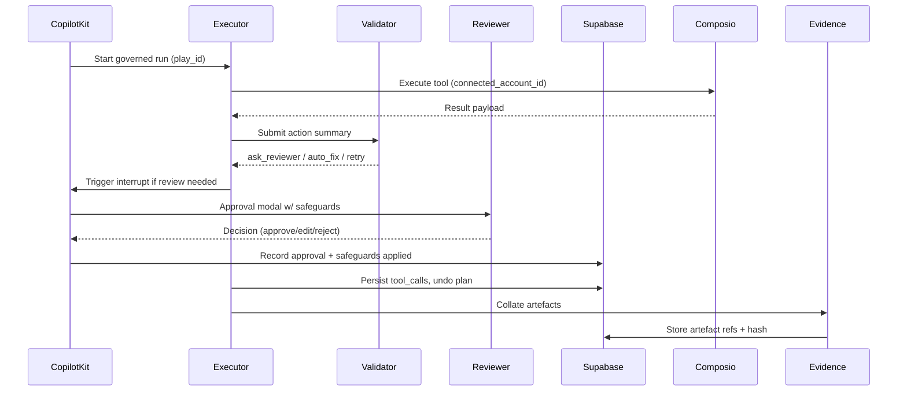
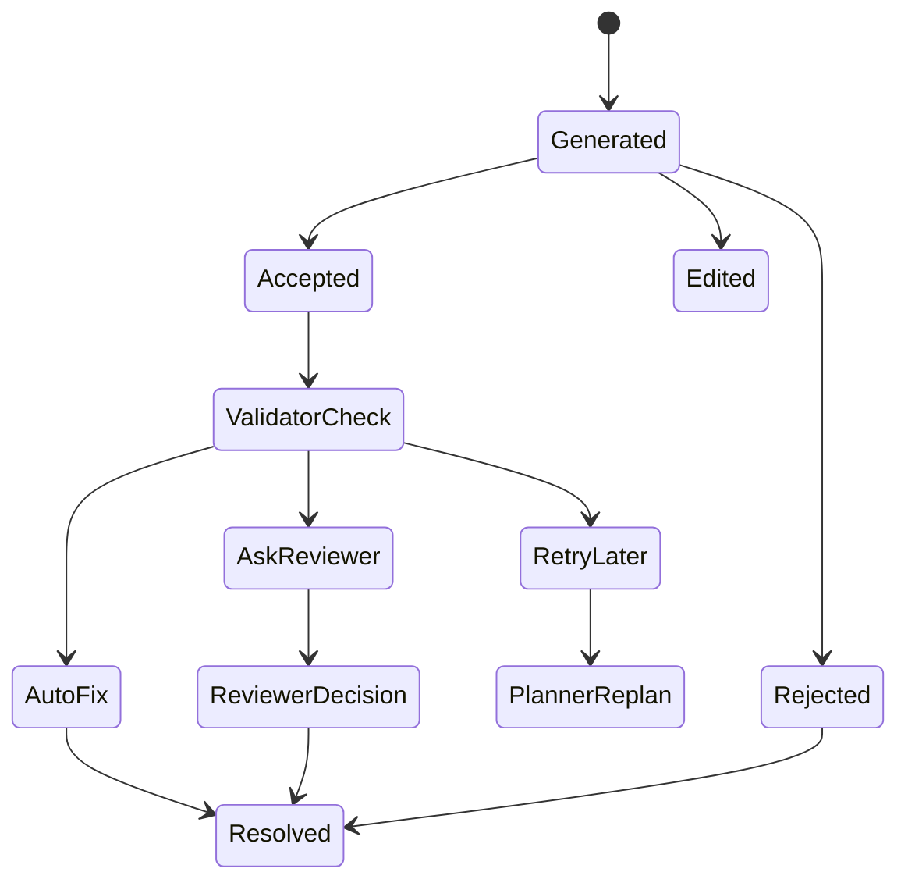
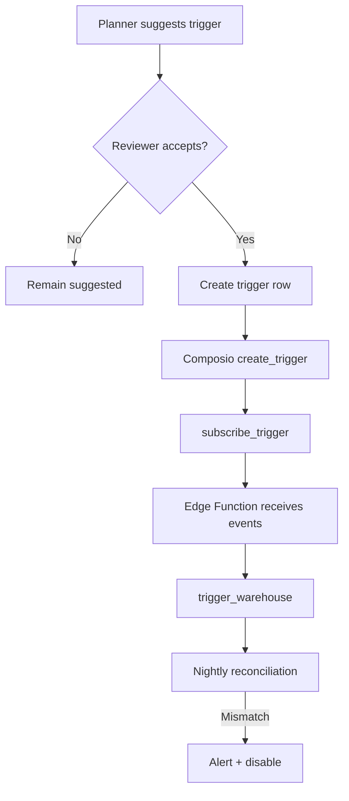
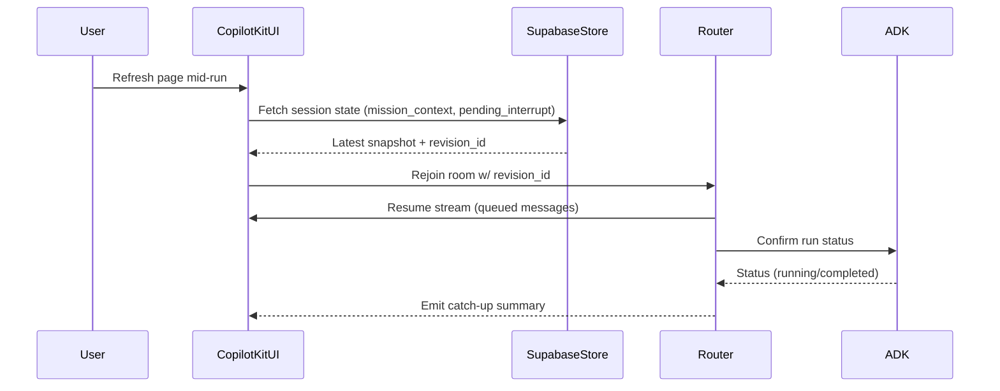
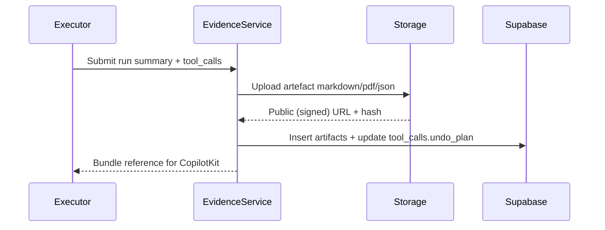

# AI Employee Control Plane — Workflow Specification (Gate G‑A Baseline)

_Last updated: October 9, 2025_

## 0. Purpose & Source Map
This document translates the architecture, product, UX, and roadmap inputs into an implementable workflow blueprint for Gates G‑A through G‑C. It should be read in tandem with:
- `new_docs/architecture.md §3–4` for system components and runtime flows.
- `new_docs/prd.md §Product Scope` and §Detailed Requirements for business guardrails.
- `new_docs/ux.md §3–7` for workspace anatomy, interrupts, and telemetry.
- `new_docs/todo.md` gate-by-gate acceptance criteria.
- Partner primers inside `libs_docs/` (Composio, ADK, CopilotKit, Supabase) for SDK-level constraints.

Each workflow section below names the data writes, CopilotKit surfaces, ADK responsibilities, Composio usage, and Supabase guardrails required to deliver repeatable, auditable missions.

---

## 1. Workflow Taxonomy
| Track | Description | Primary Goal | Exit Criteria |
| --- | --- | --- | --- |
| **Dry Run (Zero Privilege)** | Generates artefacts and ROI indicators without live credentials. | Prove smallest viable workflow within 15 minutes. | Evidence bundle ready; no governance blockers. |
| **Governed Activation** | Executes approved plays using OAuth-backed connections, with adaptive safeguards and reviewer interrupts. | Deliver real outcomes while enforcing undo + approvals. | Validator returns _pass_; approvals recorded; undo plan ready. |
| **Trigger Lifecycle** | Manages event-driven follow-ups via Composio triggers with warehouse reconciliation. | Sustain automation safely after activation. | Trigger health monitored; warehouse and tool_calls aligned. |
| **Evidence & Undo** | Packages outputs, telemetry, and rollback handles for governance and retros. | Provide audit-ready artefacts and reversible actions. | Artefact hash stored; undo tested or documented. |

---

## 2. End-to-End Overview
```mermaid
flowchart LR
    A[Intake Banner
    (CopilotKit)] -->|POST /api/intake/generate|
    B[Intake Service
    (Next.js API)] -->|Structured chips|
    C[Mission Metadata
    Supabase]
    B --> C
    C --> D[Planner Agent
    (ADK)]
    D -->|plays + rationale|
    E[CopilotKit Workspace]
    E -->|Play accept|
    F[Executor Agent]
    F -->|Dry run| G[Evidence Agent]
    G -->|Artefacts + undo|
    H[Supabase Storage]
    F -->|Governed run|
    I[Validator Agent]
    I -->|feedback|
    E
    I -->|safeguard events|
    J[Approvals API]
    J --> C
    F -->|Tool calls|
    K[Composio SDK]
    K -->|triggers|
    L[Trigger Warehouse]
```
_References: architecture.md §4.1–4.3; prd.md §Product Scope; ux.md §3._

---

## 3. Generative Intake Workflow
**Context:** Converts a single freeform input into structured mission primitives before any planner call.

- **API surface:** `POST /api/intake/generate`, `POST /api/intake/regenerate`, `POST /api/objectives` (`architecture.md §3.2`).
- **Carbon copy of UX:** Generative intake banner, editable chip rows, confidence badges (`ux.md §3.1`).
- **ADK dependency:** IntakeAgent enriches `ctx.session.state['mission_context']` with accepted chips (`libs_docs/adk/llms-full.txt §Coordinator pattern`).
- **CopilotKit contract:**
  - `useCopilotAction('generateMission')` streams chips with `copilotkit_emit_message` updates.
  - Accepted chips persist via `useCopilotAction('acceptChip')`, logging `brief_item_modified` telemetry (`ux.md §10`).
- **Supabase writes:**
  - `mission_metadata` rows (one per chip) w/ `confidence`, `source`, `regeneration_count`.
  - `mission_safeguards` rows for generated hints, status=`suggested`.
  - `objectives` row when user confirms summary.
- **Telemetry:** `intent_submitted`, `brief_generated`, `brief_item_modified` with payloads referencing `mission_id` and `field` (`prd.md §Metrics`).
- **Guardrails:**
  - Redact secrets before logging prompts (`todo.md G‑A » Intake hygiene`).
  - Regeneration limited to 3 tries per chip before prompting manual input.
  - Quiet-hours hints include tenant locale metadata for validator use.

---

## 4. Planning & Capability Grounding
Planner transforms mission context into ranked plays, connection plans, and trigger candidates.

- **Inputs:** Mission brief, safeguard hints, tenant persona, historical play success (`architecture.md §3.3`).
- **Library lookup:** Supabase `library_entries` (pgvector) + fallback heuristics when cosine similarity <0.75 (`todo.md G‑A » Planner`).
- **Composio discovery:**
  - Stage 1: `Composio.tools.get(search=objective, limit=8)` to surface no-auth options first (`libs_docs/composio/llms.txt §3.1`).
  - Stage 2: For governed mode, run `toolkits.list()` + `tools.get(toolkits=[...], scopes=[...])` to prep scope suggestions.
  - Never mix `search` with explicit `tools` arrays; store discovery request + result hash on mission for debugging.
- **Recommended tool palette:** Planner streams curated cards into CopilotKit with badges (`no_auth`, `requires OAuth`), impact heuristics, precedent missions, and suggested scopes. Users multi-select and tweak parameters; selections persist to `mission_safeguards` and gate the rest of the plan.
- **Outputs to CopilotKit:** Top 3 plays with fields: title, rationale (embedding match + success stats), required toolkits, estimated impact, undo plan summary, risk, suggested safeguards. Displayed as selectable cards (`ux.md §4.2`).
- **Supabase writes:**
  - `plays` table (one row per recommendation) with `mode` (dry_run/governed) + `reason_markdown`.
  - `mission_safeguards` entries for suggested OAuth scopes (status=`suggested`, source=`planner`).
- **Telemetry:** `play_generated`, `connection_plan_generated`.
- **Guardrails:** Planner must degrade gracefully when Composio returns zero matches: fallback to library-only suggestions, mark `warning_no_catalog`, and route to reviewer for manual toolkit selection (recorded in `mission_flags`).



### 4.1 Tool Validation & MCP Inspection Pass
- **Inspection objective:** Run non-mutating MCP calls (e.g., summarise CRM sample, fetch top tickets) using selected toolkits to validate scopes, data freshness, and guardrail compatibility before committing to a plan.
- **CopilotKit experience:** Users see inspection summaries inline ("Found 23 dormant deals; recommended segmentation ready") with actionable warnings if data is stale or missing scopes.
- **Validator hook:** Validator consumes inspection outputs; mismatches trigger `auto_fix` (adjust scope), `ask_reviewer` (manual sign-off), or `retry_later` (await data sync). Outcomes log to `safeguard_events` with reason codes.
- **Telemetry:** `inspection_preview_rendered`, `plan_validated`, `plan_validation_failed`. Track time from first recommendation to validation completion to maintain <2 minute expectation.
- **Persistence:** Store inspection artifacts in `artifacts` (type=`inspection_summary`) and link to `tool_calls` where applicable for audit.

---

## 5. Dry-Run Execution Loop
Dry runs prove value without credentials; they should finish within 15 minutes p95 (`architecture.md §4.2`).

- **Trigger:** User accepts a play card; CopilotKit calls `useCopilotAction('startDryRun')`.
- **Prereq:** Tool palette validated with MCP inspection pass and `plan_validated` event logged; if not, CopilotKit blocks dry-run start with guidance.
- **ADK flow:**
  1. Executor agent simulates tool calls using Composio draft/support modes or synthetic responses (`libs_docs/adk/llms-full.txt §ExecutionLoop`).
  2. Validator executes on simulated output to pre-empt governed failures.
  3. Evidence agent compiles proof pack.
- **Composio usage:** set `execution_mode='SIMULATION'`, annotate outputs with `simulation_notice=true` for UI badges.
- **Supabase writes:**
  - `tool_calls` entries flagged `mode='dry_run'`, `result_ref` pointing to generated previews.
  - `artifacts` records referencing Supabase Storage objects (draft docs, CSVs); attach `hash` + `simulation=true` metadata.
- **Telemetry:** `dry_run_started`, `dry_run_completed`, `dry_run_failed` (with failure reason).
- **Guardrails:**
  - Enforce `max_retries=3` per validator outcome (`todo.md G‑A » Execution loop`).
  - If validator returns `retry_later`, escalate `mission_alert` to reviewer.
  - Dry-run outputs must highlight missing OAuth scopes so governance can pre-approve them.

---

## 6. Governed Activation Workflow
Once reviewers approve scopes and plays, governed execution proceeds with live credentials.

- **Prereqs:** Accepted connection plan entries in `mission_safeguards` (`status='accepted'`), at least one connected account per required toolkit.
- **OAuth flow:**
  - CopilotKit renders approval drawer with `authorize` links; user completes auth via Composio `toolkits.authorize` (`libs_docs/composio/llms.txt §4.1`).
  - Backend stores encrypted token in `oauth_tokens` with `connection_id`, `scopes`, `status`.
- **Execution loop:**
  1. Executor resolves `connected_account_id` for each call.
  2. Validator runs _before_ final commit; may issue `auto_fix`, `ask_reviewer`, or `retry_later` outcomes (`architecture.md §3.3`).
  3. CopilotKit interrupts via `CopilotInterrupt` for reviewer approval when `ask_reviewer` triggered (`ux.md §6`).
  4. Evidence agent appends final artefacts, undo plan, rollback checklist.
- **Supabase writes:**
  - `tool_calls` w/ `mode='governed'`, `status`, `latency_ms`, `undo_plan_json`.
  - `approvals` entries with reviewer decision, notes, applied safeguard fix.
  - `safeguard_events` capturing validator + reviewer feedback.
- **Telemetry:** `governed_run_started`, `approval_required`, `approval_decision`, `governed_run_completed`, `undo_requested`, `undo_completed`.
- **Guardrails:**
  - Validator must apply accepted safeguards: quiet hours enforce scheduling, tone checks rewrite responses, escalation contact ensures notifications.
  - Undo plan must be executable within 60 seconds (or document manual steps) before mission can close (`todo.md G‑B » Undo readiness`).
  - Abort run if Composio returns `401/403` or scope mismatch; log to `mission_flags` and prompt re-auth.



---

## 7. Safeguard Feedback Loop
Safeguards remain dynamic, feeding back into future missions and analytics.

- **Generation:** Intake seeds hints (tone, quiet hours, budget caps, fallback contacts) with `confidence` scores (`architecture.md §3.7`).
- **Adoption:** Users accept/edit via Safeguard Drawer; statuses tracked in `mission_safeguards` (`ux.md §5`).
- **Validator consumption:** Validator retrieves accepted hints before each execution; mismatches produce `auto_fix` adjustments or interrupts.
- **Feedback recording:**
  - `safeguard_events` logging event type (`hint_applied`, `hint_declined`, `violation_detected`, `auto_fix`, `send_anyway`), `details`, `resolved_at`.
  - `approvals` store reviewer notes for policy tuning.
- **Analytics:** `analytics_safeguard_feedback` view aggregates adoption and override rates (`libs_docs/supabase/llms_docs.txt §Analytics`).
- **Telemetry:** `safeguard_hint_applied`, `safeguard_hint_edited`, `safeguard_hint_rejected`.



---

## 8. Evidence Bundling & Undo
Evidence underpins promotion decisions and compliance reviews.

- **Bundle contents:** Mission brief, selected plays, tool call summaries, raw outputs (redacted), ROI deltas, safeguard outcomes, undo instructions (`architecture.md §3.6`).
- **Evidence agent duties:**
  - Generate Markdown + JSON bundle; store Markdown in Supabase Storage, JSON pointer in `artifacts`.
  - Hash each payload; store SHA256 for tamper detection.
  - Append undo instructions referencing `tool_calls.undo_plan` and `approvals` decisions.
- **Undo execution:**
  - UI exposes undo button for 24 hours (configurable). Triggers Evidence service `execute_undo(tool_call_id)` which may call Composio reversal tool or perform manual follow-up with reviewer confirmation.
  - Record outcome in `undo_events` (future table per `todo.md G‑C`). Until table exists, annotate `tool_calls.undo_status`.
- **Telemetry:** `undo_requested`, `undo_completed`, `undo_failed`.
- **Guardrails:** No mission closes until undo plan is verified or reviewer waives requirement (logged in `approvals.undo_waived=true`).

---

## 9. Trigger Lifecycle & Warehouse
Automations extend missions beyond single runs.

- **Planner stage:** Identify trigger-ready plays via `Composio.triggers.list` filtered by toolkit and event type (`libs_docs/composio/llms.txt §7`). Persist suggestions to `triggers` table (`status='suggested'`).
- **Activation:**
  - Reviewer accepts trigger; CopilotKit calls backend to create `trigger` row and invoke `create_trigger()` + `subscribe_trigger()`.
  - Store `subscription_id`, `secret`, `delivery_url`. Enforce encryption for secrets at rest.
- **Event ingestion:** Composio webhook posts to Supabase Edge Function; function logs event to `trigger_warehouse` with `payload_hash`, `trigger_id`, `tool_call_id` (if action executed).
- **Reconciliation:** Nightly `trigger_consistency_job` compares `trigger_warehouse` against `tool_calls` to detect missed actions (`libs_docs/supabase/llms_docs.txt §Cron`).
- **Telemetry:** `trigger_created`, `trigger_event_received`, `trigger_disabled`.
- **Guardrails:** Auto-disable triggers after 30 days idle or 3 consecutive failures; log to `mission_flags` and notify reviewers via CopilotKit broadcast.



---

## 10. Supabase Persistence Map
| Stage | Tables touched | Notes |
| --- | --- | --- |
| Intake | `mission_metadata`, `mission_safeguards`, `objectives`, `mission_events` | Ensure RLS uses `tenant_id`. |
| Planning | `plays`, `mission_safeguards`, `mission_flags` | Write rationales + undo plan seeds. |
| Dry Run | `tool_calls` (`mode='dry_run'`), `artifacts`, `mission_events` | `result_ref` points to Storage. |
| Governed | `tool_calls` (`mode='governed'`), `approvals`, `safeguard_events`, `artifacts`, `mission_events` | Capture latency and reviewer ID. |
| Evidence | `artifacts`, `mission_events`, future `undo_events` | Store hashes and Storage URLs. |
| Triggers | `triggers`, `trigger_warehouse`, `mission_flags` | Enforce pg_cron monitoring. |
| Analytics | `analytics_*` materialized views | Refresh nightly; avoid direct writes. |

_Reference: architecture.md §3.5; libs_docs/supabase/llms_docs.txt._

---

## 11. CopilotKit Session Management
- **Persistence:** Store CopilotKit message history and shared state in Supabase via CopilotKit connectors; required for reload resilience (`prd.md §CopilotKit Experience`).
- **Shared state contract:**
  - `mission_context`: mission metadata, safeguards, planner outputs.
  - `agent_progress`: streaming updates for planner/executor/validator.
  - `pending_interrupt`: approval modals with serialized context.
- **Recovery:** On reconnect, workspace loads latest state from Supabase and replays last 20 messages. Use `copilotkit_exit` to mark completed runs and allow router hand-off.
- **Multi-tab handling:** Last write wins; include `revision_id` in shared state to avoid stale overwrites. Surfacing conflicts prompts user to refresh or continue in active tab.
- **Redaction:** Governance teams can flag messages for removal; redaction flow removes message content but keeps artefact references for audit (`ux.md §9`).

---

## 12. Telemetry & Analytics Catalogue
Capture events at every decision point to power dashboards and Gate promotion metrics.

| Event | Stage | Payload essentials |
| --- | --- | --- |
| `intent_submitted` | Intake | raw objective hash, tenant, character count |
| `brief_generated` | Intake | mission_id, generation_time_ms, acceptance_ratio |
| `brief_item_modified` | Intake | chip type, action (edit/regenerate/reset), confidence_delta |
| `play_generated` | Planning | play_id, rank, similarity_score |
| `connection_plan_generated` | Planning | suggested toolkit, scopes, confidence |
| `dry_run_started/completed/failed` | Dry run | play_id, duration_ms, failure_code |
| `governed_run_started/completed` | Governed | play_id, approvals_count, undo_plan_hash |
| `approval_required` / `approval_decision` | Governance | tool_call_id, safeguard_context, decision |
| `safeguard_hint_*` | Safeguards | hint_type, status_change |
| `trigger_created/event_received/disabled` | Triggers | trigger_id, event_type, failure_count |
| `undo_requested/completed/failed` | Evidence | tool_call_id, undo_strategy |
| `telemetry_export_generated` | Analytics | export_type, hash |

All events land in `mission_events`, feed `analytics_*` views, and support weekly readiness reporting (`prd.md §Metrics`, `ux.md §10`).

---

## 13. Error Handling & Resilience
- **Planner discovery failure:** Emit `planner_no_catalog` warning, fallback to library; notify reviewer in CopilotKit status bar.
- **Composio rate limits:** Respect SDK retry headers; on repeated `429`, pause run, log `mission_flags.rate_limited`, and surface mitigation (“retry in 60s”). (`libs_docs/composio/llms.txt §5.4`).
- **Validator retry exhaustion:** After 3 failures, abort mission run, require reviewer intervention, record in `approvals` and `mission_flags.validator_dead_end` (`todo.md G‑A`).
- **Supabase write failure:** Retry with exponential backoff (max 3). On persistent failure, store payload to local queue and alert operations.
- **CopilotKit disconnect:** If presence lost >30 seconds, queue final status message + resume instructions when user returns.
- **Undo failure:** Force manual review, mark `undo_status='manual_required'`, and escalate to governance dashboard.

---

## 14. Gate Alignment Checklist
| Gate | Required Workflow Proof | Validation Steps |
| --- | --- | --- |
| **G‑A** | Intake → Planner → Dry run loop w/ evidence bundle; safeguard edit loop functioning. | 1) Run mission: verify events logged. 2) Review `mission_metadata` + `plays`. 3) Confirm evidence bundle stored. |
| **G‑B** | Governed activation w/ approvals + undo execution; streaming status updates. | 1) Connect toolkit via oauth_tokens. 2) Trigger validator interrupt & approval. 3) Execute undo and confirm status. |
| **G‑C** | Trigger lifecycle + connection planner autopopulated scopes. | 1) Accept trigger suggestion, create subscription. 2) Receive event → log to warehouse. 3) Reconciliation job green. |
| **G‑D** | Analytics dashboards + telemetry exports. | 1) Refresh analytics views. 2) Export readiness report. 3) Validate KPI tiles with mission events. |
| **G‑E (forward looking)** | Multi-tenant governance, narrative summaries, expanded undo telemetry. | 1) Verify RLS across tables. 2) Run narrative summariser function. 3) Validate undo success reporting. |

Checklist items cross-reference `new_docs/todo.md` for detailed acceptance per gate.

---

## 15. Integration Reference Matrix
| Workflow Stage | Architecture | PRD | UX | TODO | Composio | ADK | CopilotKit | Supabase |
| --- | --- | --- | --- | --- | --- | --- | --- | --- |
| Intake | `§3.1`, `§4.1` | `§Product Scope`, `§CopilotKit Experience` | `§3.1`, `§4.1` | `G‑A Intake` | — | `Coordinator` | `Shared state`, `Actions` | `mission_metadata` |
| Planning | `§3.2–3.4` | `Capability grounding` | `§4.2` | `G‑A Planner` | `§3`, `§4` | `Planner`, `ctx.session.state` | Play cards | `plays`, `mission_safeguards` |
| Dry Run | `§4.2` | `Dry-run proof packs` | `§4.3`, `§5` | `G‑A Execution` | `§5` (simulation) | `ExecutionLoop`, `Evidence` | Streaming status | `tool_calls (dry)` |
| Governed | `§3.3` | `Governed activation` | `§6` | `G‑B Governed` | `§4`, `§5` | `Executor`, `Validator` | Approvals | `tool_calls (live)`, `approvals` |
| Safeguards | `§3.7` | `Adaptive safeguards` | `§5` | `G‑B Validators` | — | `Validator` | Safeguard drawer | `mission_safeguards`, `safeguard_events` |
| Evidence | `§3.6` | `Evidence & coaching` | `§7` | `G‑B Evidence` | — | `Evidence agent` | Artefact previews | `artifacts`, Storage |
| Triggers | `§3.4` | `Trigger-ready plays` | `§8` | `G‑C Triggers` | `§7` | `Execution` | Trigger toggles | `triggers`, `trigger_warehouse` |
| Analytics | `§3.5`, `§6` | `Metrics` | `§10` | `G‑D Analytics` | — | — | Dashboards | `analytics_*` |

---

## 16. Validation Checklist (Run Before Shipping)
1. **Document hygiene**: Confirm all links and section references resolve; update date stamp.
2. **Source alignment**: Spot-check at least one claim per section against source doc (`architecture`, `prd`, `ux`, `libs_docs`).
3. **Telemetry verification**: Run `mise run dev` + simulated mission to ensure events fire (use Supabase dashboard or logs).
4. **Evidence integrity**: Hash stored artefact; recompute locally to verify match.
5. **Undo rehearsal**: Execute undo for most recent governed run; confirm status transitions and telemetry.
6. **Trigger test**: Fire sample Composio trigger; inspect `trigger_warehouse` entry and reconciliation job.
7. **RLS audit**: Validate mission data access from another tenant fails as expected.
8. **CopilotKit recovery**: Refresh browser mid-run; ensure session resumes from persisted state.
9. **Rate limit drill**: Force Composio 429 by rapid calls; confirm mission flags and UI messaging.
10. **Stakeholder sign-off**: Runtime steward, CopilotKit UX owner, data engineer, and governance officer acknowledge readiness using this checklist.

---

## 17. Integration Gap Log
| ID | Area | Description | Proposed Next Step | Owner | Gate |
| --- | --- | --- | --- | --- | --- |
| GAP‑01 | CopilotKit Persistence | Message history store lacks soft-delete for governed transcripts without losing artefact links. | Implement redaction workflow using soft delete + placeholder events. | CopilotKit squad | G‑B |
| GAP‑02 | Trigger Wake Path | Missing documented ADK listener to wake mission when trigger payload arrives. | Add event handler that queues ADK job referencing `trigger_id`. | Runtime steward | G‑C |
| GAP‑03 | Supabase Migrations | Need migration playbook for rotating RLS policies across tenants without downtime. | Draft migration runbook + smoke test script. | Data engineer | G‑E |
| GAP‑04 | ADK Eval Coverage | Current eval suite lacks governed-mode regression set. | Add governed scenarios to `mise run test-agent`. | Runtime steward | G‑B |
| GAP‑05 | Composio Rate Limits | No monitor for sustained 429 responses beyond mission flags. | Configure Prometheus alert or Supabase function tracking failure streaks. | Platform ops | G‑D |
| GAP‑06 | Narrative Quality | Narrative summariser outputs lack reviewer calibration metrics. | Capture reviewer rating loop + add prompt tuning. | Evidence squad | G‑D |

Document owners should update status weekly and reflect closures in `docs/readiness/` artefacts.

---

## 18. Appendix — Additional Diagrams

### A. CopilotKit Session Recovery


### B. Evidence Bundle Generation


### C. Telemetry Export Flow
```mermaid
flowchart LR
    A[Mission Events] --> B[analytics_* views]
    B --> C[Telemetry export script]
    C -->|csv/json|
    D[Supabase Storage exports]
    C --> E[docs/readiness reports]
```

---

## 19. Change Log
- **2025-10-09:** Initial workflow specification authored to align Gate G‑A delivery with partner docs and roadmap requirements.
