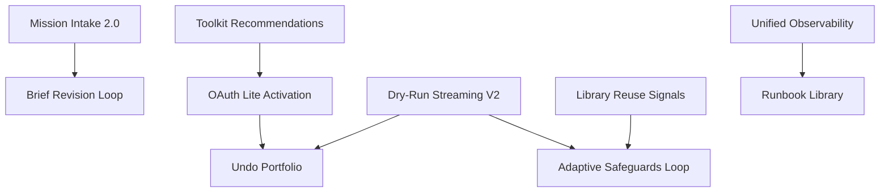

# AI Employee Control Plane: Capability Roadmap

**Version:** 2.0 (October 2025)
**Audience:** Product, Program Management, Engineering Leadership
**Status:** Unified capability progression replacing legacy gates

---

## 1. Purpose

The Control Plane now operates as a single continuous system. Instead of rigid gate silos, we track five capability pillars that mature together:

1. **Generative Intake & Briefing** — Objective-first onboarding with editable chips
2. **Capability Orchestration** — Toolkit discovery, connection, and governed execution
3. **Evidence & Undo Confidence** — Dry-run artifacts, undo plans, audit trails
4. **Learning & Intelligence** — Telemetry loops, library reuse, adaptive safeguards
5. **Operational Excellence** — Monitoring, compliance, and incident readiness

This roadmap articulates milestones across pillars, their interdependencies, and the evidence required to ship with confidence.

---

## 2. Milestone Framework

Each milestone adheres to this template:

| Field | Description |
|-------|-------------|
| **Objective** | Business and user outcome |
| **Scope** | Surfaces, agents, APIs, data changes |
| **Evidence** | Artifacts proving readiness (docs/readiness/*) |
| **Telemetry** | Events required for instrumentation |
| **Risks** | Known risks + mitigation owner |
| **Dependencies** | Other milestones or external partners |
| **Status** | ✅ done · ⚠️ in progress · ❌ not started |

---

## 3. Capability Milestones

### A. Generative Intake & Briefing

1. **Mission Intake 2.0** (Status: ✅)
   - Objective: One-prompt mission creation
   - Scope: Intake banner, chip editing, confidence badges
   - Evidence: `docs/readiness/intake_acceptance_report.md`
   - Telemetry: `intent_submitted`, `brief_generated`, `brief_item_modified`
   - Risks: Prompt drift (mitigated via weekly evals)
   - Dependencies: Gemini prompt tuning pipeline

2. **Brief Revision Loop** (Status: ⚠️)
   - Objective: Editable brief loop without losing downstream context
   - Scope: Brief reopening, diff visualization, planner rehydration
   - Evidence: `docs/readiness/brief_edit_resilience.md`
   - Telemetry: `mission_brief_reopened`, `mission_brief_diff_applied`
   - Risks: Stage context mismatch (owner: Frontend Platform)
   - Dependencies: Planner diff resilience work

### B. Capability Orchestration

1. **Toolkit Recommendations** (Status: ✅)
   - Objective: Recommend top 3 toolkits with rationale and success metrics
   - Scope: Recommendation service, capability scoring, UI badges
   - Evidence: `docs/readiness/toolkit_recommendation_accuracy.md`
   - Telemetry: `toolkit_recommendation_viewed`, `toolkit_selected`
   - Risks: Outdated capability vectors (owner: Data Platform)
   - Dependencies: Library embeddings refresh

2. **OAuth Lite Activation** (Status: ⚠️)
   - Objective: Progressive OAuth with scope explanations and rollback
   - Scope: Connect Link integration, scope previews, audit logging
   - Evidence: `docs/readiness/oauth_scope_audit.md`
   - Telemetry: `connect_link_completed`, `connection_deferred`
   - Risks: Vendor rate limits (owner: Integrations)
   - Dependencies: Composio scope metadata

### C. Evidence & Undo Confidence

1. **Dry-Run Streaming V2** (Status: ⚠️)
   - Objective: Reliable streaming with <5s heartbeat and retry resilience
   - Scope: SSE pipeline, heartbeat telemetry, pause/resume UI
   - Evidence: `docs/readiness/dry_run_resilience.md`
   - Telemetry: `dry_run_started`, `dry_run_step_completed`, `dry_run_completed`
   - Risks: Network instability (mitigation: exponential backoff)
   - Dependencies: Executor heartbeat service

2. **Undo Portfolio** (Status: ❌)
   - Objective: Every mutating action ships with rollback plan and countdown
   - Scope: `undo_events` schema, EvidenceAgent undo generation, UI countdown
   - Evidence: `docs/readiness/undo_efficacy.md`
   - Telemetry: `undo_requested`, `undo_completed`
   - Risks: Insufficient rollback coverage (owner: Trust Engineering)
   - Dependencies: Supabase function `verify_undo`

### D. Learning & Intelligence

1. **Library Reuse Signals** (Status: ⚠️)
   - Objective: Recommend proven plays based on mission context
   - Scope: Library embeddings, planner retrieval integration, reuse metrics
   - Evidence: `docs/readiness/library_reuse_metrics.md`
   - Telemetry: `library_play_recommended`, `library_play_activated`
   - Risks: Cold-start bias (mitigation: curated playbooks)
   - Dependencies: Data Intelligence pipeline

2. **Adaptive Safeguards Feedback Loop** (Status: ❌)
   - Objective: Safeguards improve based on human edits and validator outcomes
   - Scope: Safeguard feedback schema, planner prompt updates, analytics dashboard
   - Evidence: `docs/readiness/safeguard_learning_loop.md`
   - Telemetry: `safeguard_edited`, `validator_override_requested`
   - Risks: Conflicting edits (owner: Planner Team)
   - Dependencies: Feedback drawer instrumentation

### E. Operational Excellence

1. **Unified Observability** (Status: ⚠️)
   - Objective: Single dashboard for latency, success rates, safeguard incidents
   - Scope: Datadog dashboards, alerting rules, Supabase views
   - Evidence: `docs/readiness/observability_dashboard.md`
   - Telemetry: Aggregated from mission events + infrastructure metrics
   - Risks: Alert fatigue (owner: Operations)
   - Dependencies: Data warehouse sync

2. **Runbook Library** (Status: ❌)
   - Objective: Complete incident playbooks for frontline responders
   - Scope: `docs/readiness/runbooks/*.md`, on-call rotation, escalation maps
   - Evidence: `docs/readiness/runbook_validation.md`
   - Telemetry: `incident_opened`, `incident_resolved`
   - Risks: Stale procedures (owner: Incident Management)
   - Dependencies: Operations Playbook completion

---

## 4. Dependency Graph

---

## 5. Evidence Management

- Store readiness proof in `docs/readiness/<capability>/<artifact>.md`
- Link artifacts in milestone entries and PR descriptions
- Maintain evidence index spreadsheet to track owner, last updated, and validation status
- Automate checks via CI to confirm referenced artifacts exist and are updated within 30 days

---

## 6. Release Cadence & Governance

- **Cadence:** Two-week sprints with monthly executive demo (focus on outcome metrics)
- **Decision Forum:** Weekly roadmap review with Product, Engineering, Trust, and Operations
- **Risk Register:** Track top risks, mitigation owners, review bi-weekly
- **Change Control:** Major capability changes require RFC + sign-off from affected pillar leads

---

## 7. Metrics & Targets

| Pillar | Metric | Target Q4 2025 |
|--------|--------|----------------|
| Intake & Briefing | Mission acceptance without edit | ≥80% |
| Orchestration | Toolkit connection completion rate | ≥65% |
| Evidence & Undo | Undo success rate | ≥95% |
| Learning & Intelligence | Library reuse rate | ≥40% of missions |
| Operational Excellence | Incident mean time to resolve | ≤30 min |

Monitor metrics via Supabase dashboards and Datadog alerts. Investigate variances >10% within 48 hours.

---

## 8. Communication Plan

- Weekly digest summarizing milestone status and risks
- Monthly webinar for stakeholders highlighting business impact
- Internal wiki page linking to most recent roadmap snapshot
- Quarterly partner sync with Composio, CopilotKit, Gemini teams on integration roadmaps

---

## 9. Looking Ahead

Future pillars under exploration:
- **Autonomous Negotiation** — Agents negotiating guardrails with stakeholders
- **Self-Tuning Prompts** — Auto-synthesized prompt patches from telemetry
- **Marketplace Integrations** — Community toolkit submissions with review workflows
- **Policy Simulation** — Sandbox to test safeguards before production

Track early experiments in `docs/research/` and surface in roadmap reviews when ready.

